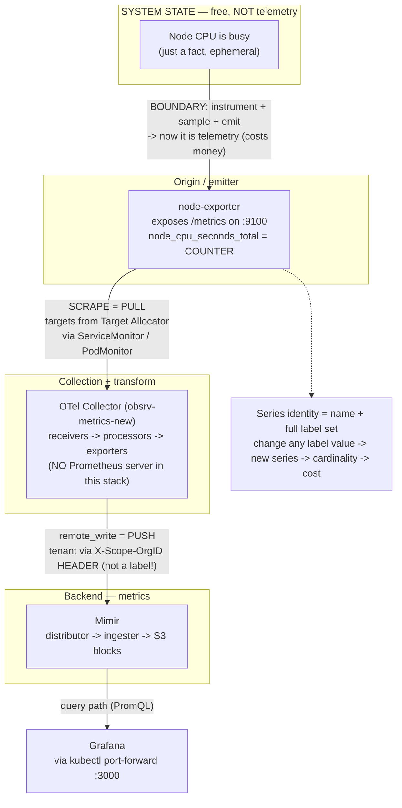

# EOD — 2026-06-06 · Phase 1 (Metrics) · Topics 1–3

## TL;DR
- **Mastered:** T1 Telemetry, T2 What is a metric.
- **In progress:** T3 Metric types — assessment posed, not yet answered (**resume here**).
- Platform went live on EKS today; Grafana MCP wired into Claude Code (static token).

---

## What I learned (revise these)

### Topic 1 — Telemetry  ✅
- **Telemetry** = the signals a system *deliberately emits about itself* (tele = remote, metron = measure). Monitoring / alerting / debugging are things you do **with** telemetry — they aren't telemetry.
- **The boundary:** system *state* is free and ephemeral; it becomes telemetry only when `instrument → sample → emit`. A node at 80% CPU is **not** telemetry until something emits it.
- **Why three signals:** metrics = *detect* (cheap, aggregate), logs = *what happened*, traces = *where in the chain*. Three not one because of **cost / cardinality** — cheap signal finds the fire, expensive ones tell you why.

### Topic 2 — What is a metric  ✅
- A stored **sample = `(timestamp, value)`** — never just the value. (This one kept slipping — drill it.)
- Full anatomy = `{label set incl __name__} + (timestamp, value)`. The metric *name* is itself the `__name__` label.
- **Series identity = the entire label set.** Change any label value → a brand-new series stored forever.
- **Series → cardinality → cost.** One unbounded label = unbounded series = ingester OOM + S3 bill.
- **Real metric I pulled off the stack** (`node_cpu_seconds_total{...}`), lessons:
  - `k8s_pod_uid`, `k8s_pod_name` → new value every pod restart → **unbounded churn cardinality**.
  - `instance`, `service_instance_id`, `server_address`+`server_port` → same `10.0.1.108:9100` encoded 3× → **redundant, droppable with zero query loss**.
  - `cpu` × `mode` → legitimate but **multiplicative** (nodes × cores × ~8 modes).
  - `X_Scope_OrgId="obsrv"` as a **label** → tenant leaking into the series; it belongs in the **request header**, not the data (revisit T20).
  - `otel_collector_id` + `job` labels **prove** an OTel collector scraped it — no Prometheus.

---

## Corrections / misconceptions caught
- ⚠️ **"Prometheus pulls, then OTel transforms" → WRONG.** This stack has **no Prometheus server**. The **OTel Collector + Target Allocator** does the pull-scrape (via ServiceMonitor/PodMonitor CRDs) and `remote_write`s to Mimir. Self-corrected on the quiz. (Prove from config at T4/T14.)
- (Carried over) NLB vs ALB; Grafana org ≠ backend tenant (`X-Scope-OrgID`).

---

## Diagram — metrics path (node CPU)

(Source: `learning/diagrams/metrics-flow-node-cpu.mmd`)

---

## ▶ Resume here next session — Topic 3: Metric types
Answer these three (already posed), then we continue:
1. `node_cpu_seconds_total` — which of the four types is it, and what *one feature* tells you? A number that only climbs is meaningless raw — what do you wrap it in, and what expression gives **"CPU busy %"**?
2. **Counter vs gauge:** why is `rate()` valid on a counter but nonsense on a gauge? One example of each from the stack (node-exporter / KSM / Mimir).
3. **Histogram (deep one):** what series/**suffixes** does Mimir actually store on disk for a latency histogram? And the trap — why can you aggregate a **histogram** across pods but **not** a **summary**?
