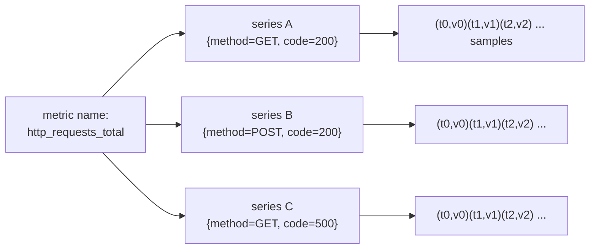
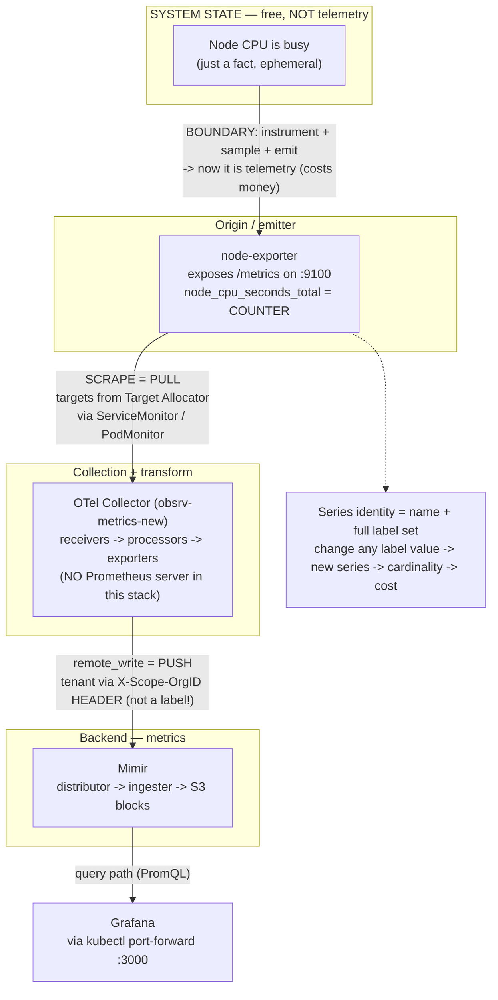

# EOD — 2026-06-06 · Phase 1 (Metrics) · Topics 1–3

> Verbose by design — this is a cold-revision artifact. You should be able to re-derive
> everything here months later without the live session. Live teaching stays terse; this
> doesn't.

## Session at a glance
Today had two halves. First we finished the platform: the full LGTM stack went live on
EKS (`meda-dev-stud-eksdemotest`), the Grafana MCP got deployed and wired into Claude Code
(settled on a **static** token after the env-var approach failed in background sessions),
and the loki/mimir/tempo/grafana chart migration + node-group bump landed on `main`.
Second, we started the actual mentorship curriculum — **Phase 1, Metrics** — and got
through Topic 1 and Topic 2, then posed Topic 3.

- **Mastered:** T1 Telemetry · T2 What is a metric.
- **In progress:** T3 Metric types — assessed, not yet answered (**▶ resume here**).

---

## Topic 1 — Telemetry ✅

### Definition
**Telemetry** = the signals a system *deliberately emits about itself* so it can be
understood from the outside. Etymology nails it: **tele** (remote) + **metron** (measure)
— *measurement at a distance*.

Three words people blur, kept straight:
- **Telemetry** — the *data/signals* a system emits (metrics, logs, traces, profiles).
- **Monitoring** — *watching* that telemetry against expectations (dashboards, alerts).
- **Observability** — a *property*: can you explain the system's internal state purely
  from its external outputs? Telemetry is the raw material; observability is the outcome.

So monitoring and alerting are things you **do with** telemetry — they are not telemetry.

### The boundary (the key idea)
A node running at 80% CPU is **just system state** — it's free, it's always true while it's
happening, and it vanishes the moment it changes. **It is not telemetry.** It only *becomes*
telemetry when something crosses the boundary:

```
state (free, ephemeral)  ──►  instrument  ──►  sample  ──►  emit  ──►  signal (costs money)
```

- **instrument** — code/agent exists that can observe the fact (e.g., node-exporter reading
  `/proc/stat`).
- **sample** — you capture it at some cadence (every 15s/30s/60s — a *config choice*).
- **emit** — you expose/push it as a signal that leaves the box.

The punchline that drives the *entire* course: **telemetry is designed in, not free.** Every
signal you choose to emit is an ingestion + storage + (especially) cardinality bill. The
80% is free; the time series recording it is not. You are always choosing what is worth
emitting.

### The signals — and why more than one
| Signal | Answers | Shape | Cost / cardinality | Role |
|--------|---------|-------|--------------------|------|
| **Metric** | "Is there a problem? how much? trend?" | numeric, aggregatable over time | **cheap**, bounded if labels behave | **detect** |
| **Log** | "What exactly happened (this event)?" | discrete timestamped record, high detail | expensive, high volume | **diagnose** |
| **Trace** | "Where in the request chain? who's slow?" | causal path of one request across services | expensive, high cardinality | **diagnose** |
| **Profile** | "Which function/line burns the CPU/mem?" | resource attribution to code (continuous profiling) | expensive | **diagnose deep** |

**Why three (four) signals instead of one rich super-signal?** Pure **cost vs cardinality**.
A single signal carrying per-request, per-line detail *for everything* would be financially
ruinous at scale. So you split by economics: the **cheap, aggregate** signal (metrics) is
always-on to **detect** the fire; the **expensive, high-detail** signals (logs/traces/
profiles) are pulled in to **diagnose** *why*. Cheap finds it, expensive explains it.

### Failure modes at this level
- **Under-instrument** → blind spots: the node is genuinely at 80% but no signal was ever
  emitted, so the dashboard shows nothing. This is an *absence*, not an error — nothing
  "broke," the data simply never crossed the boundary.
- **Over-instrument** → cardinality explosion and a cost blowup (you'll feel this hard at
  Topic 25). Emitting everything is as much a failure as emitting nothing.

The craft is choosing the right things to emit at the right cadence.

### Quiz recap (T1)
- Q (boundary): "Is 80% CPU telemetry?" → **No**, not until emitted; the failure was at the
  *emit/instrument* step. (I initially said "yes" — corrected.)
- Q (why three): **detect with metrics, diagnose with logs+traces; the reason is cost.** ✅
- Q (first hop): see the correction below — this is where the big misconception surfaced.

---

## Topic 2 — What is a metric ✅

### Anatomy
A metric, stored precisely, is:

```
{ __name__="node_cpu_seconds_total", label1="v1", label2="v2", ... }   +   (timestamp, value)
└──────────────────── identity (the full label set) ────────────────┘       └── one sample ──┘
```

- The **name is itself a label** called `__name__`. There is nothing special about it
  structurally — identity is *just labels*.
- A **sample** = **`(timestamp, value)`** — never just the value. The timestamp is the whole
  reason it's a *time* series, and it's why gaps/staleness even exist. (This was the bit that
  kept slipping today — drill it: *sample = (timestamp, value)*.)

Three terms kept straight:
- **sample** — one `(timestamp, value)` point.
- **series** (= **time series**) — the ordered stream of samples that share **one identity**
  (one exact label set).
- A **Grafana graph plots a series** (usually several) over a selected time range.

### Series identity — the idea everything else hangs on
Two data points belong to the **same series if and only if every label value is identical**
(`__name__` included). So:

- `http_requests_total{method="GET"}` and `http_requests_total{method="POST"}` are the
  **same metric** but **two different series**.
- Change *any* label value → a brand-new series, stored separately, **forever** (until
  retention drops it).



### Cardinality — why this is *the* cost driver
**Cardinality = the number of unique series** (name × every label combination). It is the
#1 cost and OOM driver across all three signals, because each series consumes memory in the
ingester (active head block + WAL) and storage in S3. Rough model:

```
series_count(metric) ≈ ∏ (distinct values of each label)
node_cpu_seconds_total ≈ nodes × cores × modes × (distinct pod identities over retention)
                                                   └─ UNBOUNDED if pod_uid is a label ─┘
```

**One unbounded label = unbounded series = ingester memory blowup + an ever-growing S3
bill.** That's why "what is a metric" is really "what is a *series*."

### The real metric we pulled off the stack (deep-dive)
You fetched `node_cpu_seconds_total{...}` live — excellent instinct, and a far better
teacher than a textbook example. Reading its labels:

| Label(s) | Verdict | Why |
|----------|---------|-----|
| `k8s_pod_uid`, `k8s_pod_name` | ⚠️ **cardinality bomb** | New value on **every pod restart** → series accumulate forever (churn). Classic ingester-OOM cause. |
| `instance`, `service_instance_id`, `server_address`+`server_port` | 🟡 **redundant** | All encode the same `10.0.1.108:9100` **3× over**. `service_instance_id` is **droppable with zero query loss**. |
| `cpu` × `mode` | ✅ legitimate but multiplicative | Per-core × per-mode (~8 modes). Real signal, but understand it multiplies. |
| `X_Scope_OrgId="obsrv"` | ⚠️ **wrong layer** | This is your **tenant**. It belongs in the *request header* (`X-Scope-OrgID`), not baked into the series as a label. It leaks the isolation layer into your data and inflates cardinality. Revisit at **T20 (multi-tenancy)**. |
| `otel_collector_id="obsrv-metrics-new"`, `job="kubernetes-service-endpoints"` | ℹ️ **proof** | These stamps prove an **OTel collector** scraped this metric — there is no Prometheus. The data itself settles the Topic-1 argument. |

### Trade-off framing (always state these)
- **Richness vs cost:** more labels = more query power *and* more cardinality. The skill is
  keeping labels that you actually filter/group by, and dropping decorative ones.
- **Stability:** prefer labels with **bounded, stable** value sets (node, namespace, mode).
  Avoid identifiers that **churn** (pod_uid, request_id) or are **unbounded** (user_id, URL,
  trace_id) as metric labels — those belong on logs/traces, not metrics.

### Quiz recap (T2)
- sample = `(timestamp, value)` ✅ (after a nudge).
- same metric / different series; label change → new series; → cardinality → cost ✅.
- most dangerous label = `pod_uid` (churn); droppable = `service_instance_id` (redundant) ✅.

---

## Corrections & misconceptions (carry these forward)

### ⚠️ "Prometheus pulls, then OTel transforms" — WRONG (corrected today)
**What I believed:** node-exporter → Prometheus pulls → hands to OTel collector to
transform → Mimir.

**Reality in this stack:** there is **no Prometheus server**. The **OTel Collector** (with
the **Target Allocator**) does the pull-scrape itself:
1. The **Prometheus Operator** is installed *only for its CRDs* — `ServiceMonitor`,
   `PodMonitor`, `ScrapeConfig`. It does **not** run a scraping server here.
2. The **Target Allocator** (the `obsrv-ta-targetallocator` pod) reads those CRDs, discovers
   targets, and **distributes** them across collector replicas.
3. Each **OTel Collector** (`obsrv-metrics-new`, `obsrv-ta-collector`) scrapes via its
   `prometheus` **receiver**, runs the data through **processors**, and `remote_write`s to
   Mimir via its **exporter**. Pull *and* transform happen in one component.

**Why people get this wrong:** the CRDs are named after Prometheus and the scrape model *is*
Prometheus' pull model — so it's natural to assume a Prometheus server is doing it. The OTel
collector adopted the same CRDs + pull model without the Prometheus server.

**How to verify (do this at T4/T14):** `kubectl get pods -A | grep -i prometheus` → only the
*operator*, no server. The scrapers are the `*-collector` / `*-targetallocator` pods. And
the data carries `otel_collector_id` labels.

### Carried over from earlier
- **NLB vs ALB:** Grafana is fronted by its own internet-facing **ALB** ingress; the **NLB**
  fronts **OTel ingestion**. (Revisit in the networking cross-cutting topics.)
- **Grafana org ≠ backend tenant:** a *Grafana org* isolates UI users/dashboards; the
  `X-Scope-OrgID` tenant isolates data inside Mimir/Loki/Tempo. Two unrelated layers that
  both got named `obsrv`.

---

## Diagram — metrics path (node CPU, corrected)

(Source: `learning/diagrams/metrics-flow-node-cpu.mmd`)

---

## Memorize these one-liners
- Telemetry = signals a system deliberately emits about itself; **state ≠ telemetry until emitted**.
- Three signals split by economics: **metrics detect (cheap), logs/traces diagnose (expensive)**.
- **sample = (timestamp, value)**; **series = samples sharing one label-set identity**.
- **Series identity = the full label set** (incl `__name__`); change a label → new series.
- **Cardinality = unique series count = the #1 cost/OOM driver.** One unbounded label = outage.
- In *this* stack, **OTel Collector + Target Allocator** scrape (pull) and **remote_write** (push) to Mimir — **no Prometheus server**.
- Tenant goes in the **`X-Scope-OrgID` header**, never as a metric label.

## Whiteboard / interview prompts (self-test)
1. Draw the path of a node-CPU sample from kernel to Grafana; label each hop pull vs push.
2. A dashboard panel is empty though the workload is clearly busy — list the places the
   metric could have died, from boundary to query.
3. Your Mimir ingesters are OOMing. Walk the cardinality investigation: which label do you
   suspect first and why?
4. Explain to a teammate why you can't just "add a `user_id` label" to a request counter.

---

## ▶ Resume here next session — Topic 3: Metric types
Answer these three (already posed), then we continue into Prometheus architecture (T4):
1. `node_cpu_seconds_total` — which of the four types is it, and what *one feature* tells
   you? A number that only climbs is meaningless raw — what do you wrap it in, and what
   expression gives **"CPU busy %"**?
2. **Counter vs gauge:** why is `rate()` valid on a counter but nonsense on a gauge? One
   example of each from the stack (node-exporter / KSM / Mimir).
3. **Histogram (the deep one):** what series/**suffixes** does Mimir actually store on disk
   for a latency histogram? And the trap — why can you aggregate a **histogram** across pods
   but **not** a **summary**?
