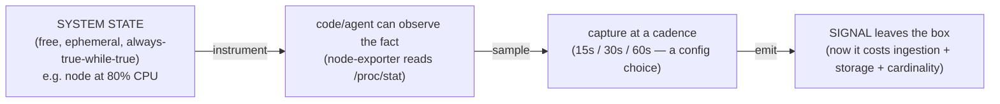

# Topic 1 — Telemetry, from scratch

> Gold-standard per-topic doc (same shape as `Topic4.md`). Self-contained for cold revision.
> Phase 1 · Metrics · mastered 2026-06-06. The anchor idea: **telemetry is designed in, not
> free** — system state is free and ephemeral; a *signal* costs money the instant you emit it.

---

## WHY telemetry exists (the problem it solves)
A running system is full of facts — "this node is at 80% CPU," "that request took 412 ms."
Those facts are **free, always-true-while-true, and vanish the instant they change.** You
cannot debug, alert, or do capacity planning on facts that evaporate. Telemetry is the
deliberate act of **capturing those facts and shipping them off the box** so the system can be
understood *from the outside, after the fact, at a distance.* The word says it: **tele**
(remote) + **metron** (measure) = measurement at a distance.

## WHAT telemetry is — three words kept straight
- **Telemetry** — the *data/signals* a system deliberately emits about itself (metrics, logs,
  traces, profiles).
- **Monitoring** — *watching* that telemetry against expectations (dashboards, alerts).
- **Observability** — a *property*: can you explain the system's internal state purely from its
  external outputs? Telemetry is the raw material; observability is the outcome.

Monitoring and alerting are things you **do with** telemetry — they are **not** telemetry.

## HOW it works — the boundary (the key idea)
A node at 80% CPU is **just system state** — free, ephemeral, not telemetry. It *becomes*
telemetry only when it crosses a boundary:

- **instrument** — something exists that can observe the fact (node-exporter reading `/proc/stat`).
- **sample** — you capture it at a cadence (every 15/30/60s — *your* choice).
- **emit** — you expose/push it so it leaves the box.

The punchline that drives the **entire course**: **telemetry is designed in, not free.** The
80% is free; the time series recording it is an ingestion + storage + (especially) cardinality
bill. You are always choosing what is worth emitting.

## The signals — and why more than one
| Signal | Answers | Shape | Cost / cardinality | Role |
|---|---|---|---|---|
| **Metric** | "Is there a problem? how much? trend?" | numeric, aggregatable over time | **cheap**, bounded if labels behave | **detect** |
| **Log** | "What exactly happened (this event)?" | discrete timestamped record | expensive, high volume | **diagnose** |
| **Trace** | "Where in the request chain? who's slow?" | causal path of one request across services | expensive, high cardinality | **diagnose** |
| **Profile** | "Which function/line burns CPU/mem?" | resource attribution to code | expensive | **diagnose deep** |

**Why split into 3–4 signals instead of one rich super-signal?** Pure **cost vs cardinality.**
One signal carrying per-request, per-line detail *for everything* would be financially ruinous
at scale. So you split by economics: the **cheap, aggregate** signal (metrics) is always-on to
**detect** the fire; the **expensive, high-detail** signals (logs/traces/profiles) are pulled
in to **diagnose** *why*. **Cheap finds it, expensive explains it.**

## Grounded in your stack
- The first emitter you'll meet is **node-exporter** (DaemonSet, `:9100`) turning kernel state
  (`/proc`, `/sys`) into `/metrics`. The 80%-CPU fact only exists downstream because node-exporter
  instruments + samples + emits it.
- The full journey those signals travel (your "one diagram"): emitter → **OTel Collector** →
  transport → **Mimir/Loki/Tempo** → **S3** → query → **Grafana**. Every topic reconnects to it.
- The bill, made concrete (numbers proven live at T3/T4): this cluster pushes **~2,034
  samples/s** into Mimir and holds **~209k active series** in ingester memory — every one of
  them a deliberate instrument→sample→emit decision. That is what "telemetry is designed in,
  not free" looks like running.

## HOW it scales / trade-offs
- **Richer telemetry = more insight *and* more cost.** Cadence (sample interval) and label
  richness are the two dials; both trade signal for spend.
- The craft is **choosing the right things to emit at the right cadence** — not "emit everything."

## Common failure modes
- **Under-instrument** → **blind spots**: the node is genuinely at 80% but no signal was ever
  emitted, so the dashboard shows nothing. This is an *absence*, not an error — nothing "broke,"
  the data simply never crossed the boundary.
- **Over-instrument** → **cardinality explosion** and cost blowup (you'll feel this at T25).
  Emitting everything is as much a failure as emitting nothing.

## Practical exercises (live cluster)
1. `kubectl -n meta-monitoring get ds` — find node-exporter; `kubectl ... port-forward` a pod to
   `:9100` and `curl localhost:9100/metrics | head` — see raw state crossing the boundary.
2. In Grafana, pick one metric and ask: *what fact does this represent, and what would I be blind
   to if it weren't emitted?*
3. Whiteboard: draw `state → instrument → sample → emit → signal` for "disk is 90% full."

## Memorize (one-liners)
- Telemetry = signals a system **deliberately emits** about itself; **state ≠ telemetry until emitted.**
- **tele + metron** = measurement at a distance.
- Monitoring/observability are done *with* telemetry; they aren't telemetry.
- Three signals split by economics: **metrics detect (cheap), logs/traces diagnose (expensive).**
- Telemetry is **designed in, not free** — every signal is a cardinality bill.
- Live anchors: **~2,034 samples/s ingest · ~209k active series** — the cluster's running bill.

## Quiz result
PASS (2026-06-06). Boundary (state≠telemetry) + detect-vs-diagnose solid. Gaps carried forward:
omitted node-exporter as the emitter and explicit pull/push labels on the first hop (→ T8/T19).
