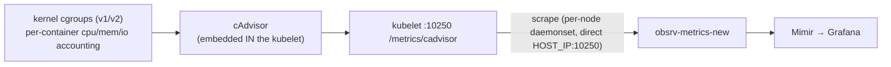
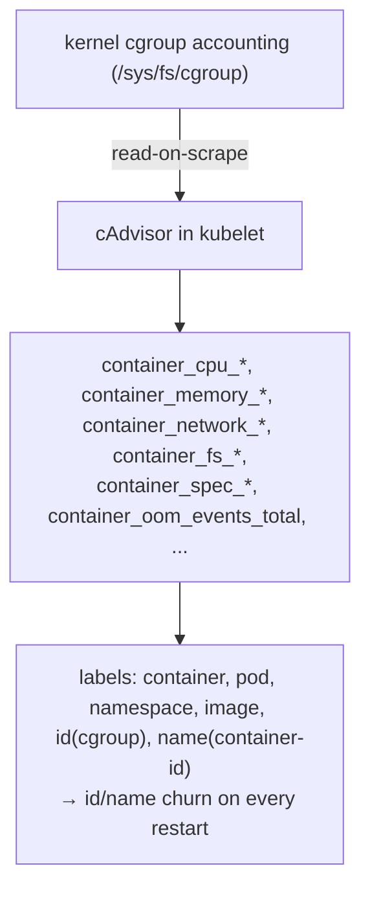
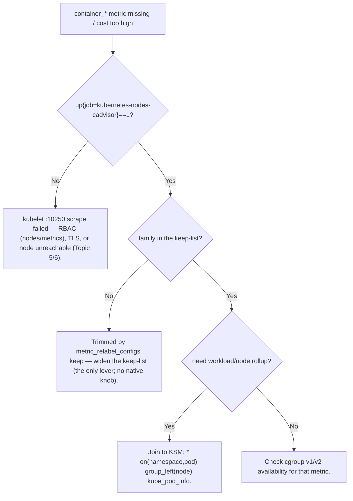
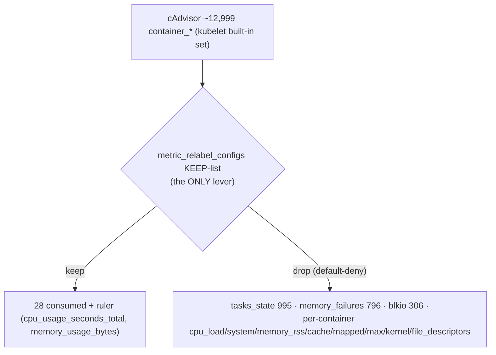

# Topic 10 — cAdvisor (+ kubelet), from scratch

> Companion to `Topic8.md` (node-exporter) / `Topic9.md` (KSM). Verbose by design — self-contained for
> cold revision in the `Topic4.md` gold-standard shape.
> **STATUS: TAUGHT 2026-06-14 — read this, then take the quiz at the bottom; cAdvisor cleanup runs
> alongside.** cAdvisor inserted as **Topic 10** (ServiceMonitor → T11, etc.).
> The one idea to anchor everything: **cAdvisor is the *container* resource exporter — it lives
> INSIDE the kubelet, reads the kernel's cgroup accounting, and emits per-container `container_*`
> metrics. It's the third leg of the trio: node-exporter = the host, cAdvisor = the containers on it,
> KSM = what Kubernetes *thinks* about them. cAdvisor's per-container × per-pod expansion makes it the
> single biggest cardinality firehose (12,999 series here).**

---

## WHY cAdvisor exists (the gap it fills)
node-exporter tells you the **host** is at 80% CPU; KSM tells you the pod **wants** 3 replicas. Neither
tells you **which container is burning the CPU / leaking memory / getting OOM-killed**. That lives in
the kernel's **cgroups** — the accounting groups the kernel uses to enforce each container's
CPU/memory/IO limits. cAdvisor ("Container Advisor") reads cgroup accounting and turns it into
`container_*` metrics. It's the Topic 7 archetype **"cgroups-via-kubelet"**: the subject is *every
container*, the data source is the kernel cgroup tree, exposed through the kubelet.



The trio, said once to memorize: **node-exporter = what the node has/uses (host `/proc`); cAdvisor =
what each container uses (cgroups); KSM = what k8s declares/observes about objects (API).**

---

## WHAT it is — embedded in the kubelet, not a separate pod
cAdvisor is **not** a Deployment/DaemonSet you run — it is **compiled into the kubelet**. Every node's
kubelet already runs cAdvisor and serves its metrics at **`https://<node>:10250/metrics/cadvisor`**
(the kubelet's *own* metrics are at `/metrics`, volume stats at `/metrics/probes`, etc.). So "scraping
cAdvisor" = scraping a kubelet endpoint.

In your stack the **daemonset** collector `obsrv-metrics-new` (`meta_metrics.yaml`) scrapes it
**directly**, one pod per node hitting its own node's kubelet:
```yaml
- job_name: kubernetes-nodes-cadvisor
  scheme: https
  metrics_path: /metrics/cadvisor
  static_configs: [{ targets: ["$${env:HOST_IP}:10250"] }]   # this node's kubelet
```
(Contrast: when you *can't* reach the kubelet directly, you scrape via the **apiserver proxy**
`/api/v1/nodes/<node>/proxy/metrics/cadvisor` — the Topic 5 escape hatch. Here the per-node daemonset
reaches `:10250` directly, so no proxy.)

---

## HOW it works internally — cgroups → metrics
- **cgroups (control groups)** are the kernel mechanism that limits+accounts each container's
  resources. The kubelet/runtime puts every container in a cgroup; the kernel continuously tallies CPU
  time, memory pages, IO, etc. into pseudo-files (`/sys/fs/cgroup/...`).
- cAdvisor reads that tree and **renders `container_*` gauges/counters on scrape** (read-on-scrape,
  like node-exporter — it reflects current cgroup accounting; counters like
  `container_cpu_usage_seconds_total` are cumulative from the kernel).
- **cgroup v1 vs v2** changes some metric availability/semantics (v2 unifies the hierarchy; some v1
  metrics vanish, memory accounting differs). EKS AL2023 / Bottlerocket are **cgroup v2**.
- **Key labels:** `container`, `pod`, `namespace`, `image`, and the cgroup path `id` (e.g.
  `/kubepods/burstable/pod<uid>/<container-id>`) + `name` (the runtime container name). The `id`/`name`
  carry the **container ID** → **every container restart = new cgroup = new series** (churn).
- It does **not** have the workload (Deployment) or node baked into every series the way you want for
  rollups → you **join to KSM** (next).



---

## The join (recall from Topic 9) — cAdvisor + KSM
cAdvisor gives the **number** per container (pod/container labels) but not the **workload/node
rollup**. Stamp it on by joining to KSM info-metrics:
```promql
# per-NODE container CPU:
sum by (node)(rate(container_cpu_usage_seconds_total[5m]) * on(namespace,pod) group_left(node) kube_pod_info)
# per-WORKLOAD (Deployment): join through kube_pod_owner → kube_replicaset_owner
```
This is *why* the trio works together: cAdvisor (usage) × KSM (topology) = "CPU by Deployment/node."

---

## Grounded in YOUR stack (live, `meda-dev-goldfish`)
- Scraped by the **daemonset** `obsrv-metrics-new`, job `kubernetes-nodes-cadvisor`, 2 targets
  (`HOST_IP:10250`), direct (no apiserver proxy). The kubelet's own metrics are the sibling
  `kubernetes-nodes` job (`/metrics`).
- **`container_*` ≈ 12,999 series — the single biggest family in the platform.** Top emitters
  (mostly **unconsumed**): `container_tasks_state` (995), `container_memory_failures_total` (796),
  `container_blkio_device_usage_total` (306), `container_network_*` (258 each), and ~10 per-container
  families at ~199 each (`container_memory_rss/cache/mapped_file/max_usage/kernel_usage`,
  `container_cpu_load_*`/`system`, `container_file_descriptors`).
- Dashboards consume **28** `container_*` families (cpu_usage, memory_working_set, network_*, fs_writes,
  oom_events, spec_*, status_*); the ruler needs `container_cpu_usage_seconds_total` +
  `container_memory_usage_bytes`. **Everything else is the firehose to trim.**

---

## HOW it scales / cardinality
- **Scale unit = containers × nodes.** Each node's cAdvisor emits per-container series; total =
  Σ(containers per node). On a churning cluster this dwarfs node-exporter (host = ~1 subject/node) and
  KSM (objects). It's the **#1 cardinality + churn source.**
- **Churn:** the `id`/`name`/`container_id`/`image_id` labels rotate on **every container restart/
  redeploy** → whole `container_*` set reborn each rollout (worse than static high-card — WAL/head/
  index pressure, the Topic 9 churn cost, amplified by container count).
- **Pause/sandbox containers** historically emitted empty-`image` series (extra noise) — relabel-drop
  them if present.

---

## COMMON FAILURE MODES
1. **The firehose itself** — un-trimmed `container_*` dominates ingest/cost. Default lever = a
   `metric_relabel_configs` **keep-list** on the cadvisor scrape (cAdvisor has **no native knob** — it's
   the kubelet's built-in set; you can't `--no-collector` it).
2. **Missing rollup** — a panel shows per-container but you wanted per-Deployment/node → you forgot the
   KSM **join** (`* on(namespace,pod) group_left(...) kube_pod_info`).
3. **cgroup v1↔v2 metric gaps** — a metric exists on one node's kernel and not another; or memory
   semantics differ (working_set vs rss vs usage). Know which the cluster runs (EKS = v2).
4. **`up=1` but `container_*` empty** — kubelet reachable but `/metrics/cadvisor` RBAC/path issue, or
   the cadvisor job's keep-list dropped it. (kubelet scrape needs `nodes/metrics` + `nodes/proxy` RBAC.)
5. **Churn-driven active-series spikes** on every deploy — expected; the lever is dropping high-card
   unconsumed families, not the churn itself.



---

## The cAdvisor cleanup (T10 capstone)
Only lever = **`metric_relabel_configs` on the `kubernetes-nodes-cadvisor` job** (daemonset
`meta_metrics.yaml`) — cAdvisor has no helm/native allowlist. Default-deny **keep-list** (like
node-exporter): keep the 28 consumed `container_*` + the 2 ruler families
(`container_cpu_usage_seconds_total`, `container_memory_usage_bytes`); drop the rest — which kills the
firehose (`container_tasks_state` 995, `container_memory_failures_total` 796,
`container_blkio_device_usage_total` 306, and the ~199-each per-container cpu_load/system/memory_rss/
cache/mapped/max/kernel/file_descriptors). Paired: the **kubelet** job (`kubernetes-nodes`) drops the
`apiserver_*` (136) spillage it re-exposes, keeps `kubelet_volume_stats_*` +
`kubelet_container_log_filesystem_used_bytes`.



---

## Cleanup result (applied 2026-06-14, baseline before → after — `baseline-goldfish-cadvisor-{before,after}.txt`)
Lever: `metric_relabel_configs` **keep-list** on the `kubernetes-nodes-cadvisor` job + an `apiserver_*`
**drop** on the kubelet `kubernetes-nodes` job (both in `meta_metrics.yaml`).

| metric | before | after | Δ |
|---|---|---|---|
| cAdvisor ingested (samples/target, post-relabel) | 6,357 | **1,740** | **−73%** |
| kubelet ingested (samples/target) | 2,433 | 2,365 | −68 (apiserver_ −136 total) |
| cluster `samples_ingested` | 46,615 | **37,315** | **−9,300 (~20%)** |
| `container_*` family | 12,695 | ~3,500 (settling) | dropped firehose aging out |

Staleness-free proof = `scrape_samples_post_metric_relabeling` (6,357→1,740); the `container_` **count**
lags ~5 min while the dropped firehose (`container_tasks_state` 995, `container_memory_failures_total`
796, `container_blkio_device_usage_total` 306) ages out of the staleness window. Kept intact:
`container_cpu_usage_seconds_total`, `container_memory_working_set_bytes`, ruler's
`container_memory_usage_bytes`; the `* on(namespace,pod) group_left(node) kube_pod_info` **join still
resolves** (2 nodes); `up`=1 on both jobs. *(Cumulative across the sweep so far: cluster ingest
**52,775 → 37,315, ~29%** from node-exporter + KSM + node_authorizer + cAdvisor.)*

## Memorize (one-liners)
- cAdvisor = **container** resource exporter, **embedded in the kubelet**, reads kernel **cgroups** →
  `container_*`; scraped at **`:10250/metrics/cadvisor`** (direct by the per-node daemonset here).
- Trio: **node-exporter = host · cAdvisor = containers · KSM = object state.**
- It's the **#1 firehose** (per-container × per-node, 12,999) and **churns** on every restart
  (`id`/`name`/`container_id`).
- cAdvisor gives usage; **join to KSM** (`* on(namespace,pod) group_left(node) kube_pod_info`) for
  node/workload rollup.
- **No native knob** — the only trim is a `metric_relabel_configs` **keep-list** on the cadvisor scrape.
- Reach it directly (per-node `:10250`) or via the **apiserver proxy** when you can't.

---

## Quiz — answer from memory, then check the key

### Questions (self-test cold)
1. **Where does cAdvisor run, and how do you scrape it?** Why is there no `--no-collector`-style knob
   to trim it, and what *is* the only trim lever?
2. **The trio.** A container is OOM-killed. Which of node-exporter / cAdvisor / KSM tells you (a) the
   container's memory usage vs its limit, (b) that the *node* was under memory pressure, (c) that the
   pod is now in `CrashLoopBackOff`? One each.
3. **Cardinality + churn.** Why is cAdvisor the biggest series source *and* the biggest churn source?
   Name the labels that rotate on a container restart, and why churn costs more than a static series.
4. **The join.** Write PromQL for **per-Deployment** container memory working set. You have
   `container_memory_working_set_bytes` (`namespace`,`pod`,`container`) and KSM. Which info-metrics do
   you chain, and on what labels?

### Answer key
1. cAdvisor is **compiled into the kubelet** (not a separate pod); scrape the kubelet at
   **`:10250/metrics/cadvisor`** (direct per-node, or via the apiserver proxy). No `--no-collector`
   because the metric set is the **kubelet's built-in cAdvisor** — not a configurable exporter. The
   only trim lever is **`metric_relabel_configs` (keep/drop)** at the scraping collector
   (`meta_metrics.yaml`, `kubernetes-nodes-cadvisor` job).
2. (a) **cAdvisor** — `container_memory_working_set_bytes` vs `container_spec_memory_limit_bytes`;
   (b) **node-exporter** — `node_memory_MemAvailable_bytes` / `node_vmstat_oom_kill`; (c) **KSM** —
   `kube_pod_container_status_restarts_total` / `kube_pod_status_phase` / waiting reason.
3. Biggest **series**: it emits per-**container** (× per-node), and containers outnumber nodes/objects.
   Biggest **churn**: `id` (cgroup path), `name`, `container_id`, `image_id` all carry the container
   identity → every restart/redeploy = new container = **new series**, old ones go stale. Churn costs
   more because each new series is a fresh head entry + index churn + WAL writes (vs a stable series
   that just appends samples and compresses well).
4. `sum by (deployment)(`
   `  container_memory_working_set_bytes`
   `    * on(namespace,pod) group_left(owner_name) label_replace(kube_pod_owner{owner_kind="ReplicaSet"}, "rs","$1","owner_name","(.*)")` … —
   simplest correct chain: join `container_memory_working_set_bytes * on(namespace,pod) group_left(...)
   kube_pod_info` for node, and for **Deployment** chain `kube_pod_owner` (pod→ReplicaSet) →
   `kube_replicaset_owner` (ReplicaSet→Deployment), matching on `namespace` + the owner name at each
   hop. Key point: cAdvisor has `namespace`,`pod` → match those to KSM, `group_left` the workload labels.
