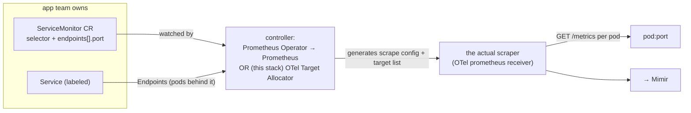
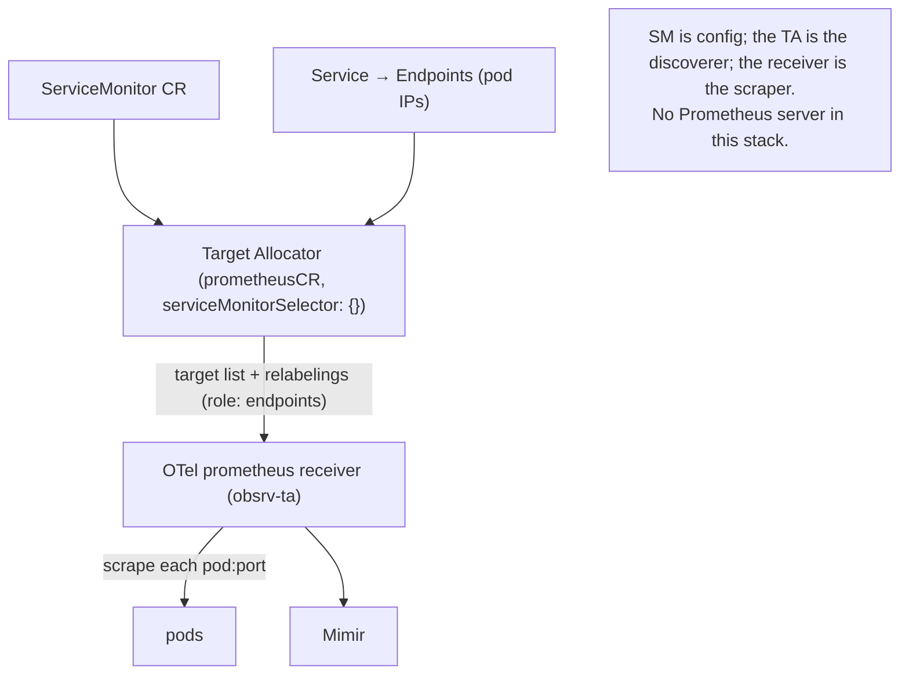
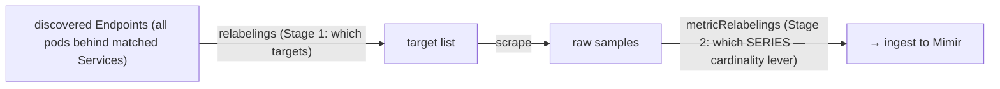
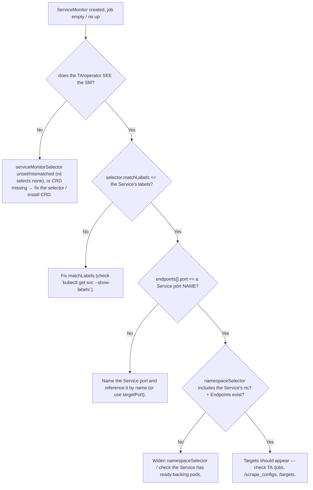

# Topic 11 — ServiceMonitor, from scratch

> Companion to `Topic4.md` (Prometheus arch) / `Topic6.md` (scraping & relabel) / `Topic8–10` (the
> exporters it scrapes). Verbose by design — self-contained for cold revision in the `Topic4.md`
> gold-standard shape.
> **STATUS: TAUGHT 2026-06-14 — read this, then take the quiz at the bottom.** cAdvisor inserted as
> T10, so ServiceMonitor = **Topic 11** (PodMonitor→T12, Prometheus Operator→T13).
> The one idea to anchor everything: **a ServiceMonitor is not a scraper — it's a *declarative
> config object* (a CRD). You label a Service + write an SM that selects it; a controller (the
> Prometheus Operator, or in THIS stack the OTel Target Allocator) watches the SM, discovers the
> pods behind the Service, generates the scrape config + target list, and feeds the actual scraper.
> "What to scrape" (the SM, owned by app teams) is decoupled from "the scraper" (owned by the
> platform).**

---

## WHY ServiceMonitor exists (the problem it kills)
The classic way to tell Prometheus what to scrape is a static `scrape_configs:` block in
`prometheus.yml`. In Kubernetes that breaks: Services/pods come and go, IPs churn, and **app teams
would have to edit the central Prometheus config** to add their target — a bottleneck and a blast
radius. ServiceMonitor turns "scrape me" into a **namespaced k8s object** an app team owns: they
label their Service and drop an SM next to it. A controller continuously reconciles all SMs into the
scraper's config + live target list. So:
- **Decoupling:** app teams declare intent (an SM); the platform owns the scraper. No central-config edits.
- **Dynamic discovery:** targets are the *Endpoints* (pods) behind the Service — auto-updated as pods
  scale/restart.
- **Self-service + GitOps-able:** SMs ship with the app's Helm chart (`prometheus.monitor.enabled`).



---

## WHAT it is — a CRD, consumed by a controller
- **Kind:** `ServiceMonitor` (`monitoring.coreos.com/v1`), part of the **Prometheus Operator CRDs**
  (must be installed cluster-wide). It is **inert config** — nothing scrapes unless a controller
  consumes it.
- **It selects *Services*** (by label) and, through them, the **Endpoints** (the pods backing the
  Service). It scrapes the **pods**, not the Service VIP (see failure modes — scraping the ClusterIP
  would load-balance to one random pod = useless per-pod metrics/`up`).
- **Shape (the fields that matter):**
  ```yaml
  apiVersion: monitoring.coreos.com/v1
  kind: ServiceMonitor
  metadata: { name: my-app, namespace: my-ns, labels: {...} }
  spec:
    selector:
      matchLabels: { app: my-app }        # which SERVICES (by label)
    namespaceSelector:                    # which namespaces (default: the SM's own ns)
      matchNames: [my-ns]                 # or `any: true` for all
    endpoints:
      - port: metrics                     # the Service port NAME (or targetPort) — NOT a number-by-default
        path: /metrics                    # default /metrics
        interval: 60s
        scheme: https
        tlsConfig: {...}
        relabelings: [...]                # Stage-1: target-level (which/relabel targets)
        metricRelabelings: [...]          # Stage-2: per-sample (the CARDINALITY lever)
  ```

---

## HOW it works — the chain, and the OTel twist
**Classic (Prometheus Operator):** Operator watches SMs → renders a `prometheus.yaml` (with a
`kubernetes_sd_config role: endpoints` job per SM + the SM's relabelings) → the config-reloader
sidecar hot-reloads Prometheus → Prometheus discovers Endpoints and scrapes.

**This stack (no standalone Prometheus):** the **OTel Target Allocator** (`obsrv-ta`,
`prometheusCR.enabled: true`, `serviceMonitorSelector: {}` = **match ALL SMs**) plays the operator's
role: it watches SM CRs + the selected Services' Endpoints, computes the target list + applies the
SM's relabelings, and hands targets to the **OTel `prometheus` receiver** in the collector. The
collector scrapes; metrics go to Mimir. **Same CRD, different consumer** — the SM doesn't care who
reads it.



**Two-stage relabel on the SM (T6 callback):**
- `relabelings` = **Stage 1, target-level, pre-scrape** — decides *which* targets and rewrites target
  labels (e.g. set `node`/`instance` from `__meta_kubernetes_*`, drop targets). The SD funnel
  (discover → relabel → assign).
- `metricRelabelings` = **Stage 2, per-sample, post-scrape** — the **cardinality lever** (keep/drop
  metric series). **This is exactly what we used for the node-exporter allowlist, the KSM tier-2 drop,
  and the cAdvisor keep-list** (cAdvisor's is on a static job, but same mechanism).



---

## Grounded in YOUR stack
- **One prometheusCR plane** (`obsrv-ta` statefulset, `serviceMonitorSelector: {}`) scrapes **every**
  ServiceMonitor: `kube-state-metrics`, `prometheus-node-exporter`, `cert-manager`,
  `aws-load-balancer-controller`, `loki/*`, `grafana`, `otelcol-contrib`, … (the daemonset
  `obsrv-metrics-new` has prometheusCR **disabled** — it only runs the static kubelet/cadvisor jobs).
- SMs are **chart-rendered**: KSM `prometheus.monitor.enabled: true` (+ `honorLabels: true`),
  node-exporter `prometheus.monitor.enabled: true`, cert-manager `prometheus.servicemonitor.enabled`.
- The **annotation → SM migration** (OPTIMIZATION.md): KSM/node-exporter/etc. moved off the
  annotation `kubernetes-service-endpoints` job onto SMs; the **two switches** were (1) create the SM,
  (2) de-annotate the source (the de-annotate knob differs per chart).
- The **metricRelabelings** we added for cleanups (node-exporter allowlist, KSM tier-2) live on these
  chart-rendered SMs (`prometheus.monitor.http.metricRelabelings`).

---

## HOW it scales / trade-offs
- The TA **shards** SM targets across collector replicas (consistent-hashing + HPA) — scales with
  scrape load. SMs themselves are cheap (config objects).
- **Self-service scales org-wide** (200 teams ship their own SM) — but that's also the risk: an
  unbounded SM (`metricRelabelings`-less, scraping a high-card `/metrics`) is how a team floods Mimir.
  The platform's guardrail = enforce/observe `metricRelabelings` + the per-job sweep (Topics 8–10).
- **Security:** an SM can point at any Service it can select (namespaceSelector scope); TLS/bearer
  tokens are referenced from Secrets. Wrong `namespaceSelector: {any: true}` widens reach.

---

## COMMON FAILURE MODES (the SM ones bite everyone)
1. **0 targets, silently.** The #1 SM failure. Causes, in order: **(a)** `selector.matchLabels`
   doesn't match the Service's **labels**; **(b)** `endpoints[].port` name ≠ the Service's port
   **name**; **(c)** `namespaceSelector` doesn't include the Service's namespace; **(d)** the Service
   has no ready Endpoints (no backing pods). All produce an empty job — no error.
2. **Scraping the wrong thing** — pointing at the Service ClusterIP instead of Endpoints would
   load-balance to one pod; the operator/TA correctly uses `role: endpoints` (per-pod), so this is
   really about wrong port/path.
3. **Double-scrape** — both an SM *and* a `prometheus.io/scrape` annotation (or a second SM) match the
   same target → duplicate series / OOO. (The annotation→SM migration existed to kill this.)
4. **CRD missing** — the `ServiceMonitor` CRD isn't installed → your SM YAML applies as an unknown
   kind / is ignored. (PodMonitor CRD likewise — Topic 12.)
5. **Selector consumed by nothing** — in a TA stack, `serviceMonitorSelector` (or `podMonitorSelector`)
   left **unset** selects **none** (nil ≠ match-all in the operator) → your SM is never picked up.

**Troubleshooting ladder — "my SM has no targets":**

**Inspect:** port-forward `svc/<col>-targetallocator:80` → `/jobs`, `/jobs/<job>/targets`,
`/scrape_configs` (the TA exposes the generated config + live targets — your ground truth).

---

## ServiceMonitor vs PodMonitor (Topic 12 preview)
- **ServiceMonitor** selects **Services** → scrapes their Endpoints; gives you Service-level context;
  needs a Service to exist.
- **PodMonitor** selects **Pods** directly → no Service required; use when there's no Service (e.g. a
  bare Deployment, or the OTel collector's `:8888` self-telemetry where the daemonset renders no
  Service). You lose Service-level labels in return.

---

## Practical exercises (live, when back at the keyboard)
1. `kubectl get servicemonitor -A` — list the SMs; pick KSM's, `kubectl get servicemonitor
   kube-state-metrics -o yaml` — read its `selector`, `endpoints[].port`, `honorLabels`,
   `metricRelabelings`.
2. Confirm the selector matches: `kubectl -n meta-monitoring get svc -l <SM matchLabels> --show-labels`.
3. TA ground truth: port-forward `svc/obsrv-ta-targetallocator:80` → `curl /jobs` and
   `/jobs/kube-state-metrics/targets`.
4. Break it on purpose (dev): change the SM's port name to a wrong value → watch the job go to 0
   targets in the TA `/jobs`; revert.

---

## Memorize (one-liners)
- ServiceMonitor = a **CRD that declares scrape intent**; it does **not** scrape. A controller
  (Prometheus Operator, or here the **OTel Target Allocator**) reconciles it into the scraper's config.
- It selects **Services by label** → scrapes their **Endpoints (pods)**, via `role: endpoints`.
- The **#1 failure = 0 targets**: selector/label mismatch, wrong **port name**, or `namespaceSelector`.
- On the SM: **`relabelings` = Stage-1 (which targets)**, **`metricRelabelings` = Stage-2 (cardinality
  lever)** — the latter is what every cleanup (T8–T10) used.
- In a TA stack, an **unset `serviceMonitorSelector` selects NONE** (nil ≠ all).
- Inspect via the **TA `/jobs` / `/targets` / `/scrape_configs`**.
- **PodMonitor** = same idea for pods with no Service.

---

## Quiz — answer from memory, then check the key

### Questions (self-test cold)
1. **It's not a scraper.** A ServiceMonitor is just a YAML object — so what actually turns it into
   live scraping **in this stack**, and how does that differ from the classic Prometheus-Operator
   setup?
2. **0 targets.** You apply a ServiceMonitor and the job shows up but has **no targets / empty `up`**.
   List the **three** most likely causes, in the order you'd check them.
3. **Two stages.** On an SM, what's the difference between `relabelings` and `metricRelabelings` —
   which one did we use to trim node-exporter/KSM/cAdvisor cardinality, and which stage (target vs
   sample) is it?
4. **Endpoints, not VIP.** Why does the SM scrape the **pods behind** the Service (its Endpoints)
   rather than the Service's ClusterIP? What breaks if it scraped the ClusterIP?
5. **SM vs PodMonitor.** When do you reach for a PodMonitor instead, and what do you give up?

### Answer key
1. The **OTel Target Allocator** (`obsrv-ta`, `prometheusCR.enabled`, `serviceMonitorSelector: {}`)
   watches the SM + the selected Services' Endpoints, generates the target list + relabelings, and
   feeds the **OTel `prometheus` receiver** (the actual scraper). Classic setup: the **Prometheus
   Operator** watches SMs and renders `prometheus.yaml` (+ config-reloader) for a **Prometheus
   server**. Same CRD, different consumer; here there is **no Prometheus server**.
2. (a) `selector.matchLabels` ≠ the **Service's labels**; (b) `endpoints[].port` ≠ a Service **port
   name**; (c) `namespaceSelector` doesn't include the Service's **namespace** (default = the SM's own
   ns). (Bonus: the Service has no ready **Endpoints**, or the TA's `serviceMonitorSelector` doesn't
   select this SM.)
3. `relabelings` = **Stage 1, target-level, pre-scrape** (which targets, rewrite target labels).
   `metricRelabelings` = **Stage 2, per-sample, post-scrape** = the **cardinality lever** — that's the
   one used to keep/drop series in the T8/T9/T10 cleanups.
4. You want **per-pod** metrics and a per-pod **`up`**. The Service ClusterIP is a load-balanced VIP —
   scraping it would hit **one random backing pod per scrape**, giving you nonsense (one pod's data
   labeled as "the service", no per-pod visibility, flapping). So the operator/TA uses
   `role: endpoints` to scrape **each pod** behind the Service directly.
5. Use a **PodMonitor** when there's **no Service** to select (a bare Deployment, or the daemonset
   collector's `:8888` self-telemetry where the chart renders no Service). You give up **Service-level
   labels/context** and select pods directly by label instead.
