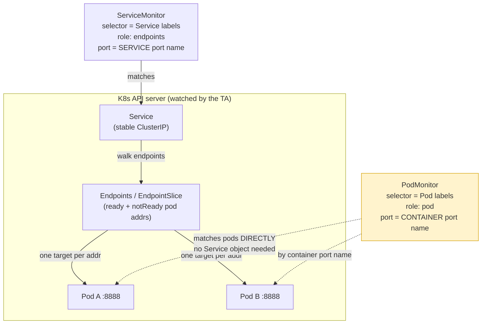
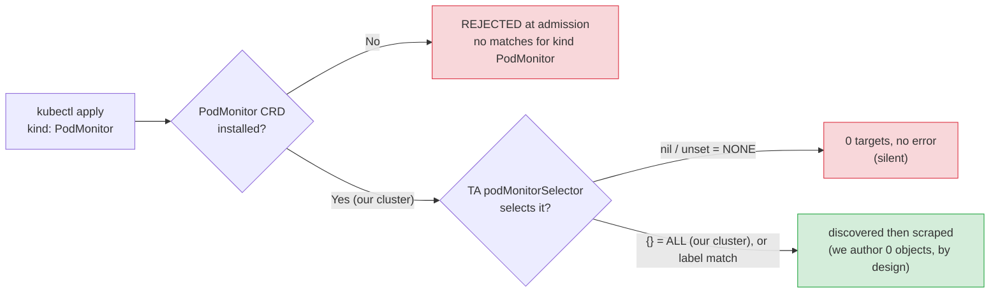

# Topic 12 — PodMonitor

> **The anchor idea:** A PodMonitor is a ServiceMonitor with the Service amputated. Same Prometheus
> Operator machinery, same two-stage relabel pipeline, same "declare intent, don't scrape" nature —
> but it discovers **pods directly** (`role: pod`) instead of walking a Service's Endpoints
> (`role: endpoints`). You reach for it precisely when **there is no Service** to hang a
> ServiceMonitor off of. In *our* stack we run **zero** of them, and that is a deliberate
> architecture choice — we mint a Service for everything so one discovery plane (ServiceMonitor)
> covers the fleet.

This doc is recollection-grade: read it cold months later with zero session memory and you should be
able to redraw the SM-vs-PM discovery split, recite the two-blocker gotcha that our cluster is sitting
on, and defend why we avoid PodMonitors entirely.

---

## WHY it exists

ServiceMonitor is the 95% case: anything with a Service in front of it (a Deployment behind a
ClusterIP, a DaemonSet you've given a headless Service, KSM, node-exporter) is scraped by selecting
that Service and walking its Endpoints. But Prometheus' Kubernetes service discovery has a `pod` role
that targets pods **directly by Pod IP**, with no Service object in the loop at all. PodMonitor is the
CRD that exposes that role.

The need is narrow but real: **some workloads have no Service and you don't want to invent one.**
- A **chart that ships metrics but no metrics Service.** The canonical example in our world is
  **cert-manager**: newer charts dropped the `:9402` metrics Service and moved to a chart-native
  **PodMonitor** path (`prometheus.podmonitor.enabled: true`). No Service = ServiceMonitor has nothing
  to select.
- **Short-lived Jobs / CronJobs** — nothing routes traffic to them, so there's no Service; if they
  live long enough to be scraped, a PodMonitor can target the pod directly. (For genuinely
  fire-and-forget jobs the real answer is Pushgateway — see T5/T7 — but a long-running Job pod is
  PodMonitor territory.)
- Any pod you want to scrape **per-pod** where introducing a Service would be pure ceremony.

> **The misconception to kill (I held it during the quiz): "DaemonSet → PodMonitor."** Wrong. A
> DaemonSet can absolutely sit behind a Service. **Our own node-exporter is a DaemonSet scraped by a
> ServiceMonitor** (`node-exporter-values.yaml` → `prometheus.monitor.enabled: true`). The trigger is
> **"no Service object,"** not "DaemonSet."

---

## WHAT it is

A `PodMonitor` is a Custom Resource (`kind: PodMonitor`, group
`monitoring.coreos.com`). Like ServiceMonitor it is **declarative intent, not a scraper** — it tells
the controller (the Prometheus Operator classically, or the **OTel Target Allocator** in our stack)
"generate scrape config for the pods matching this selector." The controller watches the API, computes
the target list, and the actual scraping is done by the collector/Prometheus.

It is a **different CRD object** from ServiceMonitor — `podmonitors.monitoring.coreos.com` vs
`servicemonitors.monitoring.coreos.com`. Installing one does **not** install the other. This matters
enormously in our cluster (see below).

### The deltas from ServiceMonitor — this *is* the topic

You already own ServiceMonitor (T11). PodMonitor is almost entirely a **delta**. Memorize this table;
everything else is identical.

| Aspect | ServiceMonitor | PodMonitor |
|---|---|---|
| Selects (the `selector`) | **Services** by their labels | **Pods** by their labels |
| K8s SD `role` generated | `endpoints` (or `endpointslice`) | `pod` |
| Endpoint port reference | the **Service** port **name** | the **container** port **name** (or `portNumber` for unnamed ports, newer operator) |
| Endpoints field name | `endpoints:` | `podMetricsEndpoints:` |
| Meta-labels available to relabel | `__meta_kubernetes_endpoints_*`, `__meta_kubernetes_service_*`, **and** `__meta_kubernetes_pod_*` (endpoints resolve back to pods) | **only** `__meta_kubernetes_pod_*` (no Service/Endpoints object in the path) |
| Needs a Service? | **Yes** | **No** — the entire reason it exists |
| CRD | `servicemonitors.monitoring.coreos.com` | `podmonitors.monitoring.coreos.com` (**separate object**) |
| Operator/TA selector that admits it | `serviceMonitorSelector` | `podMonitorSelector` |

**Everything else is the same machinery as ServiceMonitor:**
- `selector.matchLabels` / `matchExpressions` — which objects to pick.
- `namespaceSelector` — which namespaces to look in (`{}` = the CR's own namespace; `any: true` = all).
- `relabelings` = **Stage 1** (target-level, *pre-scrape*: drop/keep targets, rewrite `instance`,
  set `node`, etc.).
- `metricRelabelings` = **Stage 2** (per-sample, *post-scrape*: the **cardinality lever** — keep/drop
  whole metric families). Identical to the two-stage model from T6/T11.
- `interval`, `scrapeTimeout`, `honorLabels`, TLS/auth, etc. — same fields.

---

## HOW it works internally

1. **The TA (or Operator) watches `PodMonitor` objects** on the API server (just like it watches
   `ServiceMonitor`). To watch them at all, the **CRD must be registered** in the cluster.
2. For each PodMonitor whose labels match the controller's **`podMonitorSelector`**, it generates a
   scrape job with `kubernetes_sd_configs: [{ role: pod }]`, scoped by the `namespaceSelector`.
3. The **`role: pod` SD** enumerates Pods directly from the API. For each matching pod it emits a
   target at the pod's IP, with `__meta_kubernetes_pod_*` meta-labels
   (`pod_name`, `pod_node_name`, `pod_label_*`, `pod_container_port_name`, `pod_ready`, `pod_phase`,
   …). There is **no Service or Endpoints object touched**, so `__meta_kubernetes_service_*` and
   `__meta_kubernetes_endpoints_*` are simply **never populated**.
4. The `podMetricsEndpoints.port` is matched against the pod's **declared container port name**. If
   the container port has no `name:`, `port:` resolves nothing → 0 targets (you must name the port or
   use `portNumber`).
5. Stage-1 `relabelings` run on the target (pre-scrape). Then the scrape happens. Then Stage-2
   `metricRelabelings` run per sample (post-scrape). Same as SM.
6. Lifecycle tracking is **live via the API watch**: a new pod appears → target added; a pod is
   deleted → target removed. This is *why* PodMonitor doesn't accumulate dead targets despite pod IPs
   churning on every restart — it never works from a stale list, it works from the current watch
   state (modulo watch lag). (Same mechanism answer as the SM discovery question.)

### Discovery split — diagram



---

## Grounded in MY stack (live data, `meda-dev-goldfish-eksdemotest`, 2026-06-14)

This is the part that makes PodMonitor *click* for our platform, because the live state is
informative:

```text
$ kubectl get crd podmonitors.monitoring.coreos.com  → present  (pmon, monitoring.coreos.com/v1)
$ kubectl get podmonitor -A                           → No resources found   # ZERO PodMonitor OBJECTS
$ kubectl get servicemonitor -A                       → 23                   # everything is a ServiceMonitor
```

So our cluster has the **PodMonitor CRD installed** (it ships with every daily deploy) **and** the
TA's **`podMonitorSelector: {}`** set — *both* enabling conditions are satisfied — yet there are
**0 PodMonitor objects.** A PodMonitor authored today **would be discovered and scraped immediately**.
The reason we run zero is purely that **nobody creates the objects — by design** (we mint Services and
use ServiceMonitors). It's a *choice not to author the objects*, **not** a CRD/selector block.

> **Verify-live lesson (I got this wrong first):** `kubectl get podmonitor -A 2>/dev/null` returns
> empty output whether the CRD is **absent** (error suppressed) or **present with 0 objects** — they
> look identical. Always check the CRD directly: `kubectl get crd | grep podmonitor` /
> `kubectl api-resources | grep -i podmonitor`. Don't suppress stderr when its presence/absence is the
> very thing you're testing.

**Two concrete places PodMonitor shows up in our notes (`_meta_monitoring/OPTIMIZATION.md`):**

1. **Collector self-telemetry (`:8888`).** The daemonset collector (`obsrv-logs` / `obsrv-metrics-new`)
   has no Service by default — the OTel collector chart's daemonset mode renders no Service/SM. The
   *generic* fix would be a PodMonitor. **What we actually did** (`main.tf:46`): minted a
   **collector-self Service + ServiceMonitor** instead — "its `:8888` self-telemetry is covered by the
   collector-self ServiceMonitor (no PodMonitor)." We chose to add a Service rather than a second
   discovery plane.

2. **cert-manager.** Newer cert-manager charts offer `prometheus.podmonitor.enabled: true`
   (PodMonitor, needs the CRD). We **chose** the ServiceMonitor path (`prometheus.servicemonitor.enabled`)
   anyway — consistent with the SM-only design — even though the CRD is available. (The historical
   note that drove this said the CRD was absent; it's since been installed, but the SM decision stands
   on its own.) Note the silent footgun recorded there: the chart key is lowercase **`servicemonitor`**;
   camelCase `serviceMonitor` is silently ignored → no SM created. (Helm ignores unknown value keys —
   eyeball the rendered object.)

**The PodMonitor CRD is installed — the "fork" was already taken (live-verified 2026-06-14).** Older
`OPTIMIZATION.md` notes described a state where the CRD was *absent* and recommended installing it to
(1) let the OTel Operator auto-create the collectors' own `:8888` self-telemetry monitors and (2)
enable cert-manager's chart-native PodMonitor path. **That install has since happened** — the CRD now
ships with every daily deploy. Combined with **`podMonitorSelector: {}`** (set explicitly,
`meta_ta.yaml:19-23`, with the comment *"absent podMonitorSelector selects NONE, so it must be set
explicitly"*), **both gates are open**: a PodMonitor authored today would be scraped. We still cover
the collectors' `:8888` self-telemetry with the **collector-self ServiceMonitor** (`main.tf:46`) and
cert-manager with a **ServiceMonitor** (`prometheus.servicemonitor.enabled`) — i.e. even with the CRD
available we *deliberately* keep using SMs. The nil-vs-`{}` distinction below remains a real, must-know
trap (it's *why* the manifest sets `{}` explicitly), but it is **not** a current blocker here.

---

## HOW it scales / trade-offs

PodMonitor scales identically to ServiceMonitor — the TA shards the generated targets across collector
replicas (per-node or consistent-hashing); the CRD itself adds no scaling cost. The interesting
trade-offs are **architectural**, not performance:

| Axis | One-discovery-plane (our choice: SM only, mint Services) | Two planes (SM + PodMonitor) |
|---|---|---|
| **Operational surface** | One CRD, one selector, one mental model. Simpler. | Two CRDs, two selectors (`serviceMonitorSelector` + `podMonitorSelector`) to keep `{}`/matching. More to get wrong. |
| **Cost** | You create Service objects that exist *purely* for scraping (e.g. a Service in front of a daemonset nothing routes to) — extra objects/etcd entries, but cheap. | No spurious Services, but a whole CRD + selector plane to maintain. |
| **Coverage** | Can't scrape genuinely Service-less workloads (a chart that ships no Service forces your hand). | Covers Service-less workloads natively. |
| **Labels** | SM can attach Service-level meta-labels if you want them. | PodMonitor has only pod-level meta-labels (you "lose" Service identity). |

**Our stance:** ensure everything scrapeable **has a Service**, run **ServiceMonitor only**. The
PodMonitor CRD *is* installed and `podMonitorSelector: {}` *is* set — both gates are open — we simply
**choose not to author PodMonitor objects** (single plane in practice). The one thing that can *force*
a PodMonitor on us is a chart that ships metrics with no Service and only a PodMonitor path
(cert-manager almost did; we dodged it with an SM).

---

## COMMON FAILURE MODES (ranked by how often they bite)

1. **The CRD isn't installed.** `kubectl apply -f podmonitor.yaml` is **rejected at admission**
   (`error: resource mapping not found ... no matches for kind "PodMonitor" ... ensure CRDs are
   installed`). It never persists. *(Generic failure — **NOT** our state: our CRD is installed,
   live-verified. This is the trap in clusters that only installed the ServiceMonitor CRD.)*
2. **The selector selects none.** Even with the CRD present, if the TA/Operator's `podMonitorSelector`
   is **nil/unset** it selects **nothing** → **0 targets, no error**. `{}` (empty) selects **all**.
   Same nil-vs-`{}` trap as the ServiceMonitor selector (T11).
3. **Container port not named.** PodMonitor's `port:` matches the **container port name**. If the pod
   declares `containerPort: 8888` with no `name:`, `port: metrics` resolves nothing → 0 targets. Fix:
   name the container port, **or** use `portNumber: 8888` (newer operator).
4. **Wrong `namespaceSelector`.** Defaults to the PodMonitor's own namespace; if the pods live
   elsewhere and you didn't widen it → 0 targets.
5. **Relabel copied from a ServiceMonitor.** A `relabeling` keyed on a `__meta_kubernetes_endpoints_*`
   or `__meta_kubernetes_service_*` source label silently produces **empty output** under
   `role: pod` — those families don't exist. Only `__meta_kubernetes_pod_*` survives. (E.g. an SM that
   set a label from `__meta_kubernetes_service_label_*` must be rewritten to a pod-label source.)

> Notice failure modes 1, 2, 4 all manifest as the **same silent symptom: 0 targets, no error** — the
> exact same "#1 failure = empty target list" pattern as ServiceMonitor. Troubleshoot the same way:
> check the TA `/jobs` and `/jobs/<job>/targets`; confirm the CRD exists; confirm the selector matches;
> confirm the port name.

### A subtlety worth getting right: not-ready pods

A common (wrong) belief is that a ServiceMonitor "misses" a not-ready pod and a PodMonitor catches it.
The reality:
- A **CrashLooping pod with a Pod IP** lands in the Endpoints/EndpointSlice as a **not-ready address**
  (`__meta_kubernetes_endpoint_ready="false"`). Prometheus' `endpoints` role discovers not-ready
  addresses **by default** (the Operator adds no ready-only filter), so it **is** a target under a
  default ServiceMonitor (scrape fails → `up=0`), **and** under a PodMonitor. Both see it.
- The pod **neither** can scrape is one with **no Pod IP yet** — `Pending` / `ImagePullBackOff` /
  `ContainerCreating`. No IP = nothing to GET.
- Therefore, to **alert on a pod failing to start, the right tool is KSM**
  (`kube_pod_status_phase`, `kube_pod_container_status_restarts_total`), **not** a scrape monitor — a
  scrape monitor's whole vocabulary is `up=0`/`up=1` and it can't tell you *why* (pending vs image
  pull vs crashloop vs restart count). KSM emits phase and restart count directly.

---

## The two enabling gates — diagram

Both must pass before a PodMonitor produces a target. **Our cluster passes both** (CRD installed +
`podMonitorSelector: {}`) and follows the green path — it just has 0 objects authored.



---

## Practical exercises (live cluster)

1. **Confirm the CRD is present (don't suppress stderr):**
   `kubectl get crd podmonitors.monitoring.coreos.com` → exists (created with each daily deploy);
   `kubectl api-resources | grep -i podmonitor` → `podmonitors pmon ... PodMonitor`.
   `kubectl get podmonitor -A` → `No resources found` = **0 objects** (the CRD *is* served — if it
   weren't, you'd get `error: the server doesn't have a resource type "podmonitor"`). The
   stderr-suppressed `... 2>/dev/null` makes "absent" and "0 objects" look identical — don't do that.
2. **Confirm everything is a ServiceMonitor:** `kubectl get servicemonitor -A` → 23.
3. **Find the TA's selectors:** inspect the statefulset OTel Collector CR
   (`kubectl -n meta-monitoring get opentelemetrycollector obsrv-ta-metrics-stateful -o yaml`) → look
   for `targetAllocator.prometheusCR.serviceMonitorSelector` (`{}` = all) and `podMonitorSelector`
   (also `{}` = all — both explicitly set; live-verified 2026-06-14). With the CRD installed **and**
   `{}` on both selectors, the only reason PodMonitors contribute 0 targets is that **0 PodMonitor
   objects are authored** (by design).
4. **See where a PodMonitor *would* have been used:** read `_meta_monitoring/OPTIMIZATION.md` →
   "Fork: install the PodMonitor CRD?" and the cert-manager / collector-self-telemetry rows.
5. **(Thought experiment)** Author a PodMonitor for cert-manager right now (CRD present,
   `podMonitorSelector: {}` set). What happens? (Answer: it's **discovered and scraped immediately** —
   both gates are already open. The only reason we don't is the design choice to use SMs. In a cluster
   where the CRD were absent or the selector nil, you'd have to fix those first.)

---

## Memorize (one-liners)

- **PodMonitor = ServiceMonitor minus the Service.** `role: pod` vs `role: endpoints`; selects **pods**
  not **services**.
- **Separate CRD** (`podmonitors.monitoring.coreos.com`) — installing ServiceMonitor's CRD does not
  install it; if it's missing, `apply` is **rejected at admission**. Our cluster: **CRD installed**
  (ships with each daily deploy; live-verified).
- **`podMonitorSelector`: nil/unset = selects NONE; `{}` = selects ALL.** (Same trap as
  `serviceMonitorSelector`.) Two gates stacked: CRD must exist **and** selector must match — **ours
  are both open** (`{}`), so a PodMonitor written today would scrape.
- **Port = container port NAME** (or `portNumber` for unnamed). SM's port = the **Service** port name.
- **Meta-labels:** `role: pod` gives only `__meta_kubernetes_pod_*`; `__meta_kubernetes_endpoints_*`
  and `_service_*` **vanish** (no Service/Endpoints in the path).
- **Same two-stage relabel:** `relabelings` = Stage 1 (targets, pre-scrape); `metricRelabelings` =
  Stage 2 (samples, post-scrape, cardinality lever).
- **When to use it:** only when there is **no Service** and you won't mint one (chart ships no metrics
  Service → cert-manager; long-running Job). Otherwise **mint a Service + use ServiceMonitor.**
- **Our design:** SM-only, **0 PodMonitor objects authored** (CRD *is* installed + selector `{}` —
  both gates open; we just don't create them) — one discovery plane in practice; cost = a few
  scrape-only Service objects.
- **#1 failure = 0 targets, no error** (CRD absent / selector none / port unnamed / wrong namespace).
- **Failing-to-start pod?** Use **KSM** (`kube_pod_status_phase`, restarts), not a scrape monitor — a
  no-IP pod is invisible to both SM and PM.

---

## Quiz — Questions

> Asked live 2026-06-14. Exam-grade, no hints. (Answer key below — don't peek.)

1. **The two gates.** Name the **two cluster-level conditions** that must *both* hold before any
   PodMonitor you author produces targets. Give our live cluster's status on each (2026-06-14). Given
   that status, why does the cluster still have **zero** PodMonitor-sourced targets?
   *(Asked live in the stricter "what's rejected / what's the second blocker" form — reframed here for
   accuracy after live-verifying the CRD is installed. See the answer-key note.)*
2. **Port semantics.** A teammate migrates a working Service+ServiceMonitor to a PodMonitor: copies
   the YAML, flips `kind`, changes the selector to pod labels, keeps `port: metrics`. The pod declares
   `containerPort: 8888` with **no name**; the SM's `port: metrics` was the **Service** port name.
   After applying (CRD present, selector matches), it scrapes nothing. Why? Give the **two** fixes.
3. **Relabel blast radius.** Same migration: the old SM had a `relabeling` consuming a
   `__meta_kubernetes_endpoints_*`-family source label. After the move to PodMonitor it silently
   yields empty output. Why — what changes about the available **meta-label families** under
   `role: pod` vs `role: endpoints`? Name the family that survives and the one that vanishes.
4. **Your architecture.** Our stack runs **0 PodMonitors by design.** State (a) the design principle
   that lets you avoid them entirely, (b) one concrete **downside/cost** of that principle, and (c) the
   one real-world situation where a chart can still **force** a PodMonitor on you despite the
   principle.
5. **Discovery depth.** A pod is CrashLooping — never reaches Ready. Is it a scrape target under a
   default ServiceMonitor? Under a PodMonitor? And to **reliably alert on a pod failing to start**,
   which signal do you trust — SM, PM, or KSM — and why is a scrape monitor the wrong primary tool?

---

## Quiz — Answer key

1. **Gate 1 — the PodMonitor CRD must be registered.** It's a *separate* CRD from ServiceMonitor; if
   absent, `kubectl apply` is **rejected at admission** (`no matches for kind "PodMonitor"`).
   **Live: installed** (`podmonitors.monitoring.coreos.com`, ships with each daily deploy).
   **Gate 2 — the controller's `podMonitorSelector` must select it** (nil/unset = ***none***; `{}` =
   ***all***; or a matching label selector). **Live: `{}`** (set explicitly, `meta_ta.yaml:23`, with a
   comment noting absent = none). **Both gates are open** → a PodMonitor authored today would be
   discovered and scraped. The cluster still has **0 PodMonitor-sourced targets purely because 0
   PodMonitor objects are authored** — a design choice (we mint Services + use SMs), **not** a
   technical block.
   *(Live correction: I originally asked/answered this in the "apply is rejected, CRD absent" form
   from a stale `OPTIMIZATION.md` note. Verified live — the CRD **is** installed. The concepts tested
   — CRD-must-exist and selector nil-vs-`{}` — are unchanged and correct; only the claim about our
   live state was wrong.)*
2. **PodMonitor's `port:` matches the pod's *container* port NAME** (not a Service port name). The
   container port `8888` is **unnamed**, so `port: metrics` matches nothing → 0 targets. **Fix 1:**
   add `name: metrics` to the container port in the pod spec. **Fix 2:** point the PodMonitor at the
   numeric port — `portNumber: 8888` (newer operator) — leaving the pod spec untouched.
3. Under **`role: endpoints`** the SD walks the **Endpoints/EndpointSlice object**, so it attaches
   endpoints- and service-scoped meta-labels (`__meta_kubernetes_endpoints_*`, `__meta_kubernetes_service_*`)
   **and** resolves each address back to its pod (so `__meta_kubernetes_pod_*` ride along too). Under
   **`role: pod`** there is **no Service/Endpoints object in the discovery path** — the SD enumerates
   Pods directly. So `__meta_kubernetes_endpoints_*`/`_service_*` are **never populated** →
   **vanish**; only **`__meta_kubernetes_pod_*` survives**. A relabel keyed on the vanished family has
   an empty `source_labels` → empty output, no error.
4. **(a)** Principle: **ensure every scrapeable workload has a Service**, so a single ServiceMonitor
   discovery plane (+ one CRD) covers the whole fleet — we never stand up a second (PodMonitor)
   discovery plane. **(b)** Cost: you **create/maintain Service objects that exist purely for
   scraping** (a daemonset/agent nothing routes to still gets a Service — extra objects/surface), and
   you **can't cover genuinely Service-less workloads**. **(c)** Forced case: **a chart that ships
   metrics but no Service, exposing only a PodMonitor path** (newer **cert-manager** dropping its
   `:9402` Service); a long-running **Job** with no Service is a secondary case.
5. A CrashLooping pod **that has a Pod IP** is a **not-ready address** in the Endpoints/EndpointSlice;
   Prometheus discovers not-ready addresses **by default**, so it **is** a target under a default
   **ServiceMonitor** (scrape fails → `up=0`) **and** under a **PodMonitor**. The pod **neither** can
   scrape is one with **no Pod IP** (`Pending`/`ImagePullBackOff`/`ContainerCreating`). To reliably
   alert on a pod failing to start, trust **KSM** (`kube_pod_status_phase`,
   `kube_pod_container_status_restarts_total`): a scrape monitor's only vocabulary is `up=0/1` and a
   no-IP pod is invisible to it — KSM emits the phase and restart count directly, regardless of IP.

**Result: PASSED 2026-06-14 ✅** — clean cold on Q2 (port-name + `portNumber`), Q3 (meta-label split),
Q4 (mint-a-Service principle + overhead cost), Q5 (KSM not scrape). Two snags, both **recall** not
concept: Q1's second blocker (`podMonitorSelector` nil-vs-`{}` — conflated with Q3's meta-labels on
first pass) and a factual slip on Q5 (said CrashLoop has "no IP" — corrected: CrashLoop *has* an IP
and is scrapeable as a not-ready endpoint; the no-IP case is Pending/ImagePull). Both closed on retry.

**Mentor corrections logged (verify-live discipline — I got the live state wrong twice, the learner
caught it):**
1. I first said the TA's `podMonitorSelector` is *nil* (from a stale `OPTIMIZATION.md` note). Live +
   manifest (`meta_ta.yaml:23`) show it's explicitly `{}`. The learner's own answer was correct.
2. I then said the **PodMonitor CRD is absent** ("apply rejected at admission") — also wrong. The
   learner flagged "the CRD is installed long back"; live-verified it **is** installed
   (`podmonitors.monitoring.coreos.com`, served, `pmon`). My earlier `kubectl get podmonitor -A
   2>/dev/null` had suppressed the very error that distinguishes "absent" from "0 objects."
**Net true state:** CRD **installed** + `podMonitorSelector: {}` → **both gates open**; 0
PodMonitor-sourced targets purely because **0 objects are authored, by design**. The *concepts* tested
(separate CRD; nil-vs-`{}`; port-name; meta-label split; KSM-for-failing-pods) are all unchanged and
correct — only my claims about the cluster's live state were wrong, and are now fixed throughout this
doc + `progress.md` + the cheatsheet + `OPTIMIZATION.md`. **Lesson: never assert CRD/selector cluster
state from a stale doc or a stderr-suppressed `get`; check `kubectl get crd` / `api-resources`
directly.**
