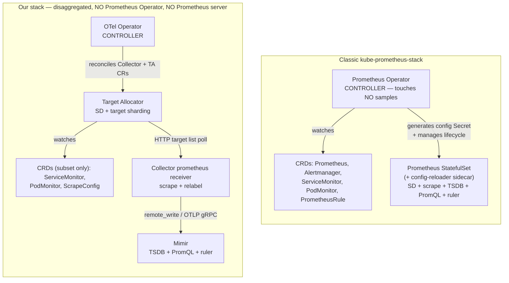

# Topic 13 — Prometheus Operator

> **The anchor idea:** The Prometheus Operator is a **Kubernetes controller**, not a Prometheus
> server and not a scraper. It **touches zero metric samples.** Input = CRDs; output = a generated
> `prometheus.yaml` (as a Secret) + a managed Prometheus StatefulSet. In *our* stack the Operator and
> the Prometheus server are **both absent** — we kept only its **interface** (the
> ServiceMonitor/PodMonitor/ScrapeConfig CRDs) and the OTel Operator + Target Allocator + collector +
> Mimir play the disaggregated roles.

Recollection-grade. Read cold months later and you should be able to (1) state precisely what the
Operator is vs the server it deploys, (2) explain why a CRD exists without its controller, (3) draw the
reconcile/reload chain and its TA-stack analog, and (4) defend the disaggregated architecture at
1000-team scale.

---

## WHY it exists

In a static VM world you hand-write `prometheus.yml` — every job, every target, every relabel. In a
dynamic Kubernetes cluster that's untenable: pods are created/destroyed constantly, IPs churn, teams
deploy new services hourly. You cannot hand-maintain a target list.

The Prometheus Operator solves this by letting each team **declare scrape intent as a Kubernetes
object** — a `ServiceMonitor` sitting next to their app — and having a controller **compile all of
them into Prometheus config automatically.** You stop editing config files; you create CRDs. The
Operator reconciles the desired state (the CRDs) into the running state (a configured Prometheus).

This is the standard Kubernetes **operator pattern**: encode operational knowledge (how to configure
and run Prometheus) into a controller that watches CRDs and reconciles.

---

## WHAT it is

A **controller** (a Deployment running a reconcile loop) that watches a specific set of CRDs and
manages Prometheus-stack workloads. It is emphatically **NOT**:
- **not a scraper** — the Prometheus *server* it deploys does the scraping;
- **not storage** — the Prometheus server's TSDB stores samples;
- **not a Prometheus server** — it *creates and configures* one (or many).

> **The #1 misconception (I held it on the assessment):** "the Operator is scraping too many targets
> and its TSDB is full." **Both halves are category errors.** The Operator never scrapes (the server's
> SD/retrieval does) and has no TSDB (the server does). The Operator only writes config and manages
> pods.

### Its CRDs (the full prometheus-operator bundle)
- **`Prometheus`** — desired Prometheus server(s): replicas, retention, resource limits, **which
  ServiceMonitors/PodMonitors to select** (`serviceMonitorSelector`, `serviceMonitorNamespaceSelector`,
  etc.).
- **`Alertmanager`** — desired Alertmanager cluster.
- **`ServiceMonitor`** — scrape intent for Services (T11).
- **`PodMonitor`** — scrape intent for Pods (T12).
- **`ScrapeConfig`** — raw/additional scrape configs (non-CRD targets, external).
- **`PrometheusRule`** — recording + alerting rules.
- **`Probe`** — blackbox-style probe targets.
- **`ThanosRuler`** — Thanos rule evaluation.

The Operator's job: turn `Prometheus` + the selected `ServiceMonitor`/`PodMonitor`/`PrometheusRule`
CRs into a running, configured Prometheus StatefulSet.

### CRD ≠ controller (the key independence)
A **CRD is a passive API schema** — `kubectl apply` of a CRD YAML just extends the Kubernetes API so
`kind: ServiceMonitor` becomes a valid object. **Installing the CRD is completely independent of
running any controller.** If you install the ServiceMonitor CRD and create 5 ServiceMonitor objects
with nothing else deployed, those 5 objects are **inert rows in etcd** — no target is created, nothing
scrapes. A **consumer** (the Operator → `prometheus.yaml`, or the OTel TA → target list) is what turns
the intent into scraping. This independence is exactly why our cluster has ServiceMonitor/PodMonitor
CRDs **without** the Prometheus Operator — they were installed standalone so a *different* consumer
could speak the same API.

---

## HOW it works internally — the reconcile + reload loop

1. **Watch.** The Operator watches its CRDs (the `Prometheus` CR + all selected
   `ServiceMonitor`/`PodMonitor`/`ScrapeConfig`/`PrometheusRule`).
2. **Render.** On any change it **generates `prometheus.yaml`** (all scrape jobs, relabel configs,
   rule file references) and stores it as a **Kubernetes Secret**.
3. **Manage the StatefulSet.** It creates/updates the **Prometheus StatefulSet** (the actual server),
   mounting that Secret, plus a **config-reloader sidecar** in the same pod.
4. **Reload without restart.** When the Secret changes, the **config-reloader sidecar** detects it and
   calls Prometheus's **`/-/reload`** endpoint (SIGHUP). Prometheus re-reads its config → the new
   scrape job/target is live, **no pod restart**. (`PrometheusRule` CRs render to rule files the same
   way and reload identically.)
5. **Selectors gate discovery.** The **`Prometheus` CR's** `serviceMonitorSelector` /
   `serviceMonitorNamespaceSelector` decide which SMs this Prometheus picks up — the same two-layer
   selector model as T11/T12 (the CR selects SM *objects*; each SM selects its Services). `{}` = all,
   nil = none.

> **The two artifacts to memorize:** (a) the intermediate artifact = the **`prometheus.yaml` Secret**;
> (b) the reload mechanism = the **config-reloader sidecar** hitting `/-/reload`. Those are the exact
> things that have *analogs* in our stack (below).

---

## Grounded in MY stack (live, `meda-dev-goldfish-eksdemotest`, 2026-06-14)

The live reality is that **there is no Prometheus Operator and no Prometheus server at all:**

```text
$ kubectl get deploy -A | grep -i prometheus-operator   → (none)
$ kubectl get deploy -A | grep -i opentelemetry-operator → opentelemetry-operator  1/1  (running, 14h)
$ kubectl get crd | grep monitoring.coreos.com
    podmonitors.monitoring.coreos.com
    scrapeconfigs.monitoring.coreos.com
    servicemonitors.monitoring.coreos.com         # ← only a 3-CRD SUBSET (no prometheuses/
                                                  #   alertmanagers/prometheusrules/probes)
$ kubectl get prometheus,alertmanager,prometheusrule -A → (CRDs absent → nothing)
```

So we kept the Operator's **interface** (the de-facto-standard `ServiceMonitor`/`PodMonitor`/
`ScrapeConfig` CRDs) but discarded its **controller**, the full CRD bundle, *and* the Prometheus
server. The roles are split across components:

| Classic role | What does it here |
|---|---|
| Prometheus **Operator** (controller) | **OTel Operator** — reconciles `OpenTelemetryCollector`/TA CRs into Deployments/StatefulSets |
| Operator config-gen + Prometheus **SD** | **Target Allocator** (SD + target sharding) |
| Prometheus **retrieval** (scrape) | **Collector** `prometheus` receiver (scrape + relabel) |
| Prometheus **TSDB + PromQL + ruler** | **Mimir** (S3-backed, multi-tenant, HA) |
| **config-reloader sidecar** (SIGHUP `/-/reload`) | **TA HTTP poll** — the receiver polls the TA's `/jobs` / `/scrape_configs`, picks up new targets dynamically |
| `PrometheusRule` CRD | **Mimir ruler** (rules live in `_9_grafana_dashboards/rules/`, not in-cluster CRs) |

### The reconcile/reload analog (the chain, both stacks)
- **Classic:** edit SM → Operator regenerates the **`prometheus.yaml` Secret** → **config-reloader
  sidecar** calls `/-/reload` → new target scraped, no restart.
- **Ours:** edit SM → **TA** (watching the SM CRD) recomputes the **target list it serves over HTTP**
  → the collector's `prometheus` receiver **polls the TA** on its interval and picks up the new target
  → scraped, no restart, no Secret, no sidecar.

### Diagram



---

## HOW it scales / trade-offs

The Operator itself is a lightweight singleton (a controller — cheap). The scaling question is really
about the **data plane** it manages, and that's where the classic model strains at fleet scale:

| Axis | Classic Operator + Prometheus | Our TA + collector + Mimir |
|---|---|---|
| **Scrape scaling** | One Prometheus scales **vertically** (bigger box) or you shard manually / add Thanos. Single server = **SPOF for all metrics**. | TA **shards targets horizontally** across collector replicas (per-node / consistent-hashing). No single scraper SPOF. |
| **Storage** | Local **TSDB** on disk — limited retention, **single-tenant**, **not HA** (lose the pod, lose recent data). | **Mimir**: S3-backed, **long retention**, **multi-tenant** (`X-Scope-OrgID`), **HA-replicated**. |
| **Rules** | `PrometheusRule` CRs evaluated **in the server**. | Evaluated by the **Mimir ruler** (centralized). |
| **Simplicity** | Fewer moving parts; mature kube-prometheus-stack ecosystem. | More components + the TA↔collector HTTP dependency; you maintain the pipeline. |

**Two reasons the disaggregated model wins at ~1000 teams:** (1) **horizontal target sharding** across
collectors instead of one vertically-scaled Prometheus SPOF; (2) **Mimir storage** — S3-backed, long
retention, multi-tenant, HA — vs a single server's local, short-retention, single-tenant TSDB.

**What you lose:** the full prometheus-operator CRD surface and in-server semantics — no
`Prometheus`/`Alertmanager`/`PrometheusRule`/`Probe` CRDs here; **recording/alerting rule evaluation
moves to the Mimir ruler**; no local Prometheus UI/federation; and the single-binary simplicity of
kube-prometheus-stack.

---

## COMMON FAILURE MODES

1. **Operator down (classic).** The **running Prometheus keeps scraping its last config** — so data
   keeps flowing. But CRD changes stop reconciling: a **new ServiceMonitor deployed during the outage
   is ignored** until the Operator returns. The precise thing frozen is **config/SD reconciliation,
   not data**. (Our analog: **TA down** → collectors **keep scraping the last fetched target list**;
   new SMs aren't discovered; target-allocation/SD is frozen. The target list is **not emptied** — it
   parallels the Operator-down case exactly.)
2. **OTel Operator down (ours).** CR edits (collector/TA spec changes) don't reconcile, but **running
   collectors keep scraping**. Reconciliation frozen, data fine.
3. **Selector scoping.** `serviceMonitorSelector`/`…NamespaceSelector` (on the `Prometheus` CR
   classically, or the TA's `prometheusCR` here) nil = none, `{}` = all. Wrong selector = silently no
   targets (T11/T12).
4. **CRD / controller version skew.** Operator expects a CRD schema version it doesn't find → render
   errors / dropped fields. (Helm silently ignores unknown value keys — eyeball the rendered object.)
5. **RBAC.** The watcher (Operator or TA) needs cluster-wide `get/list/watch` on the CRDs + endpoints/
   pods. Missing RBAC = it silently sees nothing → 0 targets, no obvious error.
6. **Mistaking a missing CRD for a missing controller (or vice-versa).** `kubectl apply` of a CR when
   its CRD is absent → **rejected at admission** (`no matches for kind`). A CR sitting unprocessed when
   the CRD exists but no controller runs → **inert object, no error.** Different symptoms, different
   fixes. (Don't suppress stderr on `kubectl get` when presence is the question — see T12.)

---

## Practical exercises (live cluster)

1. **Prove there's no Prometheus Operator / server:** `kubectl get deploy -A | grep -i prometheus-operator`
   → none; `kubectl get statefulset -A | grep -i prometheus` → none.
2. **Confirm the OTel Operator is the live controller:** `kubectl get deploy -A | grep -i opentelemetry-operator`.
3. **Confirm the 3-CRD subset (no full bundle):** `kubectl get crd | grep monitoring.coreos.com` →
   only `servicemonitors`, `podmonitors`, `scrapeconfigs`. `kubectl get prometheus -A` → CRD absent.
4. **See the reload analog live:** port-forward the TA (`svc/<col>-targetallocator:80`) → `GET /jobs`,
   `/scrape_configs`, `/jobs/<job>/targets` — that HTTP-served target list is what the
   `prometheus.yaml` Secret + config-reloader sidecar replace.
5. **Find where rules live (since no `PrometheusRule` CRD):** `_9_grafana_dashboards/rules/` → Mimir
   ruler, not in-cluster CRs.

---

## Memorize (one-liners)

- **Operator = controller, NOT a server / scraper / TSDB.** Input = CRDs; output = `prometheus.yaml`
  Secret + managed Prometheus StatefulSet. Touches **zero** samples.
- **CRD ≠ controller.** A CRD is passive API schema; objects are inert until a **consumer** (Operator
  or TA) reads them. That's why we have the SM/PM CRDs with no Operator.
- **Reconcile/reload:** SM change → Operator regenerates the **`prometheus.yaml` Secret** →
  **config-reloader sidecar** hits **`/-/reload`** → live, no restart.
- **Our analogs:** Secret → **TA's HTTP target list**; config-reloader sidecar → **collector receiver
  polling the TA**. No Secret, no sidecar, no reload — a continuous fetch.
- **Disaggregation:** Operator→**OTel Operator**; config-gen+SD→**TA**; scrape→**collector receiver**;
  TSDB/PromQL/ruler→**Mimir**; `PrometheusRule`→**Mimir ruler**.
- **Operator/TA down = config/SD frozen, NOT data** — existing scraping continues on the last config/
  target list; only new discovery stops. (TA down ≠ empty list.)
- **Scale wins:** horizontal target sharding (vs single-Prometheus SPOF) + Mimir (S3/long-retention/
  multi-tenant/HA) vs local TSDB. **Lose:** the `Prometheus`/`Alertmanager`/`PrometheusRule` CRDs +
  in-server rule eval (→ Mimir ruler).
- **Live state:** no Prometheus Operator, no Prometheus server; OTel Operator running; only a **3-CRD
  subset** (servicemonitors/podmonitors/scrapeconfigs).

---

## Quiz — Questions

> Asked live 2026-06-14. Exam-grade, no hints. (Answer key below — don't peek.)

1. **Operator vs server.** A teammate says *"our Prometheus Operator is scraping too many targets and
   its TSDB is full."* Two things are categorically wrong about what a Prometheus Operator is — name
   both, and say which component each symptom actually belongs to.
2. **CRD vs controller.** Fresh cluster: you `kubectl apply` the ServiceMonitor **CRD**, then create 5
   ServiceMonitor objects. Nothing else installed (no Operator, no TA). Do they do anything? What is a
   CRD vs what makes a ServiceMonitor actually cause scraping?
3. **Reconcile / reload chain.** Classic stack: edit a ServiceMonitor at 14:00, scraped by 14:01, no
   restart. Name (a) the intermediate **artifact** the Operator produces and (b) the **component** that
   triggers the reload. Then state what plays each role in our stack.
4. **Failure-mode nuance.** Operator down 3h (classic): (a) does existing Prometheus keep scraping?
   (b) new app+SM deployed mid-outage — scraped? (c) what's frozen? Then the same three for **our**
   stack with the **Target Allocator** down 3h.
5. **Why this design.** At ~1000 teams, give two reasons TA+collector+Mimir beats classic
   Operator+Prometheus, and one thing you genuinely lose.

---

## Quiz — Answer key

1. **(i)** The Operator does **not scrape** — the **Prometheus server**'s SD/retrieval does. **(ii)**
   The Operator has **no TSDB** — the **Prometheus server** stores samples. The Operator is a
   controller that writes `prometheus.yaml` (Secret) and manages the StatefulSet; it touches no
   samples.
2. They do **nothing** — they're **inert API objects in etcd**, no target is created. A **CRD** is a
   passive API schema that makes `kind: ServiceMonitor` a valid object; a **consumer/controller**
   (Operator → `prometheus.yaml`; or the OTel TA → target list) is what turns the intent into actual
   scraping. **CRD ≠ controller.**
3. **(a)** Artifact = the generated **`prometheus.yaml` stored as a Kubernetes Secret**. **(b)** Reload
   trigger = the **config-reloader sidecar**, which detects the Secret change and calls Prometheus
   **`/-/reload`** (no restart). **Our stack:** the artifact analog = the **target list the TA serves
   over HTTP** (no Secret); the reload analog = the **collector's `prometheus` receiver polling the
   TA** on its interval and picking up new targets dynamically.
4. **Classic (Operator down):** (a) **yes** — existing Prometheus keeps scraping its last config; (b)
   **no** — the new SM is ignored until the Operator returns; (c) **config/SD reconciliation is
   frozen, not data.** **Ours (TA down):** (a) **yes** — collectors keep scraping the **last fetched
   target list** (not empty); (b) **no** — new SM not discovered; (c) **target-allocation/SD frozen.**
   The two cases are parallel.
5. **Two reasons:** (1) **horizontal target sharding** across collector replicas (the TA) vs a single
   vertically-scaled Prometheus that is a **SPOF for all metrics**; (2) **Mimir storage** — S3-backed,
   long retention, multi-tenant, HA-replicated — vs a single server's local, short-retention,
   single-tenant TSDB. **What you lose:** in-server recording/alerting rule evaluation and the
   `Prometheus`/`Alertmanager`/`PrometheusRule` CRD surface — **relocated to the Mimir ruler** (the
   `PrometheusRule` CRD isn't even installed here).

**Result: PASSED 2026-06-14 ✅** — assessment opened with the **Operator-vs-server conflation** (said
the Operator "does SD → scrape → storage"); fully corrected by the graded quiz. Recovered on retry:
Q3 (initially gave the SD/scrape split instead of the **Secret + config-reloader** artifact/trigger —
then nailed both + the TA analogs), Q4's TA-down half (first said "list is empty" → corrected to "keeps
the last fetched list," parallel to Operator-down), Q5's second scale reason (**Mimir S3/retention/
multi-tenant/HA**). Q1/Q2 clean cold by quiz time. Core gap closed: **Operator = controller, not a
server.**
