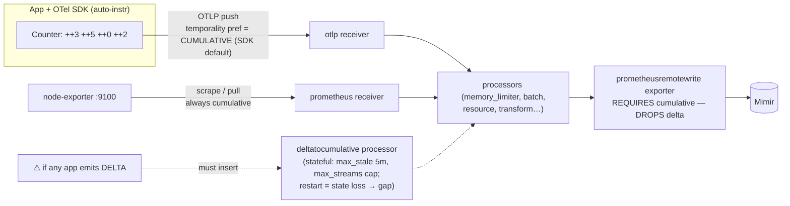
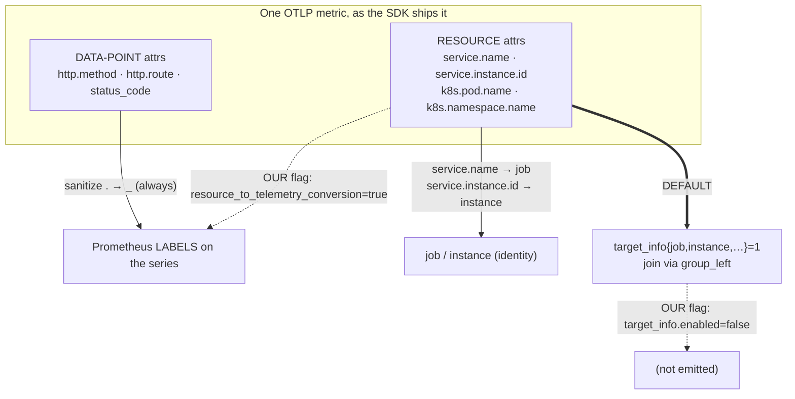
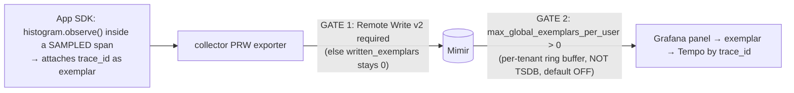

# Topic 14 — OTel metrics: the second dialect (data model, temporality, translation)

> Gold-standard per-topic doc (same shape as `Topic4.md`). Self-contained for cold revision.
> Phase 1 · Metrics · **core mastered 2026-06-18**; the 5-Q final exam is **PENDING — resume here**.
> The anchor idea: **your collector speaks two metric dialects** — Prometheus (pull, always
> cumulative) and OTLP (push). T14 is everything about the second one and how it is *translated*
> into the first so Mimir can store it. The single fact that unlocks the topic:
> **Prometheus/Mimir only understands CUMULATIVE counters; OTLP can also be DELTA — and the
> `prometheusremotewrite` exporter DROPS delta rather than corrupting it.**

---

## WHY OTel metrics exist
Prometheus is one vendor's wire format and pull model. OpenTelemetry is a **vendor-neutral**
standard covering **all three signals** (metrics, logs, traces) under one SDK, one wire protocol
(**OTLP**), one set of semantic conventions. Apps instrument **once** (often via
**auto-instrumentation** agents — Java/Python/.NET) and **push** OTLP to a collector; the collector
fans out to whatever backend you run. You adopt the OTel metric model the moment an app emits OTLP
instead of exposing a `/metrics` page.

In our stack that means the collector has **two ingestion dialects** that must converge on one
backend:
- **Prometheus dialect** — the `prometheus` receiver, TA-driven **pull** scrape (node-exporter, KSM,
  cAdvisor, Mimir self-metrics). Always cumulative (T1–T13).
- **OTLP dialect** — the `otlp` receiver, app **push** (gRPC :4317 / HTTP :4318). This is T14.

They **diverge only at the receiver** (pull vs push). The instant they're past it they share the
same `processors` and the same `prometheusremotewrite` exporter → Mimir. So the collector is a
**pull→push *and* push→push merge point**: two dialects in, one cumulative PRW stream out.

## WHAT it is — the OTel metric data model
Three things define an OTel metric, and each translates differently into a Prometheus series:

### (a) The instrument (what kind of measurement)
| OTel instrument | Monotonic? | Sync + async? | → Prometheus type | Note |
|---|---|---|---|---|
| `Counter` / `ObservableCounter` | yes (cumulative sum) | both | **counter** (`_total`) | `rate()`-able |
| `Histogram` | — | sync only | **histogram** (`_bucket`/`_sum`/`_count`) | distribution |
| `Gauge` / `ObservableGauge` | — | sync(new)/async | **gauge** | last value |
| **`UpDownCounter`** / `ObservableUpDownCounter` | **no** (cumulative sum, ±) | both | **gauge** | ⚠ **lossy — the "no clean counterpart"** |
| — | | | summary | **NO OTel instrument emits this** |

Two traps killed here:
- **"async/observable" is NOT a metric type.** `Observable*` = the *callback* flavor of the same
  instrument — the value is pulled by a callback **at export time** instead of recorded inline.
  `ObservableCounter`→counter, `ObservableGauge`→gauge. There is no "observable type."
- **OTel produces zero Summaries.** Summary is a Prometheus-legacy type with no OTel instrument;
  every summary in Mimir came from a *native Prometheus* exporter, never from OTLP.
- **`UpDownCounter` is the one with no clean Prometheus counterpart.** It is a *cumulative, additive
  sum that can also decrease* (queue depth, in-flight requests). Prometheus has only **counter**
  (monotonic) and **gauge** (free) — nothing for "non-monotonic sum" — so it degrades to a **gauge**,
  losing the additive-sum meaning. You must **never** `rate()` it: a legitimate decrease would trip
  a false counter-reset (see Temporality).

### (b) The attributes (three layers — DO NOT collapse them)
| OTel layer | Describes | Examples | Prometheus analogy |
|---|---|---|---|
| **Resource attributes** | the **source/entity** emitting | `service.name`, `service.instance.id`, `k8s.pod.name`, `k8s.namespace.name` | **target labels** (`job`, `instance`) |
| **Scope** | the instrumentation **library** | `otel_scope_name`, `otel_scope_version` | (no real analog) |
| **Data-point attributes** | the **individual measurement** | `http.method`, `http.route`, `http.status_code` | **metric labels** |

### (c) Temporality (cumulative vs delta) — THE big one
How a sum reports its value over a stream of exports:

| Export # | Events in window | **Cumulative** reports | **Delta** reports |
|---|---|---|---|
| 1 | 3 | 3 | 3 |
| 2 | 5 | 8 | 5 |
| 3 | 0 | 8 | 0 |
| 4 | 2 | 10 | 2 |

- **Cumulative** = running total since a fixed `start_time` (the Prometheus model;
  `node_cpu_seconds_total` is cumulative).
- **Delta** = increment since the *last* export; each point carries its own `[start, end)` window.

## HOW it works internally

### 1. Why Prometheus/Mimir requires cumulative
PromQL `rate()`/`increase()` are **built** on cumulative semantics: diff consecutive samples ÷ Δt,
and **detect resets** (value drops below previous ⇒ counter restarted ⇒ compensate by *adding* the
post-drop value — T5). A delta point has none of that contract. Write the delta sawtooth `3,5,0,2,…`
into Prometheus as a counter and `rate()` reads **every dip as a reset**, adding the post-dip value →
**inflated garbage** (too high). That is the conceptual reason delta is incompatible.

### 2. What ACTUALLY happens to delta in OUR pipeline (the operational truth)
The `prometheusremotewrite` exporter's contract is **cumulative**. Per its DESIGN doc, incoming
**delta** monotonic-sum/histogram metrics are *"cumulative or otherwise **dropped**."* So:
> **In our stack a misconfigured delta counter does NOT produce an inflated graph — the PRW exporter
> silently DROPS it. The metric simply goes MISSING.** The exporter protects you by *refusing rather
> than corrupting*. The symptom you debug is **"missing metric"** (→ T29), not "wrong graph."

Who makes it cumulative (push the statefulness somewhere):
1. **The SDK (default + cleanest).** The OTLP metrics exporter's temporality preference defaults to
   **cumulative** (`OTEL_EXPORTER_OTLP_METRICS_TEMPORALITY_PREFERENCE=cumulative`); the SDK holds the
   running total. Auto-instrumented apps therefore emit cumulative → nothing to convert.
2. **The collector `deltatocumulative` processor** — only if something emits delta. **Stateful**:
   - `max_stale` (default **5m**): a series with no new sample for 5m is evicted → on return it
     **re-baselines** (gap / false reset).
   - `max_streams` (default **unbounded / max-int**): cap on the per-series state table —
     **set this or a high-cardinality delta metric OOMs the collector.**
3. **Mimir's OTLP ingest path** (if writing OTLP straight to Mimir instead of via PRW).



### 3. The OTel → Prometheus translation (the `prometheusremotewrite` exporter)
Default behavior (no overrides):
1. **Name sanitization** — `.`/`-`/invalid → `_`. `http.server.duration` → `http_server_duration`.
   (always)
2. **`add_metric_suffixes: true`** — appends unit + type suffix: a Counter `http.server.requests` →
   `http_server_requests_total`; a Histogram explodes to `_bucket`/`_sum`/`_count`; a unit gives
   `_seconds`/`_bytes`. *This is the same machine that reconstructs `_bucket{le="+Inf"}` if you drop
   only `_bucket` — the whole-family-drop trap (drop `_(bucket|sum|count)` together).*
3. **Data-point attributes → labels.** Always, directly, sanitized.
4. **`service.name` (+ `service.namespace`) → the `job` label; `service.instance.id` → `instance`.**
   The two identity labels come from resource attrs, not from generic flattening.
5. **Every *other* resource attribute → `target_info{job, instance, …} = 1`** (a synthetic gauge).
   By default they are **NOT** labels on your series — you **join**:
   `my_metric * on(job,instance) group_left(k8s_pod_name) target_info`.



## Grounded in MY stack (live config)
Gateway PRW exporter — `_8_otel_collector/manifests/values.yaml:90`:
```yaml
prometheusremotewrite:
  endpoint: "${mimir_endpoint}"
  resource_to_telemetry_conversion:
    enabled: true     # flatten ALL resource attrs → labels on every series
  target_info:
    enabled: false    # the DEFAULT carrier, DISABLED (see below)
  add_metric_suffixes: true   # the _total / _seconds / _bucket suffix rule
```
- **`resource_to_telemetry_conversion: true` overrides step 5** — every resource attribute is smeared
  onto every series as a label. That is why "all attributes are labels" felt true in our cluster — it
  is **our config choice, not the default.** Cost: ~24 labels/series, the 3-way label-stacking
  cleanup. Benefit: `http_requests_total{deployment_environment="prod"}` **just works** (no join).
- **`target_info.enabled: false`** — flattening makes `target_info` redundant, *and* the multi-replica
  autoscaled gateway was racing that single shared series → `err-mimir-sample-out-of-order`. Disabled
  safely because the only dashboard use was an `or`-fallback covered by the direct-label branch.
- The per-team `resource: {delete k8s.pod.name …}` + `transform: scope set("")` blocks in
  `meta_metrics.yaml`/`meta_ta.yaml` exist **only** to pay down the duplicate labels the flatten would
  otherwise create (the dedup is done at the **per-team** collectors, NOT the shared gateway, to keep
  multi-tenant blast radius zero).

**PromQL filter contrast (why teams flip the flatten on):**
- *Vanilla:* `http_requests_total{deployment_environment="prod"}` → **nothing** (label not on the
  series); must join `... * on(job,instance) group_left(deployment_environment) target_info{...}`.
- *Ours:* `http_requests_total{deployment_environment="prod"}` → **works** (direct label). Fat series,
  cheap queries; we then dedup to claw width back.

### Depth A — Exemplars (the metrics→traces bridge)
An **exemplar** is a single example measurement attached to a metric sample, carrying a `trace_id`
(rides *alongside* the series → **zero cardinality cost**). A latency-bucket sample says "…and here's
the trace_id of one request that landed here." Grafana panel → click exemplar dot → jump to that
trace in Tempo. **Two gates, both currently SHUT in our stack:**
- **Gate 1 (collector):** writing exemplars needs **Remote Write v2**
  (`protobuf_message: io.prometheus.write.v2.Request`). Confirmed by
  `otelcol_exporter_prometheusremotewrite_written_exemplars` being *"only available when using remote
  write v2."* Our PRW is classic v1 → exemplars silently never written.
- **Gate 2 (Mimir):** exemplar storage is **off by default**; enable per-tenant
  `max_global_exemplars_per_user` (e.g. `100000` for `obsrv`). It's a capped in-memory circular
  buffer, **not the TSDB** — cheap, high RCA payoff.
- **Classic failure:** turn exemplars on in the SDK, leave PRW at v1 → they never arrive,
  `written_exemplars`=0, afternoon wasted. **Both gates or nothing.**



### Depth B — Native / exponential histograms
| | Classic histogram (we run this) | Native / exponential histogram |
|---|---|---|
| Buckets | you pre-pick `le` boundaries | generated dynamically, exponential scale |
| Series cost | ~#buckets+2 (**~15** for `cortex_request_duration_seconds`) | **1 series** for the whole distribution |
| Resolution | fixed at instrumentation time | adaptive; re-resolvable at query time |
| Compatibility | universal | needs protobuf RW + Mimir flag |

- OTel SDK emits an **exponential histogram** → collector converts → Mimir stores a **native
  histogram**. Mimir gate: `native_histograms_ingestion_enabled: true` per-tenant (default **OFF**) +
  `max_native_histogram_buckets` cap; for sharded queries `query_result_response_format: protobuf`.
- **Our state: OFF.** `cortex_request_duration_seconds` is still classic (the `_bucket` series dumped
  in T3). Migrating fat histograms to native is the **single biggest histogram-cardinality lever** —
  defer the rollout to T25/T26 but it is *the* move.
- Watch: exemplars-on-native-histograms not supported on the pull exporter path; protobuf-RW-gated.

### Depth C — Delta-temporality audit (static, 2026-06-18 — no live cluster)
- Config grep across `_8_otel_collector` / `_meta_monitoring` / `_golden_template` returned **empty**
  for `exemplar | native_histogram | exponential | deltatocumulative | temporality`.
- **No `deltatocumulative` processor anywhere** + SDK OTLP default = cumulative + the
  drop-not-corrupt failure mode (a stray delta would surface as a *missing* metric, none observed) ⇒
  **our apps emit cumulative; nothing is being converted or dropped.** Verified by config-absence +
  SDK default; a live spot-check is deferred until a cluster is up.

## HOW it scales / trade-offs
- **Flatten (`resource_to_telemetry_conversion`) vs `target_info`**: flatten = cheaper queries, fatter
  series + churn (must dedup); target_info = lean series, every panel pays a `group_left` join.
- **Native vs classic histograms**: native = ~1 series vs ~15, adaptive resolution, but protobuf-RW +
  Mimir-flag gated and less universally compatible.
- **Exemplars**: tiny capped buffer for a huge debugging payoff, but gated on RW v2 + Mimir limit.
- **Temporality statefulness**: cumulative-at-SDK pushes state to the SDK (free); delta + collector
  conversion pulls a stateful, memory-growing table into the collector.

## Common failure modes
- **Delta counter → DROPPED by PRW → missing metric** (silent; debug as "missing metric", not "wrong
  graph"). Fix: SDK cumulative, or add `deltatocumulative` (+`max_streams`).
- **`rate()` on a delta-as-counter** (conceptual) or **on an `UpDownCounter`/gauge** → inflated garbage
  from false reset detection.
- **Exemplars on, RW v1** → never arrive, `written_exemplars`=0.
- **Whole-family histogram drop trap** → dropping only `_bucket` lets `add_metric_suffixes` rebuild
  `_bucket{le="+Inf"}`; drop `_(bucket|sum|count)` together.
- **`resource_to_telemetry_conversion` on, unmanaged** → label explosion + churn (the cleanup we did).
- **Reading a counter raw / averaging raw counters** → meaningless (rate first, aggregate second).

## Troubleshooting approach
1. **OTLP metric missing in Mimir?** Suspect temporality first: is the app/exporter delta? PRW would
   have dropped it. Check the collector's `otelcol_exporter_*` and `otelcol_processor_dropped_*`.
2. **Label you expected isn't there?** Resource attr vs data-point attr — resource attrs only land as
   labels because of our flatten; check the per-team `resource: delete` list didn't strip it.
3. **Exemplars absent?** Check RW version (v2?) and `written_exemplars` counter, then Mimir's
   `max_global_exemplars_per_user`.
4. **Wrong/duplicate `job`/`instance`?** `service.name`/`service.instance.id` mapping; collisions →
   `exported_*`/`honor_labels` (T6/cheatsheet).

## Interview questions
- Why can't Prometheus store a delta counter, and what are the three ways to make it cumulative?
- What does the `prometheusremotewrite` exporter do with a delta monotonic sum — convert or drop? Why
  is that the safer choice, and how does the failure surface?
- Where do OTel **resource** attributes go by default vs with `resource_to_telemetry_conversion`?
  What's `target_info` and how do you query with it?
- Map every OTel instrument to a Prometheus type. Which has no clean counterpart and why? Which
  Prometheus type has no OTel producer?
- What two gates must be open end-to-end for exemplars, and how do you confirm each?
- Classic vs native histogram: series cost, the Mimir flag, and one limitation of native.

## Practical exercises (when a cluster is up)
1. Find an OTLP-origin series in Mimir; confirm its `job`/`instance` came from
   `service.name`/`service.instance.id`, and that a resource attr (e.g. `k8s_namespace_name`) is a
   direct label (proof the flatten is on).
2. `count by (__name__)({__name__=~".+_total"})` on an app metric; confirm `_total` was added by
   `add_metric_suffixes` (the instrument name had no suffix).
3. Pick a fat classic histogram; compute its series count (#buckets+2) × label combos — the native
   migration savings estimate for T25/T26.
4. (If enabling exemplars) flip PRW to RW v2 + set `max_global_exemplars_per_user`, watch
   `otelcol_exporter_prometheusremotewrite_written_exemplars` climb, click through to Tempo.

## Memorize (one-liners)
- **Two dialects, one egress:** prometheus receiver (pull, cumulative) + otlp receiver (push) diverge
  only at the receiver; converge at processors → one cumulative PRW stream.
- **Prometheus = cumulative only.** PRW **drops** delta monotonic sums → symptom is **missing metric**.
- SDK OTLP default temporality = **cumulative**; convert delta with **`deltatocumulative`** (stateful:
  `max_stale` 5m, `max_streams` cap — set it or OOM).
- **Three attribute layers:** resource (≈ target labels → `job`/`instance` + `target_info`), scope,
  data-point (→ labels). Resource attrs are labels here **only because** of `resource_to_telemetry`.
- Name = **sanitize `.`→`_`** + **`add_metric_suffixes`** (`_total`/units; rebuilds histogram family).
- Instruments: Counter→counter, UpDownCounter→**gauge (lossy)**, Histogram→histogram, Gauge→gauge,
  Observable*=callback flavor (not a type), **no OTel→summary**.
- Exemplars = trace_id on a sample (0 cardinality); need **RW v2** + Mimir `max_global_exemplars_per_user`.
- Native histogram = **1 series** vs classic ~15; Mimir `native_histograms_ingestion_enabled`.

## Quiz result
**Core PASSED (2026-06-18).** Closed: Q1 receiver divergence (pull vs push merge point); Q2
temporality (delta vs cumulative + the `rate()` reset-inflation mechanism, applied correctly from
T5); Q3 the 3-layer attribute model → `target_info` default vs our flatten + the PromQL filter
contrast; Q4 instruments incl. `UpDownCounter` lossy mapping, "observable=callback not a type", and
"no OTel summary". Depth folded in: exemplars (2 gates), native histograms (classic vs native + Mimir
flag), delta audit (static — apps cumulative). **Misconception corrected mid-topic:** the Q2 failure
in our *actual* pipeline is **PRW dropping delta → missing metric**, not an inflated graph.
**FULLY MASTERED — final exam PASSED (2026-06-27, 5/5).** Cold-clean: **Q1** delta reconciliation
(conceptual inflated `rate()` vs our pipeline → PRW *drops* delta → debug a **missing metric**, never
the inflated graph) and **Q2** both exemplar gates (RW v2 + `max_global_exemplars_per_user`). Closed
on retry: **Q3(c)** first said "exemplars not allowed on native histograms" (wrong — they ride RW
fine) → corrected to **classic `_bucket`/`_sum`/`_count` series vanish → dashboards + recording rules +
alerts that query `le=` break** (+ `query_result_response_format: protobuf` for sharded native
queries); **Q4** first `service_name` then "`job` in `target_info`" → corrected to **`job` as a direct
identity label on every series** (`target_info` is disabled in our config — `target_info.enabled:false`),
final series `queue_depth{job="worker", queue="email"}`; **Q5** first non-responsive (restated the
setup) → then knobs + restart, finally per-knob protection: **`max_stale`** evicts idle/dead streams
(memory bound), **`max_streams`** caps the per-series state table (OOM guard), **restart = in-memory
state loss → gap/reset downstream**.

### Final exam — PASSED 2026-06-27 (questions kept for cold revision)
1. Reconcile the two delta-failure stories (conceptual inflated `rate()` vs actual pipeline). What
   happens to a delta monotonic counter end-to-end, and which symptom do you debug in Grafana?
2. Exemplars on in the SDK, traces in Tempo, but none on the latency panel; `written_exemplars`=0.
   Name the two gates most likely shut — one collector, one Mimir.
3. Migrate `cortex_request_duration_seconds` (classic, ~15 series/combo) to native: (a) series now?
   (b) the one Mimir tenant flag? (c) one thing you lose or must watch.
4. `ObservableGauge` `queue.depth`, resource attr `service.name=worker`, data-point attr
   `queue=email`. With our gateway flags, give the final Mimir series **name + which label each
   attribute becomes**.
5. You must accept one delta-emitting app; you add `deltatocumulative`. Name its two config knobs +
   what each protects, and the failure on collector pod restart.
