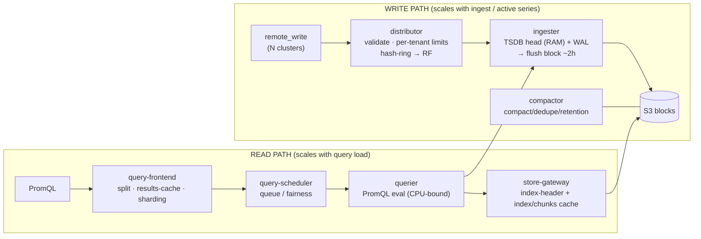
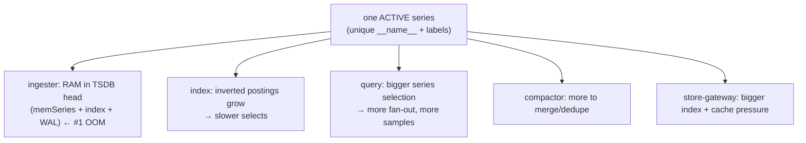
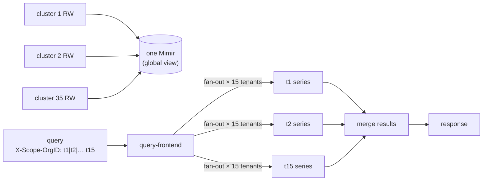

# Topic 19 — Mimir architecture (cardinality · federation · a production scenario) — PREVIEW DRAFT

> ⚠ **PREVIEW / pre-teaching draft (2026-06-18, phone revision).** Not a post-mastery gold doc. We
> **resume live** — assess → teach → ground against the live cluster → brutal quiz. **Scenario A is
> worked; Scenario B and the end Quiz have NO answers** (attempt cold; we grade on resume).
> Anchor idea: **Mimir = horizontally-scalable, multi-tenant, long-term Prometheus storage on object
> storage. Its WRITE path and READ path are independent microservices that scale separately — and
> CARDINALITY is the master cost driver across both.** Flags verified via context7 `/grafana/mimir`.

---

## WHY Mimir exists
A single Prometheus is one box: bounded RAM (active series live in memory), local disk retention, one
tenant, one cluster, no HA. Mimir keeps the **Prometheus write API + PromQL** but splits the monolith
into **stateless-ish microservices over object storage (S3)** so you get: **horizontal scale**
(add ingesters/queriers), **long retention** (blocks on S3, cheap), **HA** (replication factor),
**multi-tenancy** (`X-Scope-OrgID` isolation + per-tenant limits), and a **global/multi-cluster view**
(N clusters `remote_write` into one Mimir; query spans all of them). You adopt it the moment "one
Prometheus" can't hold the active series or the retention.

## WHAT it is — the microservices + the two paths

### Write path (ingest)
```
remote_write ─▶ distributor ─▶ ingester ─▶ (S3 blocks) ◀─ compactor
               validate +      in-mem TSDB head          compact/dedupe
               per-tenant       + WAL → flush blocks       blocks in S3
               limits +         every ~2h
               hash-ring → RF
```
- **distributor** — stateless front door. Validates samples, **enforces per-tenant limits**, hashes
  each series and replicates it to **RF** ingesters via the **hash ring**. No storage.
- **ingester** — holds the **TSDB head** (recent, in-memory active series) + **WAL** (crash recovery);
  every ~2h it **flushes a block to S3**. **This is where active series cost RAM** → the #1 OOM lever.
- **compactor** — background job that compacts/dedupes/downsamples blocks in S3 (merges per-ingester
  blocks, applies retention).

### Read path (query)
```
PromQL ─▶ query-frontend ─▶ query-scheduler ─▶ querier ─▶ ingester (recent)
          split + cache +     queue / fairness   PromQL    store-gateway (historical
          query sharding                          eval      blocks on S3 + caches)
```
- **query-frontend** — splits range queries by interval, **caches results** (memcached), **shards**
  shardable queries, and queues work. The main query-perf lever.
- **query-scheduler** — decouples the queue from the frontend; fair work distribution to queriers.
- **querier** — runs PromQL; pulls **recent** series from **ingesters** + **historical** from
  **store-gateways**, merges, evaluates. **CPU-bound** (PromQL eval).
- **store-gateway** — owns S3 blocks; serves historical reads via lazy-loaded **index-headers** +
  **index-cache** + **chunks-cache** (memcached). The historical-read accelerator.

### Cross-cutting
- **Hash ring** — consistent hashing assigns each series to **RF** ingesters; the ring is how
  distributors/queriers find owners. RF (typically **3** in prod) buys durability + HA.
- **Shuffle sharding** — give each tenant a **bounded random subset** of ingesters/queriers, so one
  noisy tenant can't blast the whole pool → **blast-radius isolation** (the noisy-neighbor fix).
- **Multi-tenancy** — `X-Scope-OrgID` is carried at **every** hop; per-tenant **limits + runtime
  overrides** (hot-reloaded), surfaced by the **overrides-exporter**.
- **ruler** — runs recording/alerting rules server-side (the recording-rule pre-aggregation engine).



## HOW it works internally (P7·P9 depth)
- **TSDB head** = the in-memory write buffer: `memSeries` (one per active series) + an inverted
  **index** (label→postings) + the **WAL** on disk. Each active series is **resident bytes** (labels,
  recent chunks, index entries) → **active-series count × bytes/series ≈ ingester RAM**. (Ties to T3's
  ~209k `cortex_ingester_memory_series` on dev.)
- **Block flush + compaction:** head → 2h blocks → S3; compactor merges the RF copies + per-ingester
  blocks into bigger blocks, dedupes the replication, applies retention.
- **Distributor hashing + RF:** `hash(labels) → ring → RF owners`; a write succeeds on quorum.
- **Store-gateway:** doesn't hold series in RAM — it lazy-loads block **index-headers** and serves via
  caches; cold blocks + cold cache = slow historical reads.

## Grounded in MY stack — dev config (the contrast)
`_5_mimir/manifests/default.yaml` (Helm `mimir-distributed`, microservices mode, **MinIO** for S3):

| Knob | Dev value | Prod implication |
|---|---|---|
| `replication_factor` | **1** (ingester + store_gateway) | prod **3** (HA + durability) |
| `ingester.replicas` | **2** (@ CPU `20m`) | scale by active-series capacity |
| `querier.replicas` | **1** (@ `20m`) | scale by query concurrency (CPU-bound) |
| `store_gateway.replicas` | **2** | shard blocks; needs caches |
| `limits.max_global_series_per_user` | **0 (unlimited)** | **must set per-tenant** in prod |
| `limits.max_global_series_per_metric` | **0** | guard instrumentation mistakes |
| `limits.ingestion_rate` | 80000 | per-tenant rate cap |
| `compactor_blocks_retention_period` | **3h** | prod = weeks/months |

**Diagnosis toolkit already in the repo** (`_9_grafana_dashboards/dashboards/mimir/`):
`mimir-top-tenants` (the 10%/90% skew), `mimir-slow-queries` + `mimir-reads(-resources)` (p99),
`mimir-writes-resources` (ingester memory/OOM), `mimir-tenants`, `mimir-scaling`; recording rules in
`_9_grafana_dashboards/rules/mimir.yaml` (e.g. `cortex_query_frontend_queue_duration_seconds`).

## HIGH CARDINALITY (deep) — the master cost driver
**Where one series costs** (why cardinality hurts everywhere):



- **The 10%/90% noisy-neighbor pattern:** a few tenants/metrics dominate total series. Without
  isolation, those heavy tenants make **every** ingester hot and unbalanced.
- **Detection (verified):**
  - **Cardinality API** — `GET /api/v1/cardinality/label_names` and `.../label_values?label_names[]=…`
    (per tenant; **disabled by default**, enable `-querier.cardinality-analysis-enabled`).
    `count_method=inmemory` (ingester memory view) vs `active` (series with a recent sample, windowed
    by `-ingester.active-series-metrics-idle-timeout`). Use it to find the label/metric blowing up.
  - `cortex_ingester_memory_series` per tenant; the **`mimir-top-tenants`** dashboard.
  - Runbook errors: `err-mimir-max-series-per-user`, `err-mimir-max-series-per-metric`.
- **Resolution ladder (cap growth + isolate damage — you need both):**
  1. **Detect** (cardinality API + top-tenants).
  2. **Per-tenant limits** (runtime `overrides`, hot-reloaded): `max_global_series_per_user`,
     `max_global_series_per_metric` (guards a single metric's label explosion), `ingestion_rate`,
     `max_label_names_per_series`. Caps unbounded growth; rejects with the runbook errors.
  3. **Drop at source** — SM `metricRelabelings` / collector `filter` (the T9/T11/T14 **two-tier**
     model: exporter-native floor + reversible SM relabel). Cheapest series never to ingest.
  4. **Shuffle sharding** (`-distributor.ingestion-tenant-shard-size`) — bound each tenant to a subset
     of ingesters → the 10% heavy tenants are **isolated**, blast radius contained.
  5. **Recording rules** — pre-aggregate hot/expensive queries into small series (query the rollup,
     not the firehose).

## FEDERATION + QUERY PERFORMANCE (deep)
**Mimir cross-tenant federation** — a single query spans multiple tenants by passing
`X-Scope-OrgID: t1|t2|…|t15` (pipe-separated). The query path **fans out per-tenant, then merges**.
Enable with `tenant_federation.enabled: true`. Cost: **N-way fan-out** (15× the work), **no
cross-tenant series dedup**, and **large merged result sets** (a federation OOM source on queriers).
**Multi-cluster:** all 35 clusters `remote_write` into one Mimir, so a single tenant's query already
spans every cluster's series — federation multiplies that.



**Query-performance levers (verified flags):**
- **query-frontend:** `split_queries_by_interval` (default **24h** — splits a long range into parallel
  per-interval subqueries; use a multiple of 24h), `cache_results` (default **false** — memcached
  results cache; huge for repeated dashboard queries), **query sharding**
  (`parallelize_shardable_queries` — splits a query across series shards run in parallel by many
  queriers; watch `cortex_frontend_query_sharding_rewrites_succeeded_total / _attempted_total`).
- **query-scheduler:** decouples queue; **shuffle sharding** via `-query-frontend.max-queriers-per-tenant`
  (>0 and < total queriers) bounds how many queriers a tenant can occupy → fairness.
- **store-gateway:** index-cache + chunks-cache hit ratios (cold cache = slow historical reads).
- **querier:** `-querier.max-concurrent`, `-querier.max-samples` (caps a single query's materialized
  samples — a federation OOM guard), and **right-sized CPU** (PromQL is CPU-bound).
- **Recording rules (the federation special):** pre-aggregate **per-tenant** rollups, then query/federate
  the small rollups instead of fanning out the raw firehose live. Turns a 15× live fan-out into a join
  over 15 tiny pre-computed series. **The single biggest federation-perf win.**

## PRODUCTION SCENARIO
> 35M active series · 10% teams = 90% series · one team = 15 tenants · 35 EKS clusters → one Mimir ·
> 75 replicas @ **8 GB / 300m CPU** · query **p99 = 15 s** · pods **frequently restarting**.

### Scenario A — WORKED: the OOM / frequent restarts
**Step 1 — identify the component (don't assume).** Restarts at 35M series scream *write-path memory*,
but confirm: `kubectl -n mimir get pods` restart counts, `kubectl get events
--field-selector reason=OOMKilling`, and **mimir-writes-resources** vs **mimir-reads-resources**
(`container_memory_working_set_bytes` vs limit). Worked answer here: **ingesters** (TSDB head). (If it
were *queriers* OOMing, the cause is large **federation result materialization** — different fix:
`-querier.max-samples` + recording rules.)

**Step 2 — the memory math.** 35M active × **RF 3** = **105M** series-replicas ÷ 75 ingesters ≈
**1.4M series/ingester**. At a rough ~**5–8 KB/series** resident (memSeries + index + recent chunks),
1.4M ≈ **7–11 GB** — i.e. an **8 GB limit with zero headroom**. Now apply the **10%/90% skew**: with
**no shuffle sharding**, heavy-tenant series spread across *all* ingesters and concentrate on the ring
owners → some ingesters hold **≫ 1.4M** → **OOMKilled** → WAL replay on restart → thundering herd.

**Step 3 — the CPU trap (the smoking gun).** **300m = 0.3 core** with an 8 GB limit is a ~1:27
core:RAM ratio — absurdly CPU-starved for a Go TSDB service. Under memory pressure Go's GC needs CPU,
but **CFS throttles** it at 300m → GC can't keep up → working set climbs past 8 GB → **OOM**. Same
throttle stalls **liveness probes** → killed → restart → WAL replay. 300m is causing **both** the
restarts *and* the p99.

**Step 4 — remediation (prioritized):**
1. **Right-size CPU first:** 300m → **2–4 cores**, **requests = limits** (no throttle), set
   **`GOMEMLIMIT` ≈ 90% of the mem limit** so Go GC targets it *before* the cgroup OOMs. This alone
   breaks the throttle → OOM → WAL-replay spiral.
2. **Right-size ingester memory/count:** target ~**1M active series/ingester with headroom**; scale by
   series capacity, not an arbitrary 75. Verify RF=3 is intended.
3. **Shuffle sharding** (`-distributor.ingestion-tenant-shard-size`) → isolate the 10% heavy tenants;
   bounded blast radius.
4. **Per-tenant series limits** (`max_global_series_per_user` / `_per_metric`, `ingestion_rate`) on the
   noisy 90%-owning tenants → cap growth; they hit `err-mimir-max-series-per-user` instead of OOMing
   everyone.
5. **Drop at source** (SM `metricRelabelings` / collector `filter`) for the worst offenders (two-tier).

### Scenario B — EXERCISE (NO ANSWERS): the p99 = 15 s
Attack it cold; we review live. **Framework:** decompose the read-path latency stage by stage —
query-frontend **queue** (`cortex_query_frontend_queue_duration_seconds`) → scheduler → querier **exec**
→ store-gateway **fetch** (S3 + cache). Read **mimir-slow-queries**, **mimir-reads(-resources)**; check
**results-cache** + **index/chunks-cache** hit ratios; the **query-sharding** rewrite success ratio;
and the **15-tenant federation fan-out**. Then answer:

1. Which **stage** owns the 15 s? Name the one metric per stage you'd read, **in order**, and what each
   rules in/out.
2. Is **300m CPU** the cause of slow PromQL eval (not just the OOM)? Which metric **proves or refutes**
   it?
3. The query federates **15 tenants** — what's the fan-out cost, and which lever (recording rules /
   query sharding / results cache / more queriers) attacks it **first**, and **why do recording rules
   help federation specifically**?
4. Slow historical read: **store-gateway cache miss** vs **ingester pressure** — how do you tell which?
5. Would `split_queries_by_interval` + `cache_results` help **this** query? Name one query shape where
   splitting **does not** help.

## HOW it scales / trade-offs
- **Write vs read scale independently** — add ingesters for series, queriers for query load; don't
  conflate (75 of *what* matters).
- **RF** trades storage/RAM (×3) for durability + HA. **Shuffle sharding** trades a little efficiency
  for isolation. **Caches** trade memory (memcached) for latency. **Recording rules** trade storage +
  rule-eval CPU for massive query speedups.

## Common failure modes
- Ingester **OOM** from active-series growth (+ skew, + no limits, + CPU throttle).
- **No per-tenant limits** → one tenant's instrumentation bug takes down ingesters for all.
- **Federation OOM** on queriers (15-tenant fan-out materializing huge result sets) — guard
  `-querier.max-samples`.
- **Cold/disabled caches** → store-gateway slow historical reads; `cache_results: false` → every
  dashboard refresh recomputes.
- **No shuffle sharding** → noisy-neighbor blast radius = the whole pool.
- CPU starvation (300m) → GC stalls → OOM + slow PromQL (one root cause, two symptoms).

## Troubleshooting approach (repo CLAUDE.md debug order)
- **Writes / ingestion latency:** **distributor metrics → ingester** (per the repo rule). Check
  `cortex_distributor_*`, ingester memory/`cortex_ingester_memory_series`, OOM events.
- **Reads:** **query-frontend queue → querier exec → store-gateway cache** (mimir-slow-queries).
- **Cardinality:** cardinality API + mimir-top-tenants to find the offending tenant/label, then the
  resolution ladder.

## Interview questions (later)
- Draw Mimir's write vs read path; which component holds active series in RAM and why is it the OOM
  lever?
- A tenant's instrumentation bug 10×'s its series. What breaks, and the ladder to contain it?
- How does cross-tenant federation work and what makes it slow/OOM-prone? Why do recording rules fix it?
- Ingesters OOM with plenty of "total" RAM in the cluster. Two causes besides "not enough memory."
- `inmemory` vs `active` cardinality counting — when do you use each?

## Practical exercises (live cluster — when back)
1. Hit the cardinality API on the live tenant (`obsrv`); find the top label by `label_values_count`.
2. Read `cortex_ingester_memory_series` per tenant + mimir-top-tenants; confirm/deny a 10/90 skew.
3. On mimir-slow-queries, decompose a real query's latency by stage; find the dominant one.
4. Compute the prod ingester count for 35M series @ RF3 at your measured KB/series; compare to 75.

## Memorize (one-liners)
- Mimir = scalable multi-tenant Prometheus on S3; **write path and read path scale separately**;
  **active series in the ingester TSDB head = the RAM/OOM lever**.
- Write: distributor (limits+hash-ring→RF) → ingester (head+WAL→S3) → compactor. Read: query-frontend
  (split+cache+shard) → scheduler → querier (CPU-bound) → store-gateway (caches over S3).
- Cardinality ladder: **detect (cardinality API/top-tenants) → per-tenant limits → drop at source →
  shuffle sharding → recording rules**. Limits cap growth; sharding isolates damage.
- Federation = `X-Scope-OrgID: t1|…|tN` fan-out (`tenant_federation.enabled`); **recording-rule
  per-tenant pre-agg is the biggest federation-perf win**.
- 300m CPU + 8 GB = CPU-starved Go → GC stalls → **OOM *and* slow PromQL**; requests=limits + GOMEMLIMIT.

## Quiz — attempt cold (NO answers; graded live on resume)
1. Ingesters OOM at 8 GB. With **plenty** of unused RAM elsewhere in the cluster, give **three**
   distinct causes and the fix for each.
2. Write the per-tenant override block that caps a noisy tenant at 2M series and 150k samples/s, and
   name the two `err-mimir-*` runbook errors it produces.
3. A federation query over 15 tenants p99s at 15 s and sometimes OOMs the querier. Name the querier
   guard that prevents the OOM and the architectural change that removes the fan-out entirely.
4. Distinguish **shuffle sharding** from **replication factor** — what does each protect against, and
   why does one *not* substitute for the other?
5. `count_method=inmemory` vs `active` on the cardinality API — which would you trust to size ingester
   RAM, and which to find a label-explosion the apps just introduced? Why?
6. You enable `cache_results` and p99 barely moves. Give two reasons the results cache wouldn't help
   this workload.
