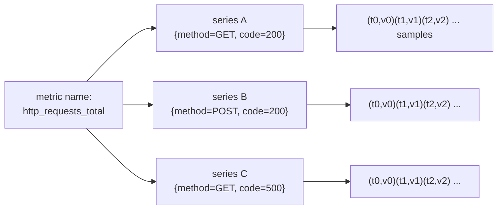

# Topic 2 — What is a metric, from scratch

> Gold-standard per-topic doc (same shape as `Topic4.md`). Self-contained for cold revision.
> Phase 1 · Metrics · mastered 2026-06-06. The anchor idea: **"what is a metric" is really
> "what is a *series*"** — identity is the full label set, and the series count *is* the bill.

---

## WHY the precise definition matters
Everyone "knows" a metric is a number over time. But every cost blowup, every ingester OOM,
every "my dashboard is empty" bug traces back to a precise structural fact people skip: a metric
is not one thing, it's a **family of time series**, and the *series* is the unit that gets
stored, billed, and OOMs you. Get the anatomy exact and the rest of metrics-land falls out.

## WHAT a metric is — anatomy
Stored precisely, a metric is:

```
{ __name__="node_cpu_seconds_total", label1="v1", label2="v2", ... }   +   (timestamp, value)
└──────────────────── identity (the full label set) ────────────────┘       └── one sample ──┘
```

- The **name is itself a label**, `__name__`. Nothing is structurally special about it —
  **identity is just labels.**
- A **sample = `(timestamp, value)`** — *never just the value*. The timestamp is the whole reason
  it's a *time* series, and why gaps/staleness exist. (Drill it: **sample = (timestamp, value)**.)

Three terms kept straight:
- **sample** — one `(timestamp, value)` point.
- **series** (= time series) — the ordered stream of samples sharing **one identity** (one exact
  label set).
- A **Grafana graph plots a series** (usually several) over a selected range.

## HOW it works — series identity (the idea everything hangs on)
Two points belong to the **same series iff every label value is identical** (`__name__` included):



- `http_requests_total{method="GET"}` and `{method="POST"}` = **same metric, two series.**
- Change *any* label value → a **brand-new series**, stored separately, **forever** (until
  retention drops it).
- Mechanically (proven at T6): the scraper computes a **fingerprint = hash(`__name__` + the
  full label set)** for every scraped sample; same fingerprint → append to the same series,
  different fingerprint → new series. Identity *is* that hash — value/timestamp never enter it.

## Cardinality — why this is *the* cost driver
**Cardinality = number of unique series** (name × every label combination). It is the #1 cost and
OOM driver across all three signals, because each series consumes ingester memory (active head
block + WAL) and S3 storage. Rough model:

```
series_count(metric) ≈ ∏ (distinct values of each label)
node_cpu_seconds_total ≈ nodes × cores × modes × (distinct pod identities over retention)
                                                   └─ UNBOUNDED if pod_uid is a label ─┘
```

**One unbounded label = unbounded series = ingester OOM + ever-growing S3 bill.**

**"Active series" — the precise definition** (flagged soft in the T1–T4 re-quiz; drill it):
an **active** series is one that received a sample **within the staleness window (~5 min)** —
it's what the ingester must hold in head-block memory (`cortex_ingester_memory_series`; live
~209k cluster-wide). A churned pod's old series stops being *active* once samples stop, but its
history persists in blocks/S3 until retention. Two cost axes: **active series = memory/ingest
pressure now; total series ever created = index + storage.** Corollary (T2/T4 re-quiz gotcha):
raising `scrape_interval` cuts **samples/sec**, *never* active-series count — the cardinality
lever is `metric_relabel_configs` keep/drop.

## Grounded in your stack — a real series we pulled live
You fetched `node_cpu_seconds_total{...}` from the cluster (far better than a textbook example).
Reading its labels:

| Label(s) | Verdict | Why |
|---|---|---|
| `k8s_pod_uid`, `k8s_pod_name` | ⚠️ **cardinality bomb** | new value on **every pod restart** → series accumulate forever (churn). Classic ingester-OOM cause. |
| `instance`, `service_instance_id`, `server_address`+`server_port` | 🟡 **redundant** | all encode `10.0.1.108:9100` **3×**; `service_instance_id` is **droppable with zero query loss.** |
| `cpu` × `mode` | ✅ legitimate but multiplicative | per-core × per-mode (~8 modes). Real signal, but it multiplies. |
| `X_Scope_OrgId="obsrv"` | ⚠️ **wrong layer** | this is your **tenant** — belongs in the request **header** `X-Scope-OrgID`, not baked into the series. Revisit at T20. |
| `otel_collector_id="obsrv-metrics-new"`, `job="kubernetes-service-endpoints"` | ℹ️ **proof** | stamps prove an **OTel collector** scraped this — there is no Prometheus server. |

## HOW it scales / trade-offs
- **Richness vs cost:** more labels = more query power *and* more cardinality. Keep labels you
  actually filter/group by; drop decorative ones.
- **Stability:** prefer labels with **bounded, stable** value sets (node, namespace, mode). Avoid
  **churning** (pod_uid, request_id) or **unbounded** (user_id, URL, trace_id) values as metric
  labels — those belong on logs/traces.

## Common failure modes
- A single unbounded/churning label silently multiplies series until ingesters OOM.
- Redundant labels (3 spellings of the same address) inflate every series for no query value.
- Putting the **tenant** in a label instead of the header leaks the isolation layer into data.

## Practical exercises (live cluster)
1. `count({__name__="node_cpu_seconds_total"})` then `count by (mode)(...)` — watch the label
   multiply the series count.
2. Pick a metric and list which labels you'd **drop** with zero query loss (find the redundant
   address spellings).
3. `topk(10, count by (__name__)({__name__=~".+"}))` — find your highest-series metrics (preview of T25).

## Memorize (one-liners)
- **sample = (timestamp, value)**; **series = samples sharing one label-set identity.**
- **Series identity = the full label set** (incl `__name__`); change a label → new series.
- **Cardinality = unique series count = #1 cost/OOM driver.** One unbounded label = outage.
- **Active series** = received a sample within the staleness window (~5 min) = ingester head
  memory (live ~209k). `scrape_interval` cuts samples/sec, **not** active series.
- "What is a metric" is really **"what is a series."**
- Tenant goes in the **`X-Scope-OrgID` header**, never as a metric label.

## Quiz result
PASS (2026-06-06). Series-identity + cardinality strong. `sample=(ts,value)` took two nudges.
Correctly flagged `pod_uid` as the cardinality risk and `service_instance_id` as droppable-redundant.
