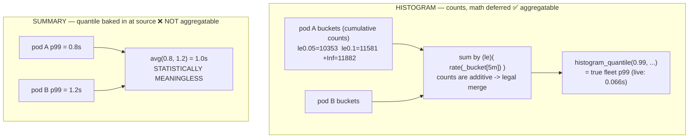

# Topic 3 — Metric types, from scratch (live data, your cluster)

> Gold-standard per-topic doc (same shape as `Topic4.md`). Self-contained for cold revision.
> Phase 1 · Metrics · mastered 2026-06-07, grounded in live Mimir data from
> `meda-dev-koi-eksdemotest`. The anchor idea: **on disk it's all float64 series; the "type" is
> a client-side contract** about how a value behaves, and therefore how you may query it.

---

## WHY metric types exist
A raw number is ambiguous: is `412` a running total, a current level, or a latency sample? You
can't know how to *query* it (rate? average? quantile?) without knowing how it **behaves over
time**. The four "types" are a **client-side semantic contract** that tells you exactly which
PromQL is valid. Mimir's TSDB stores none of this — it stores only float64 series; the type is a
promise the emitter makes and the query author must honor.

## WHAT the four types are
- **counter / gauge** = **one** series each.
- **histogram / summary** = **composite** — they explode into several counter/gauge series under
  naming conventions. **Proven live:** `cortex_request_duration_seconds` exists on disk as exactly
  three names → `_bucket`, `_count`, `_sum`.

### 1. Counter — "only climbs" (`_total`)
Monotonic; resets to 0 only on process restart. Raw value is meaningless — you want its **slope**.
- Query with `rate()` / `increase()`; `rate()` also auto-corrects restarts (no negative spike).
- **Live:** `sum(rate(cortex_distributor_received_samples_total[5m]))` ≈ **2,034 samples/s** into
  Mimir. The total is noise; the *rate* is the story.
- Canonical CPU-busy%: `100 - (avg by (instance)(rate(node_cpu_seconds_total{mode="idle"}[5m])) * 100)`.

### 2. Gauge — "snapshot, up and down"
Current level; query direct (`avg`/`max`/`sum`) or change-over-time (`delta`/`deriv`).
- **Never `rate()`** — a gauge dropping 5→3 isn't a counter reset; `rate()` would misread it.
- **Live:** `sum(cortex_ingester_memory_series)` ≈ **209,296 active series** — your cardinality
  bill, and why the meta-monitoring cleanup matters.

### 3. Histogram — "distribution, bucketed, math deferred to query time"
Pre-defined **cumulative `le` ("≤") buckets**; each observation increments **every bucket ≥ its
value**. On disk: three suffixes, **all counters** — `_bucket{le}` (one series per boundary),
`_sum`, `_count`. **`+Inf` == `_count` == total observations.**

**Live bucket dump** — `sum by (le)(cortex_request_duration_seconds_bucket{route="api_v1_push"})`:

| le (s) | cumulative count |
|---|---|
| 0.005 | 1,213 |
| 0.01 | 2,757 |
| 0.025 | 6,585 |
| 0.05 | 10,353 |
| 0.1 | 11,581 |
| 0.25 | 11,865 |
| 0.5 → +Inf | 11,882 |

Read it like an X-ray:
- **Monotonic & cumulative** — counts only rise as `le` grows. That *is* the histogram.
- **`+Inf` = 11,882 = `_count`** — everything was ≤ 0.5s.
- **Quantiles by hand** (what `histogram_quantile` automates): p50 = 5,941st obs → (0.01, 0.025] →
  ≈ **22 ms**; p99 = 11,763rd → (0.1, 0.25] → ≈ **0.2 s** (since-start snapshot).
- **Live rate-windowed p99:** `histogram_quantile(0.99, sum by(le)(rate(..._bucket[5m])))` =
  **0.066 s**. Different population (last 5m vs since-boot) → different number, same machinery —
  the window picks which observations count.
- Gotcha from raw data: `le` is a **string** (`"10"` sorts before `"2.5"`); `histogram_quantile`
  sorts numerically for you.
- **Cost:** series × (#buckets + 2). ~13 buckets → ~15 series per label combo. Histograms hide cardinality.
- (Modern evolution: **native/exponential histograms** — Mimir + OTel support them; the whole
  distribution lives in one series with dynamic buckets, far cheaper. Learn the classic model first.)

### 4. Summary — "quantiles baked in at the source"
Client computes quantiles at emit time over a sliding window. On disk: `_sum` (counter), `_count`
(counter), `{quantile="0.5"|"0.9"|"0.99"}` (**gauges**, pre-computed).

## HOW it works internally — the one distinction that matters (why histograms won)



- **Histogram** stores raw **counts** → counts are additive → `sum by (le)` across all pods, *then*
  `histogram_quantile` → valid fleet-wide p99. **Aggregatable.**
- **Summary** stores a pre-computed **quantile** → pod A p99=0.8 and pod B p99=1.2 **cannot** be
  merged (you can't average quantiles). **Locked to one instance.**
- In Kubernetes you always span replicas → you always need aggregation → **use histograms.**

| | Histogram | Summary |
|--|--|--|
| Quantile computed | server-side, at query | client-side, at emit |
| Aggregate across pods | ✅ sum buckets | ❌ can't merge quantiles |
| New quantile after the fact | ✅ any | ❌ only pre-chosen |
| Accuracy | approximate (bucket resolution) | exact |
| Series per metric | many (#buckets+2) | few (#quantiles+2) |

## Grounded in your stack — dashboards = the four types made visible
Signature counts across your installed dashboards:
```
              histogram_quantile   rate()   _total   summary
  k8s                 0             77       83        0    <- levels + totals, no latency dist
  OtelCol             0             12       72        0    <- plumbing: throughput + queue/mem
  mimir             416           1071      325        0    <- request server: latency SLOs
```
Across 30+ dashboards: **zero real summary series.** Mimir/cAdvisor/node-exporter/OTel all emit
histograms — the ecosystem abandoned summaries for exactly the aggregation reason above. Bonus:
mimir panels query `..._bucket:sum_rate` **recording rules** (a pre-aggregated histogram) — only
possible *because* buckets are additive; you could never pre-aggregate a summary's quantile (→ T23).

## HOW it scales / trade-offs
- Histograms trade **storage (many bucket series)** for **aggregatability + any-quantile-later**.
- Summaries trade **aggregatability** for **exactness + fewer series** — only acceptable single-instance.
- Bucket choice is a cost/accuracy dial: more buckets = sharper quantiles = more series.

## Common failure modes
- Running `rate()` on a gauge (garbage) or reading a counter raw (meaningless).
- Averaging summary quantiles across pods (statistically void) — the classic SLO mistake.
- Type metadata is **lost** over OTLP→Mimir here (`list_prometheus_metric_metadata` returns empty)
  → infer type from **name + shape** (`_bucket`/`_total` suffixes, monotonicity), not metadata.

## PromQL by type — worked examples (which function is legal, and WHY)
The type is a **reset contract**, and each PromQL function makes an assumption about that contract.
Pick the wrong one and you get silent garbage — no error, just a lying graph.

**Two function families, split by one question — "does it assume the series resets to 0?"**

| Family | Functions | Assumes monotonic + compensates resets? | Use on |
|---|---|---|---|
| **Counter functions** | `rate()` · `irate()` · `increase()` | **YES** — a drop ⇒ "reset", add the post-drop value | **counters only** |
| **Gauge functions** | `delta()` · `idelta()` · `deriv()` · `predict_linear()` · `*_over_time()` | **NO** — a drop is just a drop | **gauges only** |
| **Aggregators** | `sum` · `avg` · `max` · `min` · `count` · `quantile` | n/a (operate on the instant vector) | both — *but see below* |

### Example A — Counter: `cortex_distributor_received_samples_total`
Raw value is a since-boot cumulative total (billions). **Reading it raw is meaningless**; you want the slope.
- `sum(rate(cortex_distributor_received_samples_total[5m]))` ≈ **2,034 samples/s** — the live story.
- `increase(...[5m])` = total over the window = `rate × 300s`. Same machinery, different unit.
- **Why `rate()` is correct:** counter is monotonic, so `rate()` diffs consecutive samples ÷ Δt, and
  when a pod restarts (value drops to 0) it *detects the reset and compensates* → no negative spike.
- **The aggregator trap:** `avg(cortex_distributor_received_samples_total)` is **legal syntax but
  semantically void** — you're averaging since-boot totals across pods that booted at different times.
  Correct order is **`rate()` first, aggregate second:** `sum(rate(...))`, `avg(rate(...))`. Never aggregate the raw counter.

### Example B — Gauge: `cortex_ingester_memory_series`
Current level; legitimately rises and falls (series churn in, ingester flushes out).
- Instant aggregate: `sum(cortex_ingester_memory_series)` ≈ **209,296 active series** (your cardinality bill).
- Time-average: `avg_over_time(cortex_ingester_memory_series[1h])`. Peak: `max_over_time(...[1h])`.
- Net change over a window: `delta(cortex_ingester_memory_series[1h])` (can be **negative** — that's valid).
- Per-second trend via linear fit: `deriv(...[1h])`; forecast: `predict_linear(...[4h], 3600)`.
- **Why `rate()`/`increase()` are ILLEGAL here:** they assume monotonic-with-resets. A gauge dropping
  64,093 → 60,000 (a normal flush) is read by `rate()` as a **counter reset**, so it *adds* 60,000 as
  "increase since reset" → **inflated nonsense**. This is the **exact reset-misfire** behind the T14
  delta-temporality bug and the `UpDownCounter`→counter danger: a non-monotonic series + a counter
  function = fabricated spikes.

**The asymmetry to memorize:** `delta()` and `rate()` both mean "change over time" — but `delta()` is the
**gauge** tool (endpoint difference, no reset logic) and `rate()` is the **counter** tool (reset-compensating,
per-second). Same intent, opposite reset contract. Matching the function to the contract *is* the skill.

## Practical exercises (live cluster)
1. `sum by (le)(cortex_request_duration_seconds_bucket{route="api_v1_push"})` — reproduce the bucket
   table; confirm `+Inf == _count`.
2. `histogram_quantile(0.99, sum by(le)(rate(cortex_request_duration_seconds_bucket[5m])))` — get the
   live fleet p99; change `[5m]`→`[1h]` and explain why it moves.
3. Find any `_total` and any gauge in your dashboards; justify `rate()` on one and direct-read on the other.

## Memorize (one-liners)
- On disk it's all float series; **type is a client-side contract**; histogram/summary are composite.
- counter→`rate()`; gauge→read direct; histogram→buckets+`histogram_quantile`; summary→pre-baked.
- Suffixes: `_bucket{le}` + `_sum` + `_count`; **+Inf == _count == total.**
- **Histogram aggregates across pods (sum buckets, then quantile); summary does NOT.** K8s → histograms.
- Live anchors: ~2,034 samples/s ingest, ~209k active series, push p99 ~66 ms (5m window).

## Quiz result
PASS (2026-06-07, re-ask). `sum by (le)` = combine same-boundary bucket rates across sources;
summary not mergeable (quantiles don't average, no `le` series). Grounded on live
`cortex_request_duration_seconds` (p50~22ms, push p99~66ms/5m). Added depth:
rate-per-bucket-before-sum, `+Inf == _count`.
