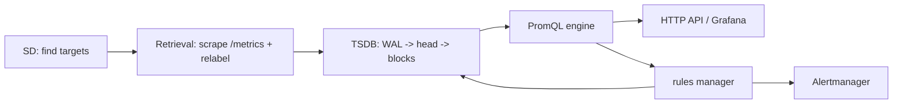
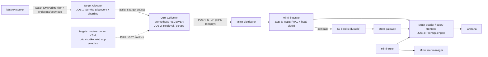
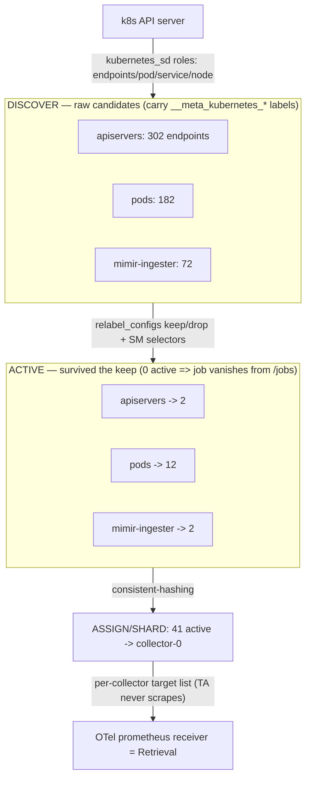
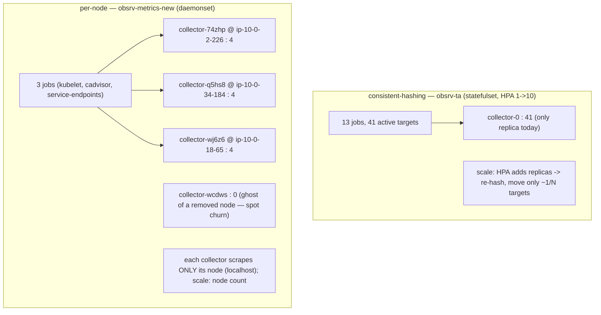
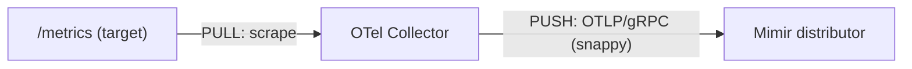
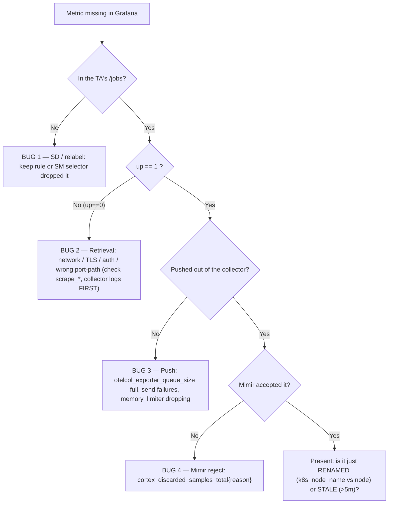
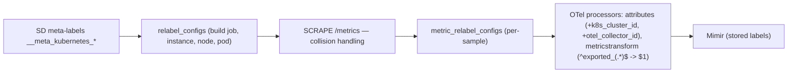

# Topic 4 — Prometheus architecture, from scratch (live data, your cluster)

> Companion to `Topic3.md`. Verbose by design — a self-contained lesson for cold revision.
> Everything here was proven live against `meda-dev-koi-eksdemotest` (ap-south-2, profile
> `obsrv`) on 2026-06-07. The one idea to anchor everything: **you run no `prometheus`
> binary** — its four internal jobs are split across the Target Allocator, the OTel
> Collector, and Mimir. Learn the canonical server first, then the mapping.

---

## WHY Prometheus exists (the problem it killed)

Before Prometheus, monitoring was **check-based** (Nagios): a central box ran a script per
host that returned OK/WARN/CRIT. No dimensions, no sliceable history, no query language —
useless once hosts/pods churn every few minutes. Google's *Borgmon* inspired the fix.
Prometheus' bet: store everything as **dimensional time series** (a name + label set), **pull**
them on a schedule, give you a real **query language (PromQL)**, and keep a local **TSDB**.
Built for dynamic, label-rich, cloud-native churn.

---

## WHAT a Prometheus server is — four jobs in one binary

This is the mental model that unlocks the topic. A single `prometheus` process is four
subsystems bolted together, plus two satellites:

1. **Service Discovery (SD)** — continuously answers *"what should I be scraping right now?"*
   Watches the k8s API (or EC2/Consul/DNS/static) and emits a live list of **targets** with
   their `__meta_*` meta-labels. Targets appear/vanish as pods churn.
2. **Retrieval (the scrape loop)** — every target's `scrape_interval`, HTTP `GET /metrics`,
   parse the exposition text, run **relabeling**, attach labels, stamp `(timestamp, value)`.
   **This is the "pull."**
3. **TSDB (local storage)** — append samples to a **WAL** (crash safety) + an in-memory
   **head block**, then **compact** to immutable blocks on local disk.
4. **PromQL engine** — evaluates PromQL over head+blocks for the HTTP API, Grafana, and rules.

Satellites:
- **Rules manager** — runs **recording rules** (pre-compute series) and **alerting rules**
  (fire when an expr is true) on a schedule.
- **Alertmanager** (separate binary) — dedup / group / route / silence alerts → Slack/PagerDuty.

Internal flow:

The **pull** principle: Prometheus reaches *out*. Targets are dumb — they expose `/metrics`
and don't know who scrapes them. The one exception: short-lived **batch jobs push to a
Pushgateway**, which Prometheus then scrapes (this is why your `meta_ta` has a
`prometheus-pushgateway` job with `honor_labels: true` — see the label section). Every scrape
also synthesizes **`up{}`** = 1 on success, 0 on failure — your first triage signal.

---

## YOUR stack — "serverless Prometheus" (the mapping that matters)

Memorize this table; it *is* Topic 4 for you:

| Prometheus job | Your stack |
|---|---|
| Service Discovery | **Target Allocator** — reads ServiceMonitor/PodMonitor/scrape_configs, watches the k8s API, computes the target list **and shards it across collector replicas** |
| Retrieval (scrape/pull) | **OTel Collector** `prometheus` **receiver** — does the actual `GET /metrics` |
| TSDB (storage) | **Mimir** — distributor → ingester → **blocks on S3** |
| PromQL engine | **Mimir** querier / query-frontend (Grafana points here) |
| Rules manager | **Mimir ruler** |
| Alertmanager | **Mimir alertmanager** |

The Target Allocator adds the thing a lone Prometheus lacks: it **shards targets** so no single
scraper is the bottleneck — solving at the *scrape* layer what Mimir solves at the *storage*
layer.

---

## Service Discovery, made concrete — the 2-stage funnel

SD is **not** one number. It is **discover → relabel-filter → assign**. I proved this live by
port-forwarding the Target Allocator's HTTP API (`svc/obsrv-ta-targetallocator:80`,
endpoints `/jobs`, `/jobs/<job>/targets`, `/metrics`). The killer insight is the gap between
**discovered candidates** and **active (assigned) targets** — that gap *is* what the TA does:

| job | discovered (`opentelemetry_allocator_targets`) | active (`/jobs/.../targets`) | what shrank it |
|---|---|---|---|
| kubernetes-apiservers | **302** | **2** | relabel `keep regex: default;kubernetes;https` |
| kubernetes-pods | **182** | **12** | relabel `keep` on `prometheus.io/scrape=true` |
| serviceMonitor/mimir-ingester | **72** | **2** | SM selector → only `mimir-ingester` endpoints |
| serviceMonitor/loki | **131** | **14** | SM selector → loki endpoints |
| kubernetes-services (probe) | **138** | **0 → absent from `/jobs`** | `keep` on `prometheus.io/probe` matched nothing |
| prometheus-pushgateway | **138** | **0 → absent from `/jobs`** | no pushgateway service exists |

**Two takeaways for debugging:**
1. A `kubernetes_sd` *role* (`endpoints`/`pod`/`service`/`node`) returns *every* object of that
   kind cluster-wide (the big number). `relabel_configs` with `action: keep`/`drop` throw away
   what doesn't match (the small number). The huge `__meta_kubernetes_*` label blob on a target
   is the **raw input to that filter**; after relabeling those `__meta_*` labels are discarded.
2. **A job with zero active targets isn't listed in `/jobs`.** `kubernetes-services` and
   `prometheus-pushgateway` discovered 138 candidates each but kept zero → gone. That is
   troubleshooting **checkpoint ①** made literal: *"is it even in the TA's job list?"* If the
   job is missing, the bug is discovery/relabel — not the scrape, not Mimir.

Your live observation, explained: **loki = 1 SM job, mimir = 9 SM jobs** is pure *chart
packaging* — the Loki chart ships one ServiceMonitor for all components; the Mimir chart ships
one per component (compactor, distributor, ingester, …). Same SD mechanism, different CR count.

---

## Sharding — the same TA, two strategies, matched to the workload

The third SD job is **assignment**. Your cluster runs the Target Allocator **twice**, with
different strategies:

| | **`obsrv-ta`** (statefulset) | **`obsrv-metrics-new`** (daemonset) |
|---|---|---|
| strategy | `consistent-hashing` | `per-node` |
| collectors | 1 (HPA 1→10) | 3 = one per node (DaemonSet) |
| active targets | 41, hash-spread across replicas | 4 per node, **pinned to local node** |
| jobs | 13 (apiservers, pods, 9× mimir SM, loki, otel) | 3 (kubelet, cadvisor, service-endpoints) |
| scales by | HPA on CPU/mem → re-hash | node count → DaemonSet auto-adds a collector |

Proof of `per-node` pinning (each collector pod scrapes the kubelet **on its own node**):

| collector pod | runs on node | scrapes kubelet of |
|---|---|---|
| `...collector-74zhp` | `ip-10-0-2-226` | `ip-10-0-2-226` ✅ |
| `...collector-q5hs8` | `ip-10-0-34-184` | `ip-10-0-34-184` ✅ |
| `...collector-wj6z6` | `ip-10-0-18-65` | `ip-10-0-18-65` ✅ |

**Why each pairing is correct (the trade-offs):**
- **Node-level metrics → `per-node`.** kubelet & cAdvisor describe the *local* node. Scrape
  `localhost`: no cross-node network; when a node joins/leaves, the DaemonSet adds/removes a
  collector and the TA rebalances **automatically**. Node count is the scaling unit — no HPA.
  This is exactly the manual-sharding pain a single Prometheus has, solved declaratively.
- **Cluster services → `consistent-hashing`.** mimir/loki/otel endpoints aren't tied to a node,
  so spread them by a stable hash; when the HPA scales the statefulset, consistent-hashing moves
  the **minimum** set of targets (~1/N), not a full reshuffle. That's the point of *consistent*
  hashing vs plain modulo.

**Real-world gotcha:** the TA reported a 4th collector `...wcdws` with **0 targets** while
`collectors_discovered=3` and `kubectl get nodes`=3. It's a **ghost series** — a collector from
a node removed by spot churn whose `targets_per_collector` sample lingers at 0. Trust
`collectors_discovered`/`allocatable` over a raw `per_collector` row count.

---

## The PULL→PUSH pivot (the one place your "Prometheus" pushes)

Left of the collector = **pull** (Prometheus model). Right = **push** (OTLP gRPC to
`otel.gowthamvandana.com`). **The collector is the hinge.** Proven live:
`sum(rate(cortex_distributor_received_samples_total[5m]))` ≈ **2,034 samples/sec** landing in
Mimir.

---

## `up` and the `scrape_*` family — the Retrieval-layer health bits

`up` is a **synthetic gauge the *scraper* invents** — the target never exposes it. One `up`
series **per target, per scrape**. In your stack the **OTel `prometheus` receiver** generates
it (proven by the label `otel_scope_name=".../receiver/prometheusreceiver"`), then it
`remote_write`s to Mimir like any series — which is *why you can query it in Grafana at all*.

- `up = 1` → scrape `GET /metrics` succeeded (connected, 2xx, body parsed).
- `up = 0` → failed (connection refused / DNS / timeout / TLS error / 401-403-5xx / bad body).

It carries the target's **post-relabel identity** (`job`, `instance`, + your pipeline's
`k8s_cluster_id`, `otel_collector_id`), so `up{job="kubernetes-apiservers",
instance="10.0.52.135:443"} == 0` names the exact dead target.

**Live on meda-dev-koi:** `count(up == 1)` = **51**, and **2** targets `up == 0` — both
`job="kubernetes-apiservers"` (the EKS managed control-plane endpoints, a common benign
quirk). Reconciliation: **41 (consistent-hashing TA) + 12 (per-node TA) = 53 = 51 up + 2 down.**
The whole topology closes.

Siblings born at the same rung (use when `up==1` but data still looks wrong):

| metric | tells you |
|---|---|
| `scrape_duration_seconds` | how long the scrape took (slow target / near timeout) |
| `scrape_samples_scraped` | how many samples the target exposed |
| `scrape_samples_post_metric_relabeling` | how many survived your `metric_relabel_configs` |
| `scrape_series_added` | new series this scrape (cardinality-bomb early warning) |

---

## Troubleshooting — walk the four jobs in order

The discipline: **walk from the target outward; the first stage where the metric/label is
present *before* and absent *after* owns the bug.**

**Missing-label ladder** (e.g. "node label is missing"): live, `node_load1` carries
`instance="10.0.18.65:9100"` and `k8s_node_name="ip-10-0-18-65…"` but **no bare `node` label**.
90% of "missing label" is "renamed/enriched label" — query the real name, or alias it with a
relabel. Then check: does SD even emit the source `__meta_*`? does a `relabel_config` map it? did
a collision turn it into `exported_<label>`?

**Missing-metric ladder** (cheapest first): `up==1`? → does the **target** emit it (`curl` its
`/metrics`)? → `scrape_samples_scraped` vs `..._post_metric_relabeling` (a drop ate it)? → was it
**renamed** (`metricstransform`)? → `sample_limit`/`target_limit`? → **stale** (>5m, use
`last_over_time`)? → Mimir `cortex_discarded_samples_total{reason}`.

**Where to look, in your debugging order** (repo CLAUDE.md: *OTel collector logs first*):
`stern -n meta-monitoring obsrv-metrics-new-collector` → TA `/jobs/<job>/targets` → the target's
raw `/metrics` → `up`/`scrape_*` in Mimir → `cortex_discarded_samples_total`.

---

## The label pipeline — `exported_*` and `honor_labels`

When the scraper attaches target labels and the **exposition already has a colliding label**
(KSM emits `kube_pod_info{namespace,pod,node}`), the behavior is set by **`honor_labels`**:
- `honor_labels: false` (default) → the **exposed** label loses, becoming `exported_<label>`.
  Then `meta_metrics` *recovers* it with relabel: `exported_pod→pod`, `exported_node→node`,
  `exported_namespace→namespace` — surgically restoring KSM's real identity while keeping the
  scrape's `job`.
- `honor_labels: true` → the **exposed** label **wins** outright. This is set on exactly one job,
  `prometheus-pushgateway` in `meta_ta` (and nowhere in `meta_metrics`), because pushgateway
  re-exposes metrics other jobs *pushed*, still carrying their **original** `job`/`instance`,
  and you must preserve those, not overwrite them with `job="prometheus-pushgateway"`.

So: **two strategies to the same goal** (preserve the source's identity) — `honor_labels`=blunt
(all exposed labels win), `exported_*`+relabel=surgical (recover only `pod/namespace/node`). This
is also the root of the latent duplication risk (`OPTIMIZATION.md` P2 notes the `exported_*`
handling runs in both collectors).

---

## Common failure modes (interview-grade)

- **Job missing from `/jobs`** → relabel `keep`/SM selector dropped every candidate (SD bug).
- **`up==0`** → discovered but scrape fails: TLS/auth (apiserver), wrong port/path, NetworkPolicy.
- **Double-scrape** → the same endpoint matched by ≥2 discovery paths (pod-annotation +
  service-annotation + ServiceMonitor). Detect with `count by(job)(<metric>) > 1`; fix by one
  discovery path per target (`OPTIMIZATION.md` P1).
- **Label "missing"** → actually renamed/enriched (`k8s_node_name`) or `exported_`-prefixed.
- **Metric "missing"** → not emitted by target / dropped by relabel / renamed / stale / Mimir-rejected.
- **TA ghost collector** → stale `per_collector` series after node churn; trust `discovered`.

---

## Practical exercises (run against the live cluster)

1. `kubectl -n meta-monitoring port-forward svc/obsrv-ta-targetallocator 8080:80` then
   `curl -s localhost:8080/jobs | jq` and `curl -s localhost:8080/metrics | grep allocator_targets`.
   Confirm a job with 0 active targets is absent from `/jobs`.
2. `count by (job) (up)` and `up == 0` in Grafana (Mimir datasource). Find the down targets;
   explain *which* of the four checkpoints they're stuck at.
3. Port-forward `obsrv-metrics-new-targetallocator:8081` and prove `per-node`: match each
   `targets_per_collector` to a DaemonSet pod's node.
4. Pick any node-exporter metric; dump its label set; identify where the node identity lives
   (`k8s_node_name`/`instance`), and which relabel would alias it to `node`.

---

## Memorize (one-liners)

- No `prometheus` binary here: **TA = SD, OTel receiver = Retrieval, Mimir = TSDB + PromQL + ruler + alertmanager.**
- SD is **discover (huge) → relabel keep/drop (small) → assign/shard**; 0 active ⇒ job not in `/jobs`.
- Two sharding strategies: **per-node** (node-local, localhost, scale = nodes) vs
  **consistent-hashing** (cluster services, scale = HPA, ~1/N churn).
- The **collector is the pull→push pivot**; ~2,034 samples/s into Mimir live.
- **`up`** is synthetic, made by the scraper, one per target/scrape; live 51 up / 2 down (apiservers).
- Troubleshoot in order: **in `/jobs`? → `up==1`? → pushed? → Mimir accepted?**
- **`exported_*`** = honor_labels=false collision recovery (KSM); **`honor_labels: true`** = pushgateway-only.
- Live anchors: 41 + 12 = 53 targets; ~209k active series; apiserver `up==0` (EKS managed quirk).

## Quiz result
PASS (2026-06-07). Q3 clean (ephemeral / no-HA / no-multi-tenancy + `remote_write`). Q1 shown
live via TA exploration (named the 4 jobs + their components). Q2 gap was ② (`up`), closed when
the learner asked *what generates `up`* — exactly the missing rung.
