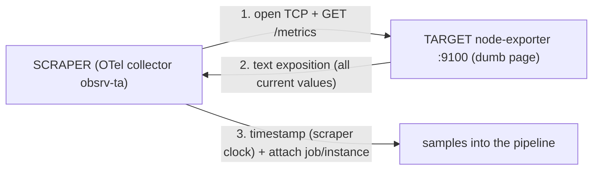
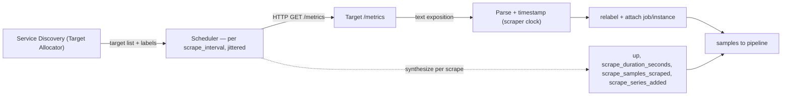
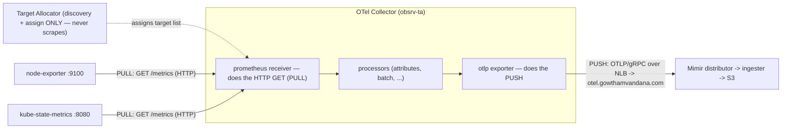

# Topic 5 — The Pull Model, from scratch (live data, your cluster)

> Companion to `Topic4.md`. Verbose by design — a self-contained lesson for cold revision.
> Proven live against `meda-dev-koi-eksdemotest` (ap-south-2, profile `obsrv`) on 2026-06-07.
> The one idea to anchor everything: **in pull, the *scraper* reaches out and `GET`s `/metrics`;
> the target is a dumb HTTP page that just exposes its current values and waits.** Push vs pull
> is decided by **one question — who opens the TCP connection.**

---

## WHY pull exists (the problem it solves)

Before pull, metrics were **push** (StatsD/Graphite era): every app fired its numbers *out* to a
central collector. That forces three pains onto the app:
1. **The app must know the backend** — its address, port, auth, protocol. Reconfigure the backend
   → reconfigure N apps.
2. **The app must buffer under backpressure** — if the backend is slow/down, the app queues in its
   own memory, retries, and can OOM. 1000 apps melting down toward one backend.
3. **Silence is ambiguous** — a backend that stops hearing from an app can't tell *"app healthy
   but quiet"* from *"app dead."*

Prometheus inverted it: the **scraper owns discovery and cadence**, the target just exposes a
page. That buys the two superpowers below — and it fits cloud-native churn, where pods appear and
vanish every minute and you do **not** want to reconfigure each one.

---

## WHAT pull is — who initiates (the mechanics)

For one scrape of `node-exporter` on node `ip-10-0-18-65`:
- The **scraper** (your OTel collector pod `obsrv-ta`) **opens** the TCP connection **to**
  `10.0.18.65:9100` and issues `GET /metrics` over HTTP.
- node-exporter replies with the **exposition format** — a plain-text snapshot of *every* metric's
  current value.
- The scraper parses it, stamps each sample with the **scrape timestamp (the scraper's clock)**,
  attaches the target's identity labels (`job`, `instance`, …), and ingests.



Direction is the whole point: **scraper → target**. The target never dials out. What is "pulled"
is a text snapshot:
```
node_cpu_seconds_total{cpu="0",mode="idle"} 47671.14
node_memory_MemAvailable_bytes 5.857624064e+09
```
**Live receipt (one scrape):** node-exporter returned **1673 samples in 29 ms**, `up=1`. Siblings:
1744 samples/44 ms, 1654 samples/25 ms. (`scrape_samples_scraped` / `scrape_duration_seconds`.)

### The two superpowers (why pull, from first principles)
1. **The scraper owns discovery + cadence.** The target needs *zero* config — it doesn't know the
   backend exists. You add/remove targets by changing **service discovery on the scraper** (your
   Target Allocator), not by touching 200 apps. (This is Topic 4's SD funnel.)
2. **Liveness for free → `up`.** Because the scraper does the connecting, it *directly observes*
   whether the target answered: success → `up=1`; refused/timeout/DNS/non-2xx → `up=0`. Push
   **cannot** do this — silence is ambiguous. Pull turns silence into a hard signal. (Live: 3
   node-exporters `up=1`, 2 apiservers `up=0` — caught with zero app cooperation.)

Bonus mechanisms: no client-side buffering/backpressure (target keeps serving its page if the
backend is down); human-debuggable (`curl` the same endpoint); scraper-controlled rate (a target
can't flood the backend).

---

## HOW it works internally — the scrape loop



- **Each scrape is independent and stateless on the target side.** The scraper just reads the
  current values; it keeps no scrape-to-scrape state on the target.
- The scraper **jitters** start times so N targets don't all hit at once.
- Every scrape auto-emits **meta-metrics about itself** (`up`, `scrape_*`) — the Retrieval-layer
  health signals (Topic 4).
- **Staleness:** when a target vanishes, the scraper injects staleness markers ~after the next
  missed scrape, so queries stop returning it (~5-min window).

### Where the counter physically lives → whether a restart resets it
This is the subtlety that trips people. A counter is just a number the scraper reads — but
*where that number is kept* decides what a restart does to it:

| | counter lives in… | target **pod** restart | what `rate()` does |
|---|---|---|---|
| `node_cpu_seconds_total` (node-exporter) | the **kernel** (`/proc/stat`, since **boot**); node-exporter is stateless and re-reads it each scrape | **no reset** — pod restart doesn't touch `/proc`; only a **node reboot** resets it | sees no reset, computes plainly |
| `cortex_ingester_ingested_samples_total` (Mimir) | the **app process memory** | **resets to 0** when `mimir-ingester-0` restarts | **detects** the drop (value < previous), assumes a reset to 0, and **compensates** (adds the missing delta) — no negative spike |

Memorize: **kernel-sourced counters survive a pod restart; in-process counters reset, and
`rate()`/`increase()` heal the reset automatically.**

---

## WHAT's behind a `/metrics` page — the four archetypes (all live)

To the *puller* every target is identical: one `GET` → text. The variety lives entirely **behind**
the endpoint. Four archetypes, dissected live with `port-forward`/`curl` (and `kubectl get --raw`
for the proxied one):

| | **node-exporter** | **kube-state-metrics** | **Mimir ingester** | **cAdvisor (kubelet)** |
|---|---|---|---|---|
| **Archetype** | host exporter | foreign-object exporter (*translator*) | **app self-instrumentation** | kubelet-embedded |
| **Subject** | the node/OS it runs on | **other** k8s objects | the app's **own** internals | every **container** on the node |
| **Data source** | kernel `/proc` + `/sys` | the **k8s API** (watch cache) | **in-process** `client_golang` counters | kernel **cgroups** (via kubelet) |
| **Signature metric** | `node_cpu_seconds_total` | `kube_pod_info` | `cortex_ingester_memory_series 64093` | `container_cpu_usage_seconds_total` |
| **Separate process?** | yes (daemon) | yes (deployment) | **no — the app *is* the source** | no — inside the kubelet |
| **Scrape path** | direct → pod `:9100` | direct → pod `:8080` | direct → pod `:8080` | **indirect → apiserver `:443` proxy → kubelet `:10250`** |
| **Sample timestamp** | scraper-stamped | scraper-stamped | scraper-stamped | **self-stamped** (cAdvisor) |
| **target vs subject** | target = subject | **target ≠ subject** → `honorLabels` | target = subject | per-node identity via relabel |
| **series here (live)** | 1673 | 6141 | 1300 | 5550 |

The spectrum: node-exporter & KSM are **exporters** — separate processes whose only job is to
expose *someone else's* state (the kernel's; the API's). Mimir is the opposite end — **native
instrumentation**, the app exposing *its own* operational truth (`cortex_ingester_memory_series
64093` = the live series this ingester holds in its TSDB head right now — *it describing itself*).

Live exposition snippets:
```
# node-exporter (subject = THIS host, from the kernel)
node_uname_info{machine="aarch64",release="6.12.88",nodename="ip-10-0-18-65...",sysname="Linux"} 1

# KSM :8080 (subject = OTHER objects, from the API)
kube_pod_info{namespace="loki",pod="loki-index-gateway-0",node="ip-10-0-34-184...",created_by_kind="StatefulSet"} 1
kube_deployment_status_replicas{namespace="loki",deployment="loki-query-scheduler"} 2

# Mimir ingester :8080 (subject = the app itself)
cortex_ingester_memory_series 64093
cortex_request_duration_seconds_count{method="GET",route="metrics",status_code="200"} 1498   # scrapes it has served

# cAdvisor (subject = each container; note the self-stamped ms timestamp at the end)
container_cpu_usage_seconds_total{container="",cpu="total",id="/",namespace="",pod=""} 5887.61 1780854144412
```

### Why this matters operationally
- **`honor_labels` is a consequence of "subject vs target."** node-exporter/Mimir describe
  *themselves* → the scrape's `instance` is correct → no `honorLabels`. KSM describes *other*
  objects → its exposition already carries the described object's `namespace/pod/node`, so we set
  **`honorLabels: true`** (in `ksm-values.yaml`) so those win over the KSM pod's `instance`. (Topic
  4's `exported_*` is the surgical alternative.)
- **The scrape path can be indirect.** cAdvisor's job relabels `__address__ →
  kubernetes.default.svc:443` and `__metrics_path__ → /api/v1/nodes/<node>/proxy/metrics/cadvisor`,
  so the collector dials the **API server** (with its SA token) and the apiserver **proxies** to
  the kubelet. **Verified twist:** all three nodes' cAdvisor is dialed through that *one* apiserver
  address, yet the stored series carry per-node `instance` (= the node name, 54/56/52 cpu series
  each). **`__address__` = where to connect; `instance` = identity in storage — relabeling lets
  them differ.**

### The `promhttp` gotcha (a series-identity trap)
`promhttp_metric_handler_requests_total` is **not a node-exporter metric** — it's a **library**
metric from Go's `client_golang` `promhttp` handler, emitted by *any* Go exporter that wraps its
endpoint. Live, `count by(job)(promhttp_metric_handler_requests_total)` returns **4 jobs**:
`prometheus-node-exporter` (9) + three Loki memcached-exporter sidecars
(`loki/loki-chunks-cache`, `loki/loki-results-cache`, `loki/loki-gateway-exporter`, 3 each).
That's **4 different exporters each exposing the same metric name**, *not* node-exporter scraped 4×
(its `node_*` metrics live under exactly one job — `node_filesystem_avail_bytes` = 51 series, one
job). **A metric name never identifies a source; `job`+`instance` do.** KSM and Mimir are *absent*
from that list for opposite reasons: KSM serves `promhttp` only on its separate telemetry port (we
scrape `:8080`), and Mimir instruments its HTTP with its *own* middleware
(`cortex_request_duration_seconds{route="metrics"}`) — no `promhttp` at all.

---

## The four archetypes — one verbose block each (for recollection)

> The table above is the cheat view; these are the full, self-contained blocks. To the *puller*
> all four are one `GET /metrics`; every difference below lives **behind** the endpoint.

### A. node-exporter — the HOST exporter (kernel `/proc` + `/sys`)
- **Why it exists:** the Linux kernel isn't a Prometheus endpoint. node-exporter is a tiny daemon
  that reads kernel pseudo-files and re-publishes them as metrics. One per node (DaemonSet).
- **Source:** `/proc` (CPU `/proc/stat`, mem `/proc/meminfo`, net `/proc/net/dev`) and `/sys`
  (disks, hwmon). **Stateless** — re-reads on every scrape, keeps no history.
- **Subject = itself:** every series is about *the node this pod runs on*, so the scrape's
  `instance` (`10.0.18.65:9100`) is the right identity → **no `honorLabels`**; node identity is
  added via `relabelings`.
- **Scrape path:** direct — collector → `GET http://<podIP>:9100/metrics`.
- **Live:** 2351 lines / **1673 series**; one scrape = 1673 samples in **29 ms**; 3/3 nodes `up=1`;
  `promhttp_metric_handler_requests_total{code="200"} 324` (it has served 324 scrapes).
- **Excerpt:**
  ```
  node_cpu_seconds_total{cpu="0",mode="idle"} 47671.14
  node_memory_MemAvailable_bytes 5.857624064e+09
  node_uname_info{machine="aarch64",release="6.12.88",nodename="ip-10-0-18-65...",sysname="Linux"} 1
  ```
  (`node_uname_info` = an **info-metric**: value always `1`, payload in labels; your nodes are
  Graviton/`aarch64` on Bottlerocket kernel `6.12.88`.)
- **Gotcha:** its counters live in the **kernel** (since boot) — a node-exporter *pod* restart does
  **not** reset `node_*`; only a node reboot does.

### B. kube-state-metrics — the FOREIGN-OBJECT exporter (the k8s API)
- **Why it exists:** to expose the **desired/observed state of k8s objects** (not resource usage):
  "how many replicas does this Deployment want? what phase is this pod in?"
- **Source:** nothing over HTTP — it **watches the Kubernetes API**, keeps an in-memory cache of
  object state, and renders it as metrics on demand. Singleton Deployment (one pod sees the whole
  cluster).
- **Subject = OTHER objects:** a series is about *a different object* than the KSM pod being
  scraped. Its exposition already carries that object's `namespace/pod/node/uid`, so we set
  **`honorLabels: true`** (in `ksm-values.yaml`) — KSM's labels win over the scrape's `instance`.
- **Scrape path:** direct — `GET http://<podIP>:8080/metrics`. (KSM's *own* telemetry —
  `process_*`, `promhttp_*` — lives on a **separate port `:8081`**, which we don't scrape → KSM
  shows `promhttp count: 0` on `:8080` and is absent from the promhttp-jobs list.)
- **Live:** 6579 lines / **6141 series** — the biggest of the four; grows with cluster object count.
- **Excerpt:**
  ```
  kube_pod_info{namespace="loki",pod="loki-index-gateway-0",node="ip-10-0-34-184...",created_by_kind="StatefulSet"} 1
  kube_deployment_status_replicas{namespace="loki",deployment="loki-query-scheduler"} 2
  kube_pod_status_phase{namespace="loki",pod="loki-index-gateway-0",phase="Pending"} 0
  ```
  (`kube_pod_info` = the info-metric you `group_left`-join to decorate other series with pod
  metadata.)
- **Gotcha:** it reports **state, not usage** (usage = node-exporter/cAdvisor). One replica = SPOF
  for all `kube_*` data.

### C. Mimir ingester — APP self-instrumentation (in-process `client_golang`)
- **Why it exists:** no separate exporter — **the app instruments itself**. Mimir's code bumps
  counters/histograms as it runs and serves them on its own `/metrics`.
- **Source:** **in-process memory** — the running app's own counters; the subject is the app's *own
  operations*.
- **Subject = itself:** `instance` (`<podIP>:8080`) is correct → no `honorLabels`.
- **Scrape path:** direct — `GET http://<podIP>:8080/metrics`.
- **Live:** 1896 lines / **1300 series** = `cortex_* 794` (app ops) + `go_* 200` + `process_* 11`.
- **Excerpt:**
  ```
  cortex_ingester_memory_series 64093                                                          # live series in its TSDB head NOW
  cortex_request_duration_seconds_count{method="GET",route="metrics",status_code="200"} 1498   # scrapes it has served
  go_goroutines 190
  ```
- **Gotcha:** Mimir instruments its HTTP with its **own middleware**
  (`cortex_request_duration_seconds{route="metrics"}` is its scrape-count) → it emits **no
  `promhttp`**. Its `cortex_*` counters live **in-process** → an ingester restart resets them, and
  `rate()` heals the reset.

### D. cAdvisor — kubelet-embedded, per-container (kernel cgroups, via the apiserver proxy)
- **Why it exists:** per-**container** resource usage. Ships *inside the kubelet* — you don't deploy
  it.
- **Source:** the kernel **cgroup** accounting (cpu/memory/blkio/net) for every container on the
  node — like node-exporter but per-cgroup, not host-wide.
- **Scrape path — the different one:** **indirect, through the API-server proxy.** The job relabels
  `__address__ → kubernetes.default.svc:443` and
  `__metrics_path__ → /api/v1/nodes/<node>/proxy/metrics/cadvisor`, so the collector dials the
  **apiserver** (SA bearer token) and the apiserver **proxies** to the kubelet `:10250` — the same
  path `kubectl get --raw` uses. The kubelet exposes siblings too: `/metrics` (kubelet itself =
  your `kubernetes-nodes` job), `/metrics/cadvisor` (this), plus `/metrics/resource`,
  `/metrics/probes`.
- **Identity twist (verified live):** all 3 nodes are dialed through the *same* apiserver address,
  yet stored series carry per-node `instance` = the node name (54/56/52 cpu series each).
  **`__address__` = where to connect; `instance` = identity in storage — relabel lets them differ.**
- **Self-stamped timestamps:** each line ends with cAdvisor's own ms timestamp — the only one of
  the four where the scraper honors the target's timestamp instead of stamping at scrape time.
- **Live:** 5706 lines / **5550 series** = `container_* 5540` + `machine_* 9` + `cadvisor_version_info 1`.
- **Excerpt:**
  ```
  container_cpu_usage_seconds_total{container="",cpu="total",id="/",namespace="",pod=""} 5887.61 1780854144412
  container_memory_working_set_bytes{...,pod=""} 2.671079424e+09 1780854144412
  ```
  (`id="/"` with empty `pod/container` = the node **root-cgroup** rollup; real containers carry
  `pod=…,container=…,namespace=…`.)
- **Gotcha:** on EKS the kubelet/cAdvisor is reachable only because the **managed apiserver** can
  proxy to it — you never scrape the node directly. (Contrast `kubernetes-apiservers`, which is
  `up=0` for a *different* reason: missing `nonResourceURLs:/metrics` RBAC.)

> Cross-cutting reminder (see the *promhttp gotcha* above): a metric **NAME never identifies a
> source** — `promhttp_metric_handler_requests_total` spans **4 different exporters**
> (node-exporter + 3 Loki memcached caches); `job`+`instance` are the identity.

## YOUR hybrid — where pull stops and push begins

You run **no `prometheus` binary** (Topic 4). The pull→push boundary lives **inside the OTel
collector**:



- **Ingress = PULL.** The **prometheus receiver**, fed targets by the **Target Allocator** (which
  only *discovers + assigns*, never scrapes), opens `GET /metrics` to your exporters. Protocol:
  **HTTP exposition.**
- **Egress = PUSH.** The **otlp exporter** pushes those samples to Mimir over the NLB; Mimir's
  **distributor** ingests. Protocol: **OTLP/gRPC** — the OTel sibling of Prometheus `remote_write`
  (both push).
- **On *both* sides the collector opens the socket** — it dials the target (pull) *and* dials Mimir
  (push). "Pull vs push" is the **data** direction, not who initiates the TCP connection.
- Proof it's pull-then-push: every series carries `otel_scope_name=…/receiver/prometheusreceiver`
  and `otel_collector_id=obsrv-ta`. This is *why* **Mimir is push-only** (it has no scraper).

---

## `up` and the `scrape_*` family — what they really mean

**`up` = "did the scrape succeed" (connect + 2xx + parseable body), NOT "is the app healthy."**

- **`up=0` causes** (distinct mechanisms): TCP refused / nothing on the port · timeout (slower than
  `scrape_timeout`, 10 s here) · HTTP non-2xx (401/403 — your apiservers; **a `500` on `/metrics`
  is `up=0` too**) · DNS failure · TLS handshake failure · unparseable body.
- **`up=1` but the app is broken:** the *application* is failing its real job (DB down, erroring
  users) while its `/metrics` page still returns 200 parseable text. `up` cannot see app health —
  only scrape success. (Alert on real SLO metrics for that, not `up`.)

Siblings (Topic 4) for when `up==1` but data still looks wrong: `scrape_duration_seconds`,
`scrape_samples_scraped`, `scrape_samples_post_metric_relabeling`, `scrape_series_added`.

---

## HOW it scales / trade-offs

**Pull's costs (the honest column):**
- **Reachability:** the scraper must be able to **open an inbound connection to every target**.
  Painful across NAT/firewalls/the public internet. (cAdvisor shows the escape hatch — proxy
  through something that *can* reach it, like the apiserver.)
- **Needs service discovery** to know what exists.
- **Bad fit for ephemeral/batch jobs** (below).

**Ephemeral jobs — the model's blind spot.** A `CronJob` that runs 20 s every 5 min vs a 60 s
`scrape_interval`: the scraper visits on *its own* clock, blind to the job's lifecycle, so the GET
almost never lands inside the 20 s window → **metrics silently lost.** Two independent failure
reasons: (1) the pod likely exits before any scrape lands (and SD may not even discover it in
time); (2) **even if caught once, one sample can't feed `rate()`/`increase()`** (need ≥2 points in
the window), and each run is a fresh process so cumulative counters restart at 0 — no continuity.

**Fix: the Pushgateway** — the job *pushes* its final metrics to a long-lived gateway before
exiting; the gateway holds the last value; the scraper *pulls the gateway* normally. It bridges a
push-shaped producer into a pull system. **But it's an anti-pattern outside true batch jobs:**
- **Stale metrics** — the gateway **freezes the last pushed value and serves it forever** (until
  you delete the group); the job is long gone but the metric lingers.
- **Loss of liveness** — the gateway is **always `up`**, so `up` now tracks the *gateway*, not the
  job; you can't tell if the job ran.
- It's also a central **cardinality sink / SPOF**.
> This is exactly why we deleted the `prometheus-pushgateway` job from `meta_ta.yaml` as dead
> config — no gateway is deployed and nothing pushes to it (`push_time_seconds` empty, 0 series).

**When to choose push instead of pull — the rule:** *pull requires the scraper to initiate a
connection to the target; if you can't reach the target inbound, pull is physically impossible →
the target must push.* E.g. a third-party SaaS webhook processor outside your VPC that you can't
open inbound to → it must **push** OTLP/remote_write out to your collector/gateway.

---

## COMMON FAILURE MODES (interview-grade)

- **Ephemeral job → no data** — pod outlived by the scrape interval; needs Pushgateway (or push).
- **Double-scrape** — same endpoint matched by ≥2 discovery paths (pod-annotation +
  service-annotation + ServiceMonitor). Detect: `count by(job)(<metric>)` shows the same series
  under two jobs (we saw node-exporter at **51+51** before de-annotating). Fix: one discovery path
  per target (`OPTIMIZATION.md` P1).
- **Unreachable target (`up=0`, refused/timeout)** — NAT/firewall/SG/NetworkPolicy; if truly
  unreachable inbound, switch that target to push.
- **Slow target** — `scrape_duration_seconds` creeping toward `scrape_timeout` → truncated scrape;
  raise timeout or lighten the target.
- **Counter-reset misread** — assuming a node-exporter pod restart zeroes `node_cpu_seconds_total`
  (it doesn't — kernel-sourced); or forgetting `rate()` already heals in-process resets.
- **"It's scraped 4×"** — really 4 different exporters sharing a library metric name; check
  `job`/`instance`, not the bare name.

---

## Practical exercises (run against the live cluster)

1. **See all four archetypes.** Port-forward and `curl` each `/metrics`; compare the subject:
   ```bash
   kubectl -n meta-monitoring port-forward pod/node-exporter-prometheus-node-exporter-l7m4g 9100:9100 &
   curl -s localhost:9100/metrics | grep -E '^node_' | head           # host, from /proc
   kubectl -n meta-monitoring port-forward pod/kube-state-metrics-<id> 8080:8080 &
   curl -s localhost:8080/metrics | grep -E '^kube_' | head           # other objects, from the API
   kubectl -n mimir port-forward pod/mimir-ingester-0 18099:8080 &
   curl -s localhost:18099/metrics | grep -E '^cortex_' | head        # the app itself
   kubectl get --raw "/api/v1/nodes/<node>/proxy/metrics/cadvisor" | grep -E '^container_' | head  # containers, via apiserver proxy
   ```
2. **Prove `up` is the scraper's invention:** `up{job="prometheus-node-exporter"}` and note the
   label `otel_scope_name=".../receiver/prometheusreceiver"` — the target never exposed it.
3. **Read a scrape's receipt:** `scrape_samples_scraped` and `scrape_duration_seconds` for a target.
4. **Bust the promhttp myth:** `count by(job)(promhttp_metric_handler_requests_total)` → 4 jobs;
   confirm node-exporter's real metrics sit under one job (`count by(job)(node_filesystem_avail_bytes)`).
5. **Watch staleness:** delete/scale a target to 0 and watch its series stop returning after ~5 min.

---

## Memorize (one-liners)

- **Pull = the scraper opens the connection and `GET`s `/metrics`; the target is a dumb page.**
  Push vs pull = **who initiates the TCP connection.**
- Pull's two superpowers: **central SD/cadence** + **`up` liveness for free.**
- Your stack = **pull in** (prometheus receiver, TA-driven) / **push out** (otlp → Mimir); the
  **collector is the pivot**; Mimir is push-only. The TA discovers+assigns, **never scrapes.**
- One scrape = a timestamped snapshot of all current values (~1673 samples / ~29 ms live).
- **Four `/metrics` archetypes:** node-exporter (host, `/proc`) · KSM (other objects, API) · Mimir
  (the app itself, in-process) · cAdvisor (containers, cgroups, **via apiserver proxy**).
- **`up` = scrape succeeded, not app healthy;** a `500` on `/metrics` is `up=0`.
- Counter location decides resets: **kernel counters survive a pod restart; in-process counters
  reset and `rate()` heals them.**
- Pull's blind spot = **ephemeral/batch** → Pushgateway (stale-value + breaks `up`; we deleted ours).
- **Can't reach the target inbound → you must push.**

## Quiz result
PASS (2026-06-07). Clean on `up`-semantics-vs-app-health, the pull→push boundary (collector pivot,
TA never scrapes), Pushgateway downsides (stale value + loss of liveness), and the
reachability→push rule. Gaps that were closed during the quiz: (1) **`rate()` reset handling** —
initially said `rate()` "sees no reset" for the in-process case; corrected to *`rate()` detects and
compensates* for the cortex reset, while node-exporter's kernel counter genuinely has no reset to
handle; (2) **reachability** — first answered "pull" for an unreachable target, corrected to
**push** (pull needs an inbound path). Side-misconception cleared: `promhttp_metric_handler_requests_total`
under 4 jobs = 4 exporters sharing a library metric name, not node-exporter scraped 4×.
