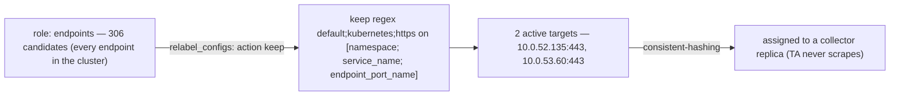
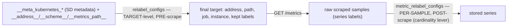
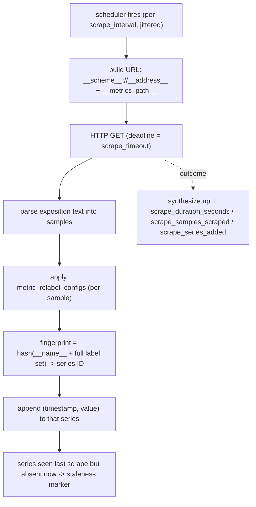

# Topic 6 — Scraping (the mechanics), live data, your cluster

> Companion to `Topic4.md`/`Topic5.md`. Verbose by design — self-contained for cold revision.
> Proven live against `meda-dev-koi-eksdemotest` (ap-south-2, profile `obsrv`) on 2026-06-07.
> The unlock: **a scrape is NOT "GET /metrics."** It's a pipeline —
> **discover → relabel (filter + rewrite) → assign → GET → parse → relabel samples → fingerprint
> into a series.** Service Discovery finds *candidates*; **relabeling** decides which survive,
> *where* to connect, and *what they're called*.
>
> *(Taught consolidated — folds the internals deep-dive parts P4·P5·P6. Quiz parked — see end.)*

---

## WHY scraping needs SD + relabel
You have ~300 endpoints churning every minute. You cannot hardcode "scrape `10.0.52.135:443`."
You declare **intent** ("scrape the apiserver"; "scrape every pod with annotation X"; "scrape the
endpoints behind this Service") and the machinery continuously turns that intent + a live cluster
into a concrete list of `(address, path, labels)` to GET. Scraping is the machinery between
*declarative intent* and *a concrete HTTP request*.

---

## Service Discovery **roles** — what gets enumerated
`kubernetes_sd_configs` has **roles**; each enumerates a different object kind *cluster-wide* and
stamps every candidate with `__meta_kubernetes_*` metadata labels (the raw discovery blob):

| role | enumerates | your jobs |
|---|---|---|
| `endpoints` | every address behind every Service's Endpoints | `kubernetes-apiservers`, **all ServiceMonitors** |
| `pod` | every pod + its declared ports | `kubernetes-pods` (now retired) |
| `node` | every node's Kubelet | `kubernetes-nodes`, `kubernetes-nodes-cadvisor` |
| `service`, `endpointslice`, `ingress` | (others) | — |

A role returns **everything** of that kind — that's the big number. ServiceMonitors are the *same*
`role: endpoints` under the hood, pre-scoped by the SM's `selector`.

---

## The discover → relabel → assign funnel (live)

Live funnel (`opentelemetry_allocator_targets`, statefulset TA):

| job | discovered | → active | what shrank it |
|---|---|---|---|
| kubernetes-apiservers | **306** | 2 | `keep regex default;kubernetes;https` |
| serviceMonitor/loki | 131 | 14 | SM selector |
| serviceMonitor/mimir-ingester | 72 | 2 | SM selector |
| serviceMonitor/kube-state-metrics | 11 | 1 | SM selector |

The shrink is **relabeling with `action: keep`** — discard every candidate whose joined source
labels don't match the regex. (A job whose `keep` matches **zero** candidates vanishes from the
TA's `/jobs` entirely — Topic 4, checkpoint ①.)

---

## Relabeling — the heart of T6 (**TWO** stages)
Each rule reads `source_labels`, joins them with `;`, regex-matches, and acts:
`keep` / `drop` (filter targets or samples) · `replace` (write a `target_label`) · `labelmap`
(copy matching labels through) · `hashmod` (shard). There are **two distinct phases**:

**Stage 1 — `relabel_configs` (target-level, before the scrape).** Acts on the SD's `__meta_*`
labels plus the connection-control `__` labels. Three jobs:
- **keep/drop** the target (the funnel): apiservers `keep regex default;kubernetes;https` on
  `[__meta_kubernetes_namespace, __meta_kubernetes_service_name, __meta_kubernetes_endpoint_port_name]`
  → only the `kubernetes` Service's `https` endpoints in `default` survive.
- **rewrite where to connect:** cadvisor sets `__address__ → kubernetes.default.svc:443` and
  `__metrics_path__ → /api/v1/nodes/<node>/proxy/metrics/cadvisor` (the T5 apiserver-proxy trick).
- **build identity labels:** `target_label: node` from `__meta_kubernetes_node_name`;
  `labelmap __meta_kubernetes_node_label_(.+)`.

**Stage 2 — `metric_relabel_configs` (per-sample, after the scrape).** Acts on the **actual series
labels** of every scraped sample. This is the **cardinality lever** — `drop`/`keep` here removes
whole series *before storage* (Topic 2/4: *this*, not `scrape_interval`, reduces active series).
It's also where `exported_pod→pod` recovery lived in the old annotation jobs.

> Hold the line: **relabel_configs** = "which targets, where to dial, what to call them" (runs
> once per target). **metric_relabel_configs** = "which scraped samples to keep / how to rename
> their labels" (runs per sample, every scrape).
>
> Nice live before/after: the retired `kubernetes-service-endpoints` job had ~16
> `relabel_configs` rules (build `__scheme__`/`__metrics_path__`/`__address__` from annotations +
> `exported_*` recovery); the new **CoreDNS ServiceMonitor needs none** — the operator derives the
> address/port from the Service, so SMs replace a wall of hand-written relabels.

---

## The `__` labels — internal, temporary, steer the GET
Labels beginning `__` are **internal**: they exist only during relabeling and are **dropped before
ingestion** (they never reach Mimir). Two families:
- **Connection-control** (the scraper reads these to build the request): `__address__` (host:port to
  dial), `__scheme__` (http/https), `__metrics_path__` (default `/metrics`), `__param_<k>` (query
  params).
- **SD metadata:** `__meta_kubernetes_*` — namespace, pod, labels, annotations, endpoint port… The
  **input** to Stage 1; discarded afterward.
- **Survival rule:** a `__meta_*` value persists only if a relabel **copies it into a real label**
  (`target_label: node`). Otherwise it's gone.
- **`instance` defaults to the final `__address__`** (post-relabel) unless set. That's why cadvisor
  *could* have had `instance=kubernetes.default.svc:443`, but a relabel made it the node name —
  `__address__` = where to connect ≠ `instance` = identity.

---

## The scrape lifecycle — one cycle end-to-end

The crux: **a series' identity is the fingerprint of `__name__` + its full label set.** Two scrapes
append to the *same* series iff that fingerprint is identical. Add/rename one label (or a relabel
does) → a *different* series. Value+timestamp are the **sample**, never identity (Topic 2).

---

## Grounded live (your cluster, now)
- **apiservers:** `role: endpoints` discovered **306 → 2 active** via `keep default;kubernetes;https`;
  survivors `10.0.52.135:443`, `10.0.53.60:443`. (After today's RBAC fix —
  `nonResourceURLs:["/metrics"]` on `otel-ta-role` — both are `up=1`.)
- **ServiceMonitors** = auto-generated jobs `serviceMonitor/<ns>/<name>/0`; the SM `selector`
  pre-scopes the `role: endpoints` discovery (mimir-ingester 72→2, KSM 11→1, loki 131→14).
- **cadvisor:** relabel rewrote `__address__→apiserver`, built `node` from
  `__meta_kubernetes_node_name` → stored series carry per-node identity though the GET hit the
  apiserver.
- **CoreDNS (today):** migrated annotation→SM (`job=kube-dns`); the old
  `kubernetes-service-endpoints` copy decayed out within the ~5-min staleness window. Annotation
  discovery now fully retired; daemonset scrapes only kubelet + cAdvisor.

---

## Common failure modes (interview-grade)
- **Job missing from `/jobs`** → a `keep` matched zero candidates (Stage-1/relabel bug) — not the
  scrape. Checkpoint ①.
- **Wrong `__metrics_path__`/`__address__`** → `up=0` or 404; the GET went to the wrong place.
- **Label collision** → a scraped label clashes with a target label → becomes `exported_<label>`
  (`honor_labels: false`); recover with a relabel, or set `honorLabels: true`.
- **`metric_relabel` too greedy** → needed series silently gone (compare `scrape_samples_scraped`
  vs `scrape_samples_post_metric_relabeling`).
- **Cardinality bomb** → a missing `drop`; watch `scrape_series_added`.
- **Double-scrape** → same endpoint matched by ≥2 discovery paths (annotation + SM). Detect:
  `count by(job)(<metric>)` shows the same series under two jobs (we just saw CoreDNS 422+422
  during the SM cutover — staleness, confirmed via `time()-timestamp(...)`).

---

## Practical exercises (live cluster)
1. `kubectl -n meta-monitoring port-forward svc/obsrv-ta-targetallocator 18090:80` →
   `curl -s localhost:18090/jobs` and `curl -s localhost:18090/metrics | grep opentelemetry_allocator_targets`.
   Confirm discovered (big) vs active (small), and that a 0-active job is absent from `/jobs`.
2. Pick `kubernetes-apiservers`; from `meta_ta.yaml` read its `keep` rule and explain 306→2.
3. Find a relabel-built label: `up{job="kubernetes-nodes-cadvisor"}` carries `node` (from
   `__meta_kubernetes_node_name`) though `__address__` was rewritten to the apiserver.
4. Cardinality lever: identify which stage (`metric_relabel_configs`) a `drop` belongs in, and why
   raising `scrape_interval` would *not* cut active-series count.

---

## Memorize (one-liners)
- Scrape = **discover (SD role) → relabel keep/rewrite → assign → GET → parse → metric_relabel →
  fingerprint → append.**
- SD roles: `endpoints` (Services/SM), `pod`, `node` — each enumerates everything of that kind;
  `keep` filters. Live: apiservers **306→2**.
- **Two relabel stages:** `relabel_configs` (target-level, pre-scrape, on `__meta_*`/`__address__`)
  vs `metric_relabel_configs` (per-sample, post-scrape — the **cardinality lever**).
- `__` labels are internal + **dropped before storage**; `__address__`/`__scheme__`/`__metrics_path__`
  steer the GET; `instance` defaults to the post-relabel `__address__`.
- **Series identity = fingerprint(`__name__` + full label set)**; same fingerprint = same series.
- A ServiceMonitor replaces a wall of hand-written `relabel_configs` (operator derives address/port
  from the Service).

## Quiz result
**PASS (2026-06-13)** — posed 2026-06-07, parked when the learner pivoted to the
kube-dns/apiserver ops fixes; taken to completion on 2026-06-13.

**The gap it exposed and closed — the two-stage relabel conflation.** The learner initially
named **Stage 1 (`relabel_configs`) for BOTH Q2 and Q5**. Q5 (a job vanishing from `/jobs`) *is*
Stage 1 — a `keep` matching zero candidates. But Q2 (cutting **active series**) is **Stage 2
(`metric_relabel_configs`)**. Locked after the correction:
- **Stage 1 `relabel_configs`** — target-level, pre-scrape: *which targets, where to dial, what
  to name them.* A `keep` matching zero here = job absent from `/jobs`.
- **Stage 2 `metric_relabel_configs`** — per-sample, post-scrape: *which series to keep/drop
  before storage* = the **cardinality / active-series lever** (drop a noisy `__name__`, or strip
  a high-cardinality label so many series collapse into fewer). `scrape_interval` is **not** the
  lever (it cuts samples/sec).

Other answers: Q1 clean after one nudge — role `endpoints` enumerates **all ~306 cluster-wide
endpoints**, `keep` regex `default;kubernetes;https` maps positionally to
`__meta_kubernetes_namespace=default` ; `__meta_kubernetes_service_name=kubernetes` ;
`__meta_kubernetes_endpoint_port_name=https` (joined in source-label order). Initial slip: read
the 306 as "the apiserver's endpoints" — it's *every* Service's endpoints, the `keep` narrows to
2. Q3 (a) corrected — a relabel **set `instance` to the node name**, overriding the
`instance=__address__` default (else all 3 nodes would read `kubernetes.default.svc:443`); (b)
`__meta_kubernetes_*` are dropped before ingestion unless copied into a real label. Q4 clean —
new series; identity = fingerprint(`__name__` + full label set), add a label → new hash.

**The 5 questions (for re-revision):**
1. apiserver job discovers 306, keeps 2 — name the SD **role**, what the 306 are, and the `keep`
   rule (which 3 `__meta_` labels, against what value).
2. `scrape_interval: 120s` to "halve active series" — right/wrong? correct lever + which relabel
   stage.
3. cadvisor sets `__address__ = kubernetes.default.svc:443` for all 3 nodes — (a) why isn't
   `instance` that address? (b) what happens to every `__meta_kubernetes_*` label after relabeling?
4. scrape N has `{job,instance,pod}`; scrape N+1 a relabel adds `node` — same series or new? why
   (what's identity)?
5. a job is entirely absent from the TA's `/jobs` — which stage is broken, one-line cause?
