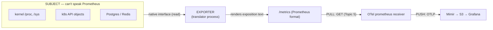
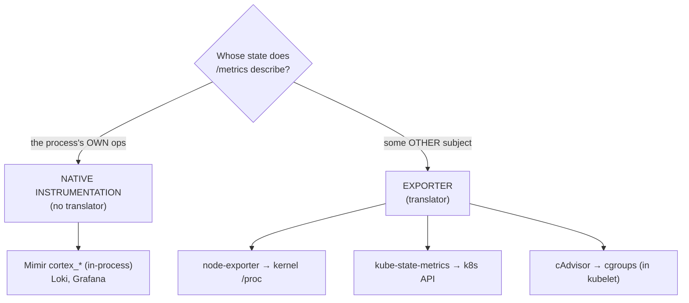
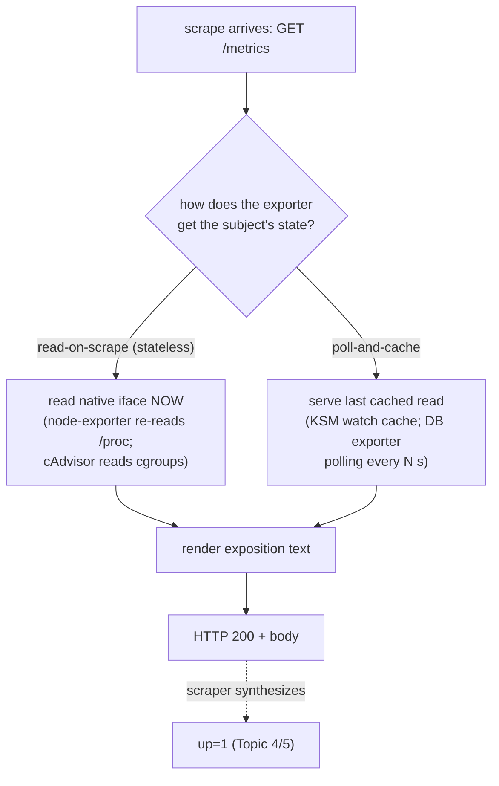
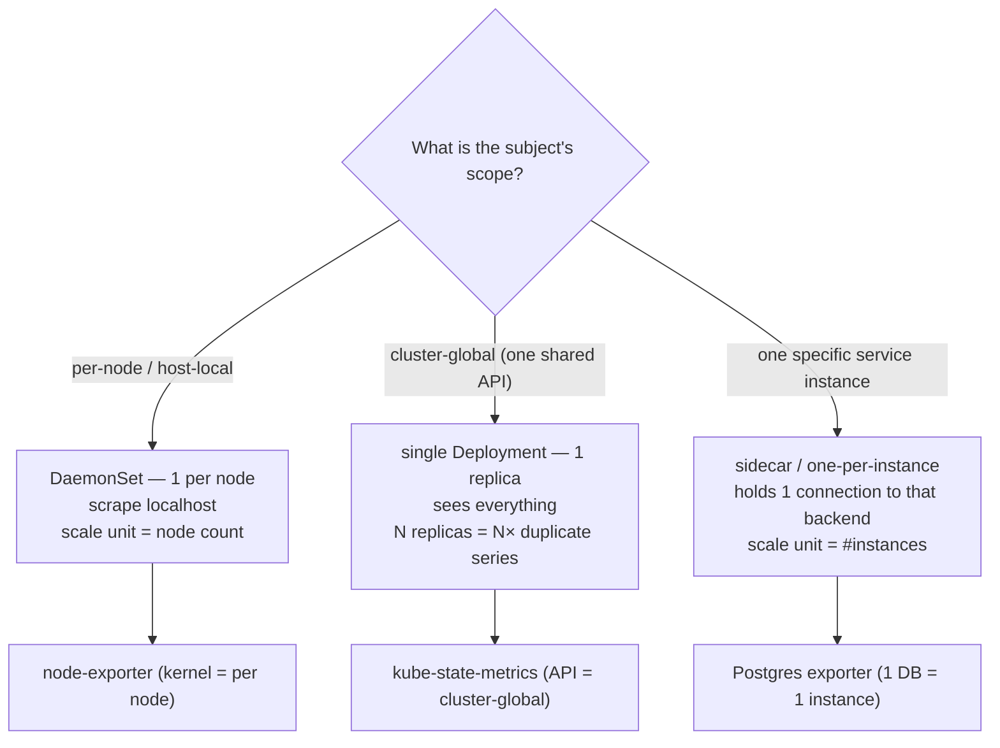
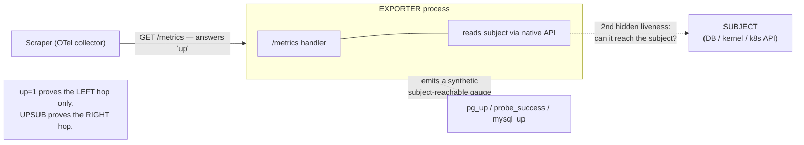
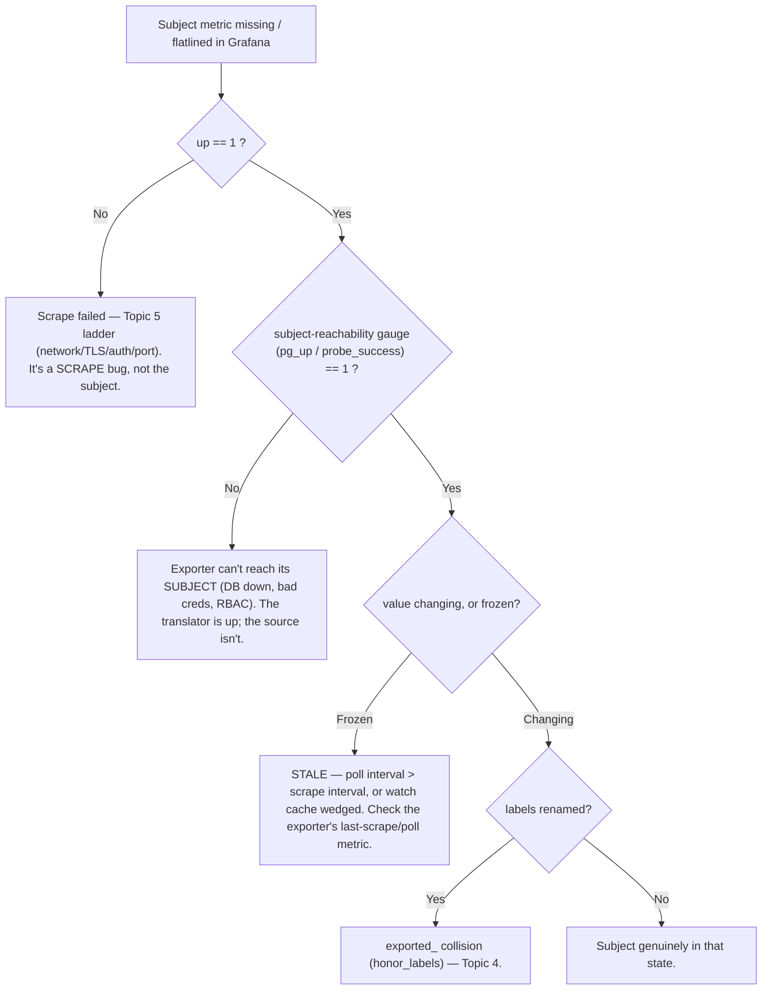

# Topic 7 — Exporters, from scratch (live data, your cluster)

> Companion to `Topic4.md`/`Topic5.md`. Verbose by design — a self-contained lesson for cold
> revision in the `Topic4.md` gold-standard shape.
> **STATUS: in progress (2026-06-13)** — taught cold (learner said "vague idea, not concrete");
> quiz posed but **not yet taken**. Resume by answering the 4 questions at the bottom.
> The one idea to anchor everything: **an exporter is a *translator* — a separate process that
> stands in front of something which can't speak Prometheus, reads its *native* interface, and
> re-publishes it as `/metrics`.** Everything else falls out of "translator for a subject that
> can't speak for itself."

---

## WHY exporters exist (the problem they kill)
Most things in the world don't expose `/metrics`. The Linux kernel doesn't. The Kubernetes API
doesn't. Postgres, Redis, an SNMP switch, a hardware RAID controller — none speak the Prometheus
exposition format. But you still need their state as metrics to detect/diagnose (Topic 1). You have
two ways to get a subject's state into Prometheus:

1. **Make the subject instrument itself** (link in `client_golang`, expose its own `/metrics`). Only
   possible if you control the code *and* it's a long-lived server. The kernel, the k8s API, a
   closed-source appliance — you can't.
2. **Put a translator in front of it** — a process that reads the subject's native interface
   (`/proc`, the k8s watch API, a SQL connection, an SNMP walk) and renders Prometheus text. That
   translator **is the exporter.**

Without it, the subject is a **blind spot**: its state exists but never crosses the telemetry
boundary. Exporters are how the un-instrumentable world gets pulled into the pull model (Topic 5).

Reconnect to the journey: the exporter is only the **origin**. It *exposes*; the OTel prometheus
receiver still has to **pull** it (Topic 5), the collector pushes to Mimir (Topic 4). **No scrape =
no data**, no matter how healthy the exporter is.

---

## WHAT an exporter is — the line vs native instrumentation (D1)
The clean test is **subject identity** — the same "subject vs target" distinction sharpened at T5:

> **Does the process expose metrics about *itself*, or about something *else*?**

- **Native (direct) instrumentation** — the app's own code increments its own counters about its
  own operations. **Subject = the process.** Mimir/Loki/Grafana import `client_golang` and describe
  themselves; there's no translator (`cortex_ingester_memory_series` is Mimir *describing itself*).
- **Exporter** — a *separate* process representing a **foreign subject** that can't expose
  Prometheus itself. The subject can't run `client_golang`, so the stand-in translates for it.

It's a **spectrum, not a hard wall** (cAdvisor is exporter-shaped but embedded in the kubelet; a
sidecar exporter shares a pod with its subject), but the subject-vs-process test resolves ~95% of
cases. *"Is this an exporter?" = "is it speaking for something other than itself?"*

| Source (your stack) | Subject | Data source | Exporter? |
|---|---|---|---|
| node-exporter | the node/kernel/host | `/proc` + `/sys` | ✅ exporter (subject = OS) |
| kube-state-metrics | other k8s objects | the k8s **watch API** | ✅ exporter (subject = the API) |
| cAdvisor | every container | kernel **cgroups** (via kubelet) | ✅ exporter-shaped, embedded |
| Mimir `/metrics` (`cortex_*`) | Mimir itself | in-process `client_golang` | ❌ native instrumentation |

---

## HOW it works internally — the request lifecycle inside an exporter
To the *puller* every target is one `GET /metrics` (Topic 5). Behind the endpoint, an exporter does
one of two things when a scrape arrives — and **which** decides its failure modes:

- **Read-on-scrape (stateless):** node-exporter opens `/proc/stat` on every scrape and re-reads it;
  it keeps no history. Fresh every time — but a slow/blocked read shows up as
  `scrape_duration_seconds` creep.
- **Poll-and-cache:** KSM maintains an in-memory **watch cache** of the whole cluster's object state
  and renders from it; a DB exporter may poll the backend every 60s. Cheap per scrape, but the data
  is only as fresh as the last poll → **staleness** is a built-in risk (failure mode #2).

Either way, the exporter speaks for a subject it had to *reach*. That second hop is invisible to the
scraper and is the root of every exporter-specific failure below.

---

## Grounded in YOUR stack (live — T5 archetype dissection, meda-dev-koi 2026-06-07)
Four `/metrics` pages, dissected live; series counts are real:

| exporter | topology | subject | scrape path | live series |
|---|---|---|---|---|
| node-exporter | DaemonSet (1/node) | this host's kernel | direct → pod `:9100` | **1673** |
| kube-state-metrics | single Deployment | all k8s objects | direct → pod `:8080` | **6141** (biggest) |
| cAdvisor | in kubelet (1/node) | every container | **indirect → apiserver proxy** | **5550** |
| Mimir ingester (native) | — | the app itself | direct → pod `:8080` | 1300 |

- node-exporter's counters live in the **kernel** → a node-exporter *pod* restart does **not** reset
  `node_*` (only a node reboot does) — Topic 5.
- KSM's `honorLabels: true` exists *because* its subject ≠ itself: its exposition already carries
  the described object's `namespace/pod/node`, which must win over the KSM pod's `instance` (Topic 4
  `exported_*`).
- cAdvisor proves "exporter-shaped but embedded" — same translator job (cgroups → metrics), but it
  ships inside the kubelet, reached through the apiserver proxy (`__address__` rewrite, Topic 6).

---

## HOW it scales — topology mirrors the subject's scope (D2)
> **An exporter's replication model copies the locality/scope of its subject.**

| Subject scope | Topology | Why |
|---|---|---|
| **per-node / host-local** | **DaemonSet** | each node's kernel is a distinct subject; scrape it locally; node join/leave auto-adds/removes a pod |
| **cluster-global** (one shared API) | **single Deployment** | one replica sees everything; N replicas = every series duplicated N× for zero gain, all watching the same API |
| **one specific service instance** | **sidecar / one-per-instance** | the exporter holds a connection to exactly one backend |

**Worked example — a Postgres exporter.** Subject = *one database instance* → **one exporter per
Postgres** (sidecar in the DB pod, or a small Deployment pointed at the DB endpoint). It scales with
**number of databases**, not nodes, not clusters. As a DaemonSet you'd get N copies all hammering
the same DB; as a single cluster-wide Deployment it could only watch one DB. *The subject's scope is
the answer.*

---

## Trade-offs (performance / scaling / security / cost)
- **Performance:** read-on-scrape exporters do real work per scrape (node-exporter reads dozens of
  `/proc` files; a heavy collector set raises `scrape_duration_seconds`). Disable collectors you
  don't use (`--no-collector.*`).
- **Scaling:** the topology table *is* the scaling story — get the subject scope wrong and you
  either duplicate series (KSM as N replicas) or under-cover (DB exporter as a singleton).
- **Security:** an exporter often needs **privileged reach into its subject** — node-exporter mounts
  host `/proc`+`/sys` (host PID/FS exposure); **KSM holds cluster-wide read RBAC on the entire k8s
  API** (a fat read token — and a tempting target). Native instrumentation needs none of this. Scope
  RBAC tightly; never give an exporter write access.
- **Cost:** exporters are a top cardinality source — KSM alone is **6141 series** here, cAdvisor
  **5550**; both grow with cluster object/container count. The cardinality lever is
  `metric_relabel_configs` keep/drop (Topic 6), not `scrape_interval`.

---

## COMMON FAILURE MODES — the ones unique to the exporter pattern (D3, interview-grade)
The deep idea: with native instrumentation, if the process is up, the metrics are *of* that process
— `up=1` and data-validity **share fate**. An exporter **splits liveness into two questions**: *is
the exporter up?* and *is its subject reachable/healthy?* These can diverge, and that gap is the
entire exporter-specific failure surface.

1. **Exporter up, subject unreachable.** Postgres exporter can't connect to the DB; blackbox target
   is down. `up=1` (the `/metrics` handler answers fine) but the subject data is missing / zero /
   stale. → **Trust the exporter's own subject-reachability gauge**: `pg_up`, `mysql_up`,
   `probe_success`. Exporters emit these *precisely because* `up` is blind to the second hop.
   **Mental hook: `pg_up` is to the exporter what `up` is to the scraper** — same idea, one layer in.
2. **Stale / cached data.** The exporter polls its subject slower than you scrape it (KSM watch-cache
   lag; an exporter polling a DB every 60s but scraped every 15s → you re-read identical values 4×).
   Native instrumentation is always live. → watch the subject's own freshness, not scrape success.
3. **SPOF for the subject.** A single exporter is one point of failure for *all* data about its
   subject. KSM is one pod — if it dies, **every** `kube_*` series vanishes cluster-wide even though
   every object it describes is perfectly healthy. Native instrumentation *can't* have this (each app
   reports itself; failure is local). → HA = 2 KSM replicas with shard config, or at minimum alert on
   `up{job="kube-state-metrics"}==0`.
4. **Identity collisions** — the `honorLabels` case from T5/T4. The exporter carries labels about the
   *subject* (`namespace/pod/node`) that collide with the *scrape's* target labels. Only happens
   because subject ≠ target — i.e. only for exporters. (`honor_labels: false` → `exported_<label>`;
   set `honorLabels: true` on KSM so the subject's labels win.)

**Troubleshooting ladder — "exporter metric missing/wrong":**

---

## Practical exercises (run against the live cluster)
1. **Place each on the subject-identity axis.** `curl` node-exporter `:9100`, KSM `:8080`, Mimir
   ingester `:8080`; for each ask "is `/metrics` about *this process* or *something else*?" Confirm
   only Mimir is native.
2. **Find a subject-reachability gauge.** Pull KSM's `/metrics`; locate the watch/list success
   metrics (the KSM analog of `pg_up`). Contrast with `up` (the scrape gauge) — two different hops.
3. **Prove the SPOF.** `kubectl -n meta-monitoring get deploy kube-state-metrics` (1 replica). Reason
   through: scale to 0 → which dashboards go blank, and are the underlying objects actually unhealthy?
   (Don't actually delete prod data — reason it.)
4. **Topology check.** `kubectl get ds node-exporter -A` (per node) vs `kubectl get deploy
   kube-state-metrics -A` (single). Tie each back to its subject's scope.
5. **Security surface.** Inspect KSM's ClusterRole (cluster-wide read on the API) and node-exporter's
   host mounts (`/proc`, `/sys`). Name what native instrumentation would *not* need.

---

## Memorize (one-liners)
- An exporter is a **translator** for a subject that can't speak Prometheus; it only *exposes* —
  something still has to scrape it (**no scrape = no data**).
- The line: **subject = the process → native instrumentation; subject = something else → exporter.**
- **Topology mirrors subject scope:** host-local → DaemonSet (node-exporter); cluster-global → single
  Deployment (KSM); one instance → sidecar/one-per-instance (DB exporter).
- Exporters **split liveness in two:** `up` = exporter reachable; **`pg_up`/`probe_success`** =
  *subject* reachable. `up=1` + flatlined data ⇒ check the subject-reachability gauge.
- A single exporter is a **SPOF for its whole subject** (KSM down = all `kube_*` gone though objects
  are fine) — and often a **privileged one** (KSM = cluster-wide API read; node-exporter = host mounts).
- Live anchors (T5): node-exporter **1673** series · KSM **6141** · cAdvisor **5550** · Mimir-native 1300.

---

## Quiz — PENDING (resume here)
Posed 2026-06-13, not yet answered. Brutal rules: no hints, from memory, mark wrong out loud.
1. The single test that decides exporter vs native instrumentation — apply it to **cAdvisor** and to
   **Grafana's own `/metrics`**.
2. A team runs `kube-state-metrics` as a **3-replica Deployment** "for HA." Two things are now wrong
   — name both, and what they should have done instead.
3. A Postgres exporter shows `up=1` for 20 min but the DB-connections panel is flatlined at the last
   value. Walk the diagnosis: which metric first, the two possible outcomes, what each tells you.
4. Why can a *single* node-exporter pod restart **not** lose cluster-wide data, while a single KSM pod
   restart **can** — in terms of subject scope and topology (ties to D2)?
