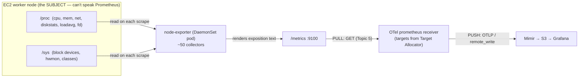
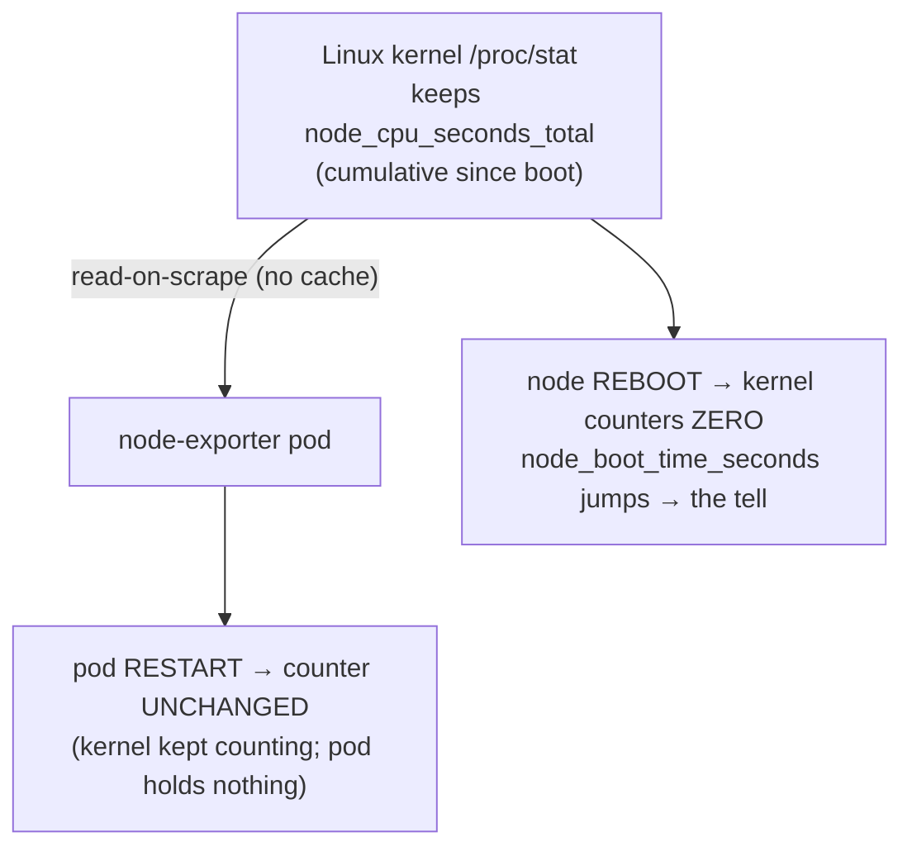
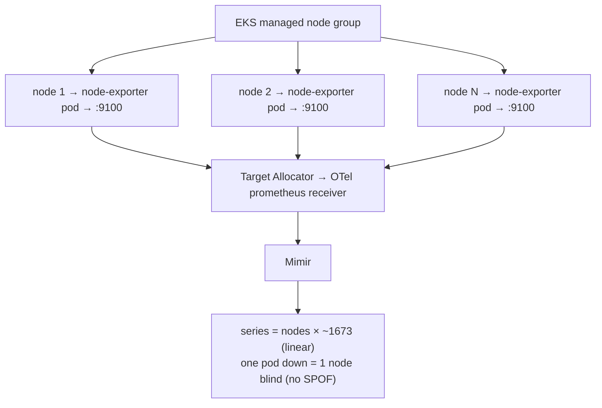
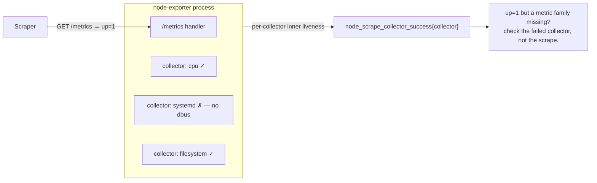
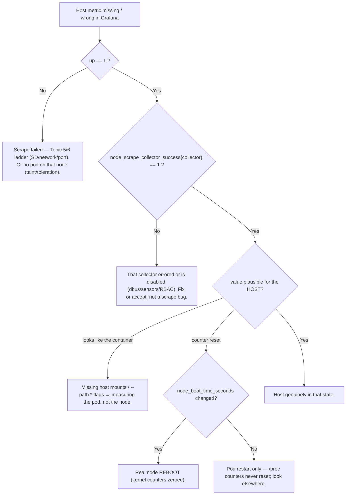

# Topic 8 — node-exporter, from scratch (the host/OS exporter)

> Companion to `Topic4.md`/`Topic5.md`/`Topic7.md`. Verbose by design — a self-contained lesson for
> cold revision in the `Topic4.md` gold-standard shape.
> **STATUS: TAUGHT 2026-06-13 — quiz + live testing PENDING (tomorrow, on the fresh daily cluster).**
> Built right after Topic 7 (Exporters), where node-exporter was the canonical *per-node DaemonSet*
> exporter. This topic zooms into that one box.
> The one idea to anchor everything: **node-exporter is the *translator for the Linux host* — a
> DaemonSet pod on every node that reads the kernel's `/proc` and `/sys` on each scrape and renders
> them as `/metrics`. Its counters live in the kernel, not in the pod; its topology is one-per-node
> because its subject (the kernel) is one-per-node.**

---

## WHY node-exporter exists (the problem it kills)
Everything you run sits on a Linux host: EKS worker nodes are EC2 instances running a kernel. That
kernel *is* the substrate — if a node runs out of memory, fills its disk, saturates CPU, or drops
packets, **every pod on it suffers**, and no application metric will tell you *why*. You need the
**host's** state as metrics.

But the kernel doesn't speak Prometheus. It exposes its state through **pseudo-filesystems**
(`/proc`, `/sys`) and syscalls, not an HTTP `/metrics` endpoint — and it never will. So, exactly per
the Topic 7 rule, you need a **translator**: a process that reads `/proc`+`/sys` and re-publishes
them in the Prometheus exposition format. That translator is **node-exporter** — the canonical
**host/OS exporter** (the first archetype from the `/metrics` archetypes: *host/proc*).

Without it the host is a **blind spot**: an OOM-killing, disk-filling node looks fine from the app's
point of view until pods start getting evicted and you have no idea the substrate was the cause.



Reconnect to the journey: node-exporter is only the **origin**. It *exposes*; the OTel prometheus
receiver still has to **pull** it (Topic 5/6), then the collector pushes to Mimir (Topic 4).
**No scrape = no host data**, no matter how healthy the node-exporter pod is.

---

## WHAT it is — placing it on the subject-identity axis (Topic 7)
Apply the Topic 7 test: *does `/metrics` describe the process itself, or another subject?*
node-exporter's purpose is the **host's kernel/hardware** — a subject other than the node-exporter
process → **it's an exporter** (the host/OS archetype). (It also emits a handful of `process_*` and
`go_*` series about *itself*, but those are incidental; its *reason to exist* is the host.)

| | node-exporter | (contrast) kube-state-metrics | (contrast) cAdvisor |
|---|---|---|---|
| Subject | this node's **kernel/hardware** | all **k8s API objects** | every **container** (cgroups) |
| Data source | `/proc` + `/sys` | k8s **watch API** | kernel **cgroups** (via kubelet) |
| Scope | **per-node** | **cluster-global** | **per-node** (in kubelet) |
| Topology | **DaemonSet** (1/node) | single Deployment | embedded in kubelet |
| Live series (your stack) | **1673 / node** | 6141 | 5550 |

It is **not** metrics-server, **not** cAdvisor, **not** KSM — different subjects:
- **cAdvisor** = *containers* (cgroup usage). node-exporter = the *host underneath* them.
- **KSM** = *API object state*. node-exporter = *host resource reality*.
- **metrics-server** = CPU/mem for `kubectl top`/HPA (a different, non-Prometheus path).

A useful mental split: **cAdvisor tells you what a container is using; node-exporter tells you what
the node has left.** You need both to reason about "is this pod throttled because *it* is greedy, or
because the *node* is exhausted?"

---

## HOW it works internally
### A single static binary, organized into "collectors"
node-exporter is one small Go binary. Its metrics are grouped into ~50 **collectors**, each owning a
metric family and a `/proc`/`/sys` source:

| collector | reads | emits (examples) |
|---|---|---|
| `cpu` | `/proc/stat` | `node_cpu_seconds_total{cpu,mode}` |
| `meminfo` | `/proc/meminfo` | `node_memory_MemAvailable_bytes`, `…MemTotal_bytes` |
| `filesystem` | `/proc/mounts` + `statfs` | `node_filesystem_avail_bytes{device,mountpoint,fstype}` |
| `diskstats` | `/proc/diskstats` | `node_disk_read_bytes_total`, `node_disk_io_time_seconds_total` |
| `netdev` | `/proc/net/dev` | `node_network_receive_bytes_total`, `…_receive_errs_total` |
| `loadavg` | `/proc/loadavg` | `node_load1`, `node_load5`, `node_load15` |
| `filefd` | `/proc/sys/fs/file-nr` | `node_filefd_allocated`, `node_filefd_maximum` |
| `stat` | `/proc/stat` | `node_boot_time_seconds`, `node_context_switches_total` |
| `vmstat` | `/proc/vmstat` | `node_vmstat_oom_kill`, `node_vmstat_pgmajfault` |
| `uname` | syscall | `node_uname_info{release,nodename,…}` |

Collectors are **enabled-by-default** (cpu, meminfo, filesystem, diskstats, netdev, loadavg, stat,
vmstat, time, uname, filefd, netstat, sockstat, …), **opt-in** (`--collector.systemd`,
`--collector.processes`, `--collector.ntp`), or can be **disabled** (`--no-collector.<name>`). The
**textfile** collector is on but does nothing until you point it at a directory.

### Read-on-scrape (stateless) — and WHERE the counters actually live
This is the subtle, exam-favourite part. node-exporter is **read-on-scrape**: it keeps **no
history**. When a scrape arrives it opens the relevant `/proc`/`/sys` files **right then**, reads the
current values, renders them, and forgets. There is **no poll loop, no cache** (contrast KSM's watch
cache).

So where do cumulative counters like `node_cpu_seconds_total` come from? **The kernel.** `/proc/stat`
holds CPU time **cumulative since boot** — the *kernel* keeps the running total. node-exporter just
reads the current number. Consequences:

- A **node-exporter pod restart does NOT reset** `node_cpu_seconds_total` (or any `/proc`-backed
  counter): the kernel kept counting; the new pod reads the same ever-growing number. There's nothing
  in the pod to lose — it's stateless.
- A **node reboot DOES reset** them: the kernel's counters zero out, and `node_boot_time_seconds`
  jumps to the new boot time. That `node_boot_time_seconds` change is *how* you distinguish "counter
  reset because the box rebooted" from "counter reset because someone redeployed node-exporter" (the
  latter never resets the `/proc` counters).



### Running in a container but measuring the HOST (the #1 gotcha)
node-exporter runs in a pod, but a container's own `/proc` shows the *container's* tiny view, not the
host's. So the DaemonSet **mounts the host's pseudo-filesystems** and tells node-exporter to use them
via flags:

```yaml
# DaemonSet essentials
hostNetwork: true            # so node_network_* reflect the host NICs; :9100 on the host
hostPID: true                # only needed for the processes collector
volumeMounts:
  - { name: proc, mountPath: /host/proc, readOnly: true }
  - { name: sys,  mountPath: /host/sys,  readOnly: true }
  - { name: root, mountPath: /host/root, readOnly: true, mountPropagation: HostToContainer }
args:
  - --path.procfs=/host/proc
  - --path.sysfs=/host/sys
  - --path.rootfs=/host/root
  - --collector.filesystem.mount-points-exclude=^/(dev|proc|sys|run|var/lib/kubelet/.+)($|/)
```

Forget the mounts/flags and node-exporter silently reports the *container's* filesystem (a couple of
GB) instead of the host's EBS volume — a classic "the disk metric is wrong" bug.

### The textfile collector — custom host metrics without writing an exporter
`--collector.textfile.directory=/var/lib/node_exporter/textfile_collector`: node-exporter reads every
`*.prom` file there and merges it into `/metrics`. A cron job or host script writes
`backup_last_success_timestamp 1718…` to a `.prom` file; node-exporter exposes it. The escape hatch
for host-level batch metrics — no new exporter, no new scrape target.

---

## Grounded in YOUR stack (EKS, ap-south-2, profile `obsrv`)
- Deployed as a **DaemonSet** across every worker in the daily `meda-dev-<word>-eksdemotest` cluster
  (managed node group). Node join/leave auto-adds/removes a pod — *the topology tracks the fleet.*
- **~1673 series per node** (live, from the Topic 5/7 archetype dissection). On a 3-node cluster ≈
  **5k series** just from node-exporter; it grows **linearly with node count** — autoscale to 30
  nodes ⇒ ~**50k** series from node-exporter alone (a real cardinality contributor — see scaling).
- **Scraped by the OTel prometheus receiver**, with targets handed out by the **Target Allocator**
  (`obsrv-ta-metrics-stateful`) — *not* a standalone Prometheus. `up{job=…}` per node = scrape
  liveness (Topic 5/6).
- EKS-relevant signals:
  - `node_filesystem_avail_bytes` on `/` and the container-runtime volume → **EBS (gp3) fill**; a
    full node goes `NotReady` and the kubelet evicts pods.
  - `node_memory_MemAvailable_bytes` → **memory pressure** → kubelet eviction thresholds.
  - `node_cpu_seconds_total{mode="idle"}` → CPU saturation / throttling on the instance type.
  - `node_disk_io_time_seconds_total` → EBS IO saturation (gp3 baseline IOPS/throughput limits).

---

## HOW it scales — and the trade-offs
**Scale unit = node count.** DaemonSet = exactly one pod per node; each pod's series count is roughly
constant (~1673), so **total node-exporter series = nodes × ~1673**. This is the cleanest scaling
story of any exporter: it's linear and predictable, and it auto-tracks autoscaling. But it also means
node-exporter is a **top cardinality source** at fleet scale (100 nodes ⇒ ~167k series).

- **Performance:** read-on-scrape does real work per scrape (dozens of `/proc` files); a fat collector
  set raises `node_scrape_collector_duration_seconds` and overall `scrape_duration_seconds`. Keep the
  collector set lean.
- **Cost/cardinality levers (without losing core host visibility):**
  1. **Disable unused collectors** — `--no-collector.<name>` (e.g. `hwmon`, `nfs`, `infiniband` are
     useless on EC2). Removes whole metric families.
  2. **Exclude noisy mounts/devices** — `--collector.filesystem.mount-points-exclude` /
     `--collector.netdev.device-exclude` to drop overlay/tmpfs/`/var/lib/kubelet/pods/...` and veth
     churn — otherwise thousands of `node_filesystem_*` / `node_network_*` series per node.
  3. Drop at ingest with `metric_relabel_configs` (Topic 6) as the last resort. **Not** via
     `scrape_interval` — that changes samples/sec, not active series (Topic 2).
- **Security:** node-exporter needs **privileged host reach** — `hostNetwork`, host `/proc`+`/sys`+`/`
  mounts (host PID/FS exposure), sometimes `hostPID`. That's a real surface: mount **read-only**,
  enable only the collectors you need, and don't grant more host access than the chosen collectors
  require. (Native instrumentation needs none of this — the cost of translating for the host.)
- **Reliability:** blast radius = **1 node** (Topic 7, Q4). A pod restart blanks only that node's
  host metrics for a sub-scrape gap; every other node has its own pod. **No SPOF** — the opposite of
  KSM.



---

## COMMON FAILURE MODES
Node-exporter inherits the Topic 7 **split-liveness** idea, but the "second hop" is *internal*: even
with `up=1`, an individual **collector** can fail. Its analog of `pg_up` is
**`node_scrape_collector_success{collector="X"}`** (1 = that collector ran OK, 0 = it errored).



1. **Reports the container, not the host.** Missing host mounts / `--path.*` flags → filesystem &
   network metrics describe the pod's namespace, not the node (e.g. disk shows a few GB, not the EBS
   volume). The #1 misconfiguration.
2. **`up=1` but a metric family is absent.** A collector errored or is disabled — e.g.
   `--collector.systemd` needs dbus access it doesn't have; `hwmon`/sensors don't exist on virtualized
   EC2. Confirm with `node_scrape_collector_success{collector="systemd"}==0`. (Split liveness, one
   layer *inside* the exporter.)
3. **Filesystem / netdev cardinality explosion.** Not excluding overlay/tmpfs/kubelet-pod mounts and
   veth interfaces → thousands of `node_filesystem_*` / `node_network_*` series **per node**, which
   then multiplies by node count.
4. **Counter "reset" confusion.** A node-exporter pod restart does **not** reset `/proc` counters
   (kernel holds them); only a node reboot does (watch `node_boot_time_seconds`). Misreading a pod
   restart as a host reboot leads to wrong RCA.
5. **SecurityContext / admission blocks.** PSA/restricted policies blocking `hostNetwork`/`hostPID`/
   host mounts → pod won't schedule or collectors silently fail. On tainted nodes (GPU/spot), missing
   **tolerations** ⇒ no pod on those nodes ⇒ those nodes are invisible.

**Troubleshooting ladder — "host metric missing/wrong":**



---

## Practical exercises (run live tomorrow on the fresh cluster)
1. **Confirm the topology.** `kubectl -n <ns> get ds -l app.kubernetes.io/name=node-exporter -o wide`
   — one desired pod per node; correlate with `kubectl get nodes`.
2. **Prove read-on-scrape & counter location.** `kubectl -n <ns> delete pod <node-exporter-pod>` (with
   confirmation), then check `node_cpu_seconds_total` for that instance did **not** reset; compare
   `node_boot_time_seconds` (unchanged → no reboot).
3. **Find the inner liveness gauge.** Query `node_scrape_collector_success` and list any collector
   `== 0` on your nodes — the node-exporter analog of `pg_up`.
4. **Container-vs-host check.** `curl` a node-exporter `:9100/metrics`; confirm `node_filesystem_*`
   shows the **EBS** sizes, not a few-GB container rootfs → proves the host mounts/flags are wired.
5. **Cardinality.** `count by (__name__)({job="node-exporter"})` and
   `count(node_filesystem_avail_bytes) by (instance)` — see which families dominate the ~1673/node;
   identify a collector you could disable on EC2.
6. **CPU utilisation PromQL.** `1 - avg by (instance)(rate(node_cpu_seconds_total{mode="idle"}[5m]))`.

---

## Memorize (one-liners)
- node-exporter is the **translator for the Linux host** — reads `/proc`+`/sys` **on each scrape**
  (read-on-scrape, no cache) and renders `/metrics` on **:9100**.
- It's a **DaemonSet (1/node)** because its subject — the kernel — is **per-node**; blast radius = 1
  node, **no SPOF** (the opposite of KSM).
- Counters live in the **kernel**, not the pod → **pod restart doesn't reset** `node_*`; only a
  **node reboot** does (`node_boot_time_seconds` is the tell).
- In a container you must mount host `/proc`,`/sys`,`/` and pass `--path.procfs/sysfs/rootfs`, else it
  measures the **pod**, not the host.
- Split liveness, one layer in: `up=1` = scrape OK; **`node_scrape_collector_success{collector}`** =
  that collector OK.
- Cardinality levers: **`--no-collector.*`** + **filesystem/netdev exclude** patterns; total series ≈
  **nodes × ~1673** (linear).
- Custom host metrics without a new exporter ⇒ **textfile collector**.
- Live anchor: **1673 series / node**; subject = host kernel; data source = `/proc` + `/sys`.

---

## Quiz — PENDING (to be taken LIVE tomorrow) ⏳
> Per convention, **Questions** and **Answer key** are separate so you can self-test cold. We'll run
> these against the live cluster tomorrow (exercises above feed them). Brutal rules: no hints, from
> memory, marked wrong out loud, mastery held until correct.

### Questions (self-test cold — don't peek at the key)
1. node-exporter is redeployed (pod restart). Explain precisely why `node_cpu_seconds_total` does
   **not** reset, yet after an EC2 **node reboot** it does — and which single metric distinguishes the
   two cases.
2. `node_filesystem_avail_bytes` for a node reports only a few GB, not its EBS volume. What is
   misconfigured, and what specifically must be present for it to read the **host** filesystem?
3. `up{job="node-exporter"}==1` for a node, but `node_systemd_unit_state` series are entirely absent
   while CPU/mem are fine. Which **single** metric do you query to confirm the cause, and what does it
   tell you?
4. Your cluster autoscales from 3 → 30 nodes. By roughly how much does node-exporter's contribution
   to Mimir active series change, and name **two** config levers to cut node-exporter cardinality
   **without** losing core host visibility.
5. Why is node-exporter a **DaemonSet** and not a Deployment — and why is a single node-exporter pod
   restart **not** a cluster-wide problem (tie to subject scope / blast radius, Topic 7 D2)?
6. You need to expose "timestamp of last successful backup" as a host metric, but there's no exporter
   for it. How do you get it into `/metrics` **without** writing a new exporter or adding a scrape
   target?

### Answer key (model answers — graded live tomorrow)
1. `node_cpu_seconds_total` is read from **`/proc/stat`**, which the **kernel** maintains cumulatively
   since boot. node-exporter is **read-on-scrape and stateless** — it holds nothing, so a pod restart
   just re-reads the kernel's still-growing number (no reset). A **node reboot** zeroes the kernel's
   counters; the distinguishing metric is **`node_boot_time_seconds`** (it jumps on a real reboot,
   stays flat across a pod restart).
2. The DaemonSet is **missing the host mounts and/or `--path.*` flags**, so node-exporter reads the
   *container's* `/proc`/rootfs. Required: mount host `/proc`→`/host/proc`, `/sys`→`/host/sys`,
   `/`→`/host/root` (read-only) **and** pass `--path.procfs=/host/proc --path.sysfs=/host/sys
   --path.rootfs=/host/root` (filesystem collector uses rootfs).
3. **`node_scrape_collector_success{collector="systemd"}`** — `==0` means the systemd collector
   errored (typically no dbus access) or is disabled, even though the scrape itself succeeded
   (`up=1`). It's the inner, per-collector liveness — the node-exporter analog of `pg_up`.
4. Series scale **linearly with node count**: 3→30 nodes ≈ **10×** node-exporter active series
   (≈ nodes × 1673). Two levers: **(a) disable unused collectors** (`--no-collector.hwmon` etc.) and
   **(b) exclude noisy mounts/devices** (`--collector.filesystem.mount-points-exclude`,
   `--collector.netdev.device-exclude`). (`scrape_interval` is **not** a cardinality lever — Topic 2.)
5. Its **subject is the per-node kernel**, so it needs exactly one reader per node → **DaemonSet**
   (node join/leave auto-adds/removes a pod). A single pod restart blanks **only that one node's**
   host metrics for a sub-scrape gap — **blast radius = 1 node** — because every other node has its
   own pod. There is no single shared source to lose (unlike KSM's cluster-global SPOF).
6. Use the **textfile collector**: write the value to a `*.prom` file in the directory given by
   `--collector.textfile.directory`; node-exporter merges it into `/metrics` on the next scrape. No
   new exporter, no new scrape target.
