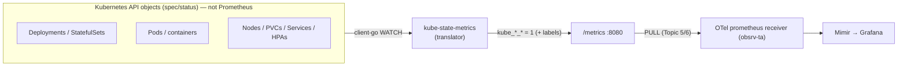
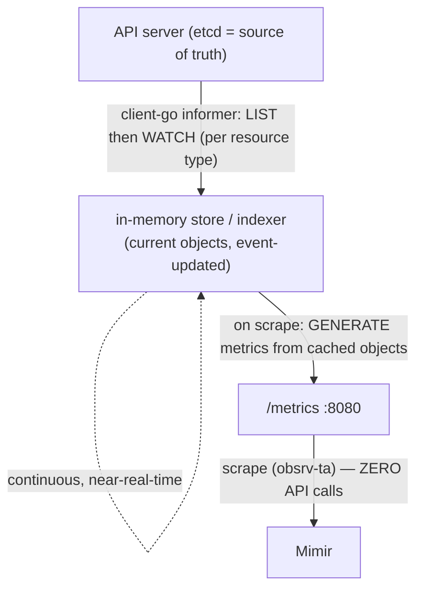
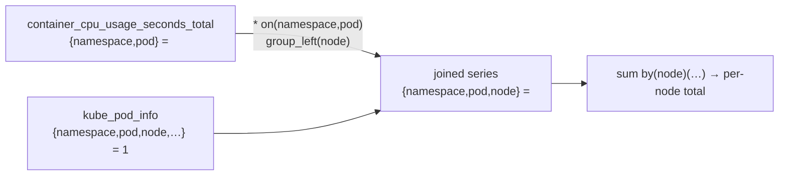
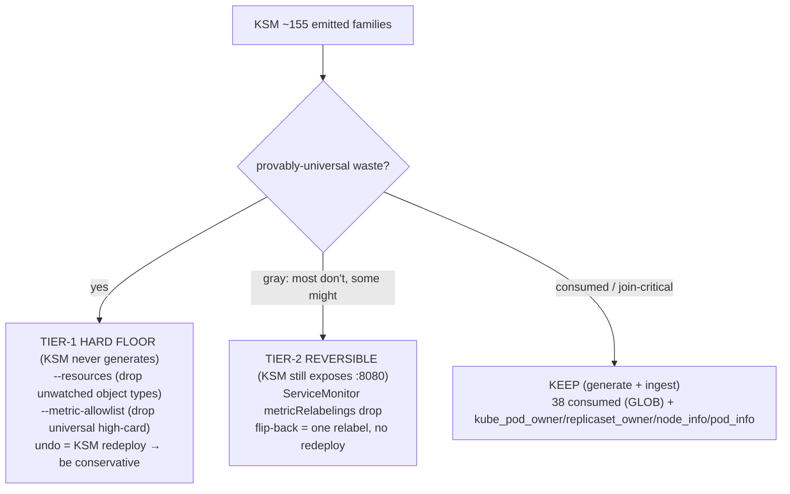
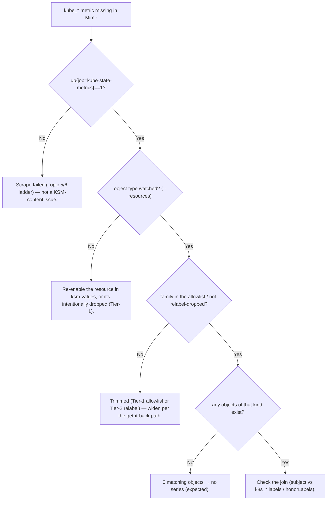

# Topic 9 — kube-state-metrics (KSM), from scratch

> Companion to `Topic4.md`/`Topic7.md`/`Topic8.md`. Verbose by design — a self-contained lesson for
> cold revision in the `Topic4.md` gold-standard shape.
> **STATUS: TAUGHT 2026-06-14 — read this, then take the quiz at the bottom; KSM cleanup capstone runs
> alongside.** Builds directly on the KSM deep-dive already in `Topic7.md` (stateless mirror,
> replication≠HA, sharding) — this topic adds the **mechanism (informers)**, the **info-metric + join
> pattern**, and the **cardinality/cleanup**.
> The one idea to anchor everything: **KSM is a stateless *projection* of the Kubernetes API's object
> state into metrics. It WATCHES the API into an in-memory cache and, on each scrape, generates
> metrics from that cache — the metrics' value is almost always `1`; the information is in the
> labels, which you JOIN onto other metrics to add k8s topology.**

---

## WHY KSM exists (the problem it kills)
You can see *resource usage* (cAdvisor: container CPU/mem; node-exporter: host) — but those raw
numbers have no k8s *meaning*. Is that pod part of a Deployment that wants 3 replicas but has 2
ready? Is it Pending because it can't schedule? Is a DaemonSet missing on a node? That information
lives only in the **Kubernetes API objects** (`spec`/`status`), and the API doesn't expose it as
Prometheus metrics. KSM is the **translator for the API server's object state** (Topic 7 archetype:
subject = *other objects*, data source = the **watch API**). Without it you can compute "this
container used X cores" but never "this Deployment is degraded" or "this pod is CrashLooping."



It is **not** metrics-server (CPU/mem for `kubectl top`/HPA, a non-Prometheus API) and **not**
cAdvisor (container *usage*). **cAdvisor tells you what a container is using; KSM tells you what k8s
*thinks* about it.** You need both, and you **join** them (below).

---

## WHAT it is — stateless mirror + info-metrics
- **Stateless mirror.** KSM stores nothing durable. It holds an in-memory copy of current API
  objects and renders metrics from it. Restart → rebuild from the API in seconds (Topic 7: this is
  why replication ≠ HA, and why 1 replica is fine).
- **Info-metrics.** Most KSM series have **value `1`** (a presence marker) or a plain gauge
  (`kube_deployment_spec_replicas = 3`). The **information is in the labels.** Example, live from
  your cluster — one `kube_pod_info` series for pod `aws-node-c5bvq`, value **`1`**:

  ```
  kube_pod_info{
    namespace="kube-system", pod="aws-node-c5bvq",      # the DESCRIBED pod (subject)
    node="ip-10-0-8-89…", created_by_kind="DaemonSet", created_by_name="aws-node",
    host_ip="10.0.8.89", pod_ip="10.0.8.89", priority_class="system-node-critical",
    uid="a9294adc-…",
    # …plus pipeline labels describing KSM itself: k8s_namespace_name="meta-monitoring",
    #   k8s_pod_name="kube-state-metrics-…", instance="10.0.5.8:8080", job="kube-state-metrics"
  } 1
  ```

  **Subject-vs-target labels (T7 `honorLabels` callback):** `namespace`/`pod`/`node` describe the
  *subject* (the aws-node pod in kube-system); `k8s_namespace_name`/`k8s_pod_name` describe *KSM's
  own pod* (in meta-monitoring). `honorLabels: true` (set in `ksm-values.yaml`) is what lets the
  subject's `namespace`/`pod` win instead of becoming `exported_*`. **When you join, match on the
  subject labels (`namespace`,`pod`,`node`) — never the `k8s_*` ones** (those are constant = KSM's
  location, so matching them joins everything to KSM and produces nothing useful).

---

## HOW it works internally — informers (watch, not poll)
This is the layer beneath Topic 7's "LIST then WATCH, in-memory cache." The actual machinery is
**client-go informers**:

1. **Reflector / ListWatch (per resource type).** On startup, a **LIST** of all objects of that type;
   then a long-lived **WATCH** that streams add/update/delete events.
2. **In-memory store (indexer/cache).** Events update a local cache of the *current objects*. Kept
   fresh **continuously**, event-driven, near-real-time — **independent of scrapes**.
3. **Metric generation on scrape.** KSM's `/metrics` handler **walks the cached objects and generates
   the metrics on the fly** — it stores *objects*, not metrics. A scrape = read cache → render text →
   respond. **Zero API-server calls per scrape.**



**Consequences to memorize:**
- **Freshness = watch-lag, NOT `scrape_interval`.** Halving the scrape interval does **not** make KSM
  hit the API more — it just re-reads the same cache more often.
- **API blip ≠ blank metrics.** If the API server is briefly unreachable, the watch disconnects but
  the **cache persists**, so `/metrics` keeps serving the last-known objects; on reconnect the
  informer re-LISTs/re-syncs. Only a KSM *restart* (cold cache) causes a brief gap (re-LIST), which
  self-heals — Topic 7's "stateless, self-heals."
- **Scrape never load-tests the API server** — the watch already paid that cost once (LIST) and now
  rides the event stream.

---

## The pattern you MUST own — info-metrics + the join
KSM metrics are mostly **markers** (`=1`) whose worth is unlocked by **joining** them onto other
metrics to add k8s topology. The tool is PromQL **vector matching with `group_left`** (many-to-one):

```promql
# container CPU (cAdvisor) has namespace+pod but NO node — stamp node on, then total per node:
sum by (node) (
  rate(container_cpu_usage_seconds_total[5m])
    * on(namespace,pod) group_left(node) kube_pod_info
)
```

- `* on(namespace,pod)` — match each left series to its `kube_pod_info` by the **shared subject
  labels**.
- `group_left(node)` — many-to-one (many container series per pod), **copy `node`** from the right
  (info) side onto the left.
- **Why value-`1` doesn't corrupt it:** you're multiplying the rate by `1` → value unchanged, labels
  merged. (If you only need the labels and not a product, the join is still `* …` by convention.)



The **owner-join chain** (pod → workload): `kube_pod_owner{owner_kind=ReplicaSet,owner_name=rs}` →
`kube_replicaset_owner{owner_kind=Deployment}` lets you roll pod metrics up to the Deployment. That's
why KSM's `*_info`/`*_owner` markers matter even though their value is `1`.

---

## Grounded in YOUR stack (live, `meda-dev-goldfish`, ~6,141 KSM series)
- Deployed via `helm_release "kube_state_metrics"` (chart `kube-state-metrics`), ServiceMonitor
  (`prometheus.monitor.enabled`, `honorLabels: true`, 60s), `prometheusScrape: false`
  (de-annotated → only the SM scrapes it, no double-scrape). Single replica (correct — stateless).
- Scraped by the **statefulset** collector `obsrv-ta` (the single prometheusCR plane), **not** the
  daemonset. `up{job="kube-state-metrics"}` = 1.
- KSM emits **~155 metric families**; your dashboards consume **38**. The rest is the cleanup target.

---

## HOW it scales / sharding (recap from Topic 7)
KSM is **cluster-global** → one replica sees everything. Don't replicate "for HA" (stateless →
0 availability gain + duplicate series). When one pod can't hold the whole object set (huge cluster
→ OOM / scrape timeout), **shard**: `--total-shards=N` + `--shard=i`; each pod emits only objects
where **`hash(uid) mod N == i`** (disjoint, union = full). Run as a **StatefulSet** (stable ordinal
→ auto-derives `--shard`). **CRITICAL:** the scrape layer (the TA) must discover **every** shard, or
a slice goes silently missing. Your cluster: single replica, no sharding (correct for the size).

---

## Cardinality — the enum-expansion driver + churn
KSM cardinality scales with **object count × per-object expansion**. The biggest drivers here aren't
the obvious "container" ones — they're **enum-expanded status families**: KSM emits **one series per
object per possible enum value** (value `0`/`1`). Live top families:

```
kube_pod_status_reason          280   = ~56 pods × N reasons
kube_pod_status_phase           280   = ~56 pods × 5 phases (Pending/Running/Succeeded/Failed/Unknown)
kube_pod_tolerations            182   = per toleration per pod
kube_deployment_status_condition 174  = per condition per deployment
kube_pod_status_qos_class/ready/scheduled  168 each
kube_endpoint_address           149
kube_pod_container_resource_requests 110  = per container × per resource type
```

- **Dimension that explodes it:** `pods × enum-cardinality` (phase/reason/condition/qos), most rows
  value-`0`. 56 pods → `kube_pod_status_phase`=280; 560 pods → 2,800. Linear in pods.
- **Churn (costs more than static series).** Pods are the most ephemeral object: every
  deploy/scale/restart mints pods with new `uid`/`pod`/`container_id` → **whole families are reborn**
  each change; the old series go stale (linger one staleness window) while new ones are created. Churn
  = constant create/destroy = WAL/head-block pressure and index growth in Mimir, worse than a stable
  high-cardinality series that at least compresses well.

### The footgun — `kube_pod_labels` / `kube_*_annotations`
KSM can map every k8s **label/annotation** into a metric label (`label_<key>` on a per-object series).
Your cluster has these **OFF** (`kube_pod_labels` = **0 series** — verified) — the safe default. KSM
only emits them via an explicit **`--metric-labels-allowlist`**. Why off: k8s labels are user-defined
and **unbounded** — `pod-template-hash` changes every deploy, commit-SHA labels, team tags — turning
them all into metric labels = uncontrolled, churning cardinality from metadata you don't control.
**If you ever enable it, allowlist only the specific stable labels you query** (e.g.
`pods=[app,team]`), never `pods=[*]`.

---

## The KSM cleanup (T9 capstone) — two-tier, 200-team lens
Same default-deny philosophy as node-exporter, but split by **reversibility** because this serves
~200 teams:



- **Tier-1 (KSM `--resources` + `--metric-allowlist`):** drop object types no team watches (lease,
  webhookconfigurations, poddisruptionbudget, storageclass, volumeattachment, persistentvolume,
  replicaset-except-owner) and universal waste families (`*_metadata_resource_version`,
  `kube_pod_tolerations`, most `*_created`, `kube_pod_status_*_time`, `kube_pod_spec_volumes_*`,
  `kube_pod_ips`). KSM never generates them → also saves KSM CPU/mem.
- **Tier-2 (SM `metricRelabelings`):** the gray area (`kube_deployment_status_condition`,
  `kube_endpoint_address`/`ports`, `kube_pod_status_ready`, `kube_pod_init_container_*`,
  `kube_node_status_addresses`) — dropped centrally, KSM still exposes them, flip-back trivially.
- **KEEP via GLOBS** so consumed-but-currently-0-series (`kube_pod_container_status_waiting_reason`,
  `*_last_terminated_*`) survive.
- **The get-it-back path** is documented in `meta_metrics.yaml` (port-forward the source → widen the
  helm) so the 200 teams self-serve.

---

## COMMON FAILURE MODES
1. **`up=1` but a `kube_*` family is empty.** Often the object type isn't watched (`--resources`
   excludes it) or `metric-allowlist`/relabel dropped it — not a scrape failure. Or genuinely 0
   objects of that kind (a metric with no matching objects = no series).
2. **Replicated "for HA" → duplicate/over-counted series** (T7). One replica; alert on `up==0`.
3. **Join returns nothing.** You matched on `k8s_namespace_name`/`k8s_pod_name` (KSM's own location)
   instead of the subject `namespace`/`pod`. Or `honorLabels:false` turned the subject labels into
   `exported_*`. Fix: match subject labels; keep `honorLabels: true`.
4. **Stale data.** Watch wedged / informer not re-syncing → metrics frozen while objects change.
   Rare; restart re-LISTs. (Freshness is watch-lag, so suspect the watch, not the scrape.)
5. **Label-metric cardinality blow-up.** Someone set `--metric-labels-allowlist=pods=[*]`.
6. **Sharded but TA misses a shard** → a hash-slice of objects silently absent.

**Troubleshooting ladder — "a kube_ metric is missing":**


---

## Practical exercises (live cluster)
1. **Prove watch≠scrape:** `kubectl -n meta-monitoring scale deploy kube-state-metrics --replicas=0`
   then `1` (with care) → KSM cold-starts, re-LISTs; confirm series return within a scrape interval.
2. **The join:** run `sum by(node)(rate(container_cpu_usage_seconds_total[5m]) * on(namespace,pod)
   group_left(node) kube_pod_info)` — confirm per-node totals; then break it by matching on
   `k8s_pod_name` and watch it return nothing.
3. **Cardinality:** `topk(10, count by(__name__)({__name__=~"kube_.+"}))` — see the enum-expanded
   status families dominate; `count(kube_pod_labels) or vector(0)` → confirm the footgun is off (0).
4. **Owner chain:** `kube_pod_owner` → `kube_replicaset_owner` — roll a pod up to its Deployment.

---

## Memorize (one-liners)
- KSM = **stateless projection of API object state**; value is `1`, **info is in the labels**.
- Internals = **client-go informers**: LIST→WATCH→in-memory store; **scrape generates from cache,
  zero API calls**; freshness = **watch-lag, not scrape_interval**.
- **Join pattern:** `<metric> * on(namespace,pod) group_left(<labels>) kube_pod_info` — match the
  **subject** labels (`namespace`/`pod`/`node`), not `k8s_*` (honorLabels makes the subject win).
- KSM ≠ cAdvisor (container usage) ≠ metrics-server (HPA CPU/mem). cAdvisor = what it uses, KSM = what
  k8s thinks.
- Cardinality driver = **enum-expansion** (`kube_pod_status_phase` = pods×5); churn via `uid`.
- Footgun = `--metric-labels-allowlist=pods=[*]` (off by default — k8s labels are unbounded).
- Cleanup = **two tiers**: KSM `--resources`/`--metric-allowlist` for universal waste (hard floor);
  SM `metricRelabelings` for reversible gray-area; KEEP via globs.

---

## Quiz — answer from memory, then check the key

### Questions (self-test cold)
1. **Mechanism.** KSM runs an hour; the API server is unreachable for 30 s, then recovers. What does
   `/metrics` serve *during* and *after*? And: halving `scrape_interval` — does KSM call the API more
   often? Explain via the watch/cache.
2. **The join.** Write PromQL for **per-node total container CPU rate** from
   `container_cpu_usage_seconds_total` (`namespace`,`pod`, no `node`) and `kube_pod_info` (has
   `node`). Name the operator; why value-`1` doesn't corrupt the sum; why match `namespace`,`pod` and
   **not** `k8s_namespace_name`,`k8s_pod_name` (what would the `k8s_*` match do?).
3. **Cardinality.** 56 pods → `kube_pod_status_phase` = 280 series. Where does 280 come from? Scale to
   560 pods → new count? What's the real lever to cut this family?
4. **Footgun.** A team sets `--metric-labels-allowlist=pods=[*]` to "see all pod labels in Grafana."
   Name the **two** things that break at scale, and the safer config.

### Answer key (model answers)
1. **During:** `/metrics` keeps serving — the in-memory **store persists**; the watch just
   disconnects, the cache isn't flushed. **After:** the informer reconnects and re-LISTs/re-syncs to
   catch missed events; no gap. **Halving scrape_interval does NOT increase API calls** — scrapes read
   the **cache**, not the API; KSM's API traffic is the watch stream (one LIST + event stream),
   decoupled from scraping. (Only a KSM *restart* causes a brief gap while it re-LISTs — self-heals.)
2. `sum by(node)(rate(container_cpu_usage_seconds_total[5m]) * on(namespace,pod) group_left(node)
   kube_pod_info)`. Operator = **`* on(...) group_left(...)`** (many-to-one vector match; `group_left`
   copies `node` from the info side). **Value-`1`** means multiply-by-one → the rate is unchanged,
   only labels merge. Match **`namespace`,`pod`** = the *subject* (described pod) labels; matching
   **`k8s_namespace_name`/`k8s_pod_name`** = KSM's *own* pod identity (the same constant on every KSM
   series) → it'd match nothing (or fan everything to KSM's namespace) and the join yields no useful
   result. (`honorLabels: true` is what keeps the subject's `namespace`/`pod` as plain labels.)
3. **280 = 56 pods × 5 phases** (Pending/Running/Succeeded/Failed/Unknown) — KSM emits one series per
   pod per *possible* phase, mostly value-`0`. **560 pods → 2,800** (linear in pods). The real lever
   is **not** fewer pods — it's **dropping the family / enum-expansion** (allowlist or relabel), since
   the cost is the per-pod × per-enum expansion, not the pod count you can't control.
4. (a) **Unbounded cardinality** — every k8s label becomes a `label_<key>` metric label on a per-pod
   `kube_pod_labels` series; arbitrary/team labels blow up the dimension count. (b) **Churn** —
   `pod-template-hash` (and commit-SHA/build labels) change on every deploy → the whole
   `kube_pod_labels` series set is reborn each rollout → active-series + WAL/index pressure → Mimir
   OOM risk. **Safer:** allowlist only specific *stable* labels you actually query
   (`--metric-labels-allowlist=pods=[app,team]`), never `pods=[*]`.
