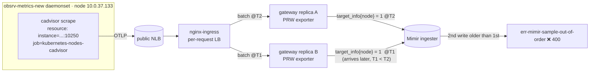

# Why the gateway's `target_info` got rejected by Mimir (out-of-order)

> The idea that unlocks this: **a Prometheus series may only ever be written by ONE writer.** Put a
> load balancer in front of N stateless remote-write collectors and any series they *all* emit will
> race — and `target_info` is exactly such a shared series.

> ⚠️ STUB — captured 2026-06-13 on `meda-dev-alien-eksdemotest`. Root cause + fix are solid; expand
> into full Topic format later.

---

## Symptom
The `opentelemetry-collector` gateway (`_8_otel_collector`, release `argus-otel-gateway`) logged a
flood of:

```
Exporting failed. Dropping data.   component=prometheusremotewrite signal=metrics dropped_items=608
failed to send WriteRequest to remote endpoint   status=400 Bad Request
  error="...the sample has been rejected because another sample with a more recent timestamp has
  already been ingested and out-of-order samples are not allowed (err-mimir-sample-out-of-order).
  The affected sample ... series target_info{gateway="argus-otel-gateway",
  instance="10.0.37.133:10250", job="kubernetes-nodes-cadvisor", ...}"
```

Always `target_info`. `dropped_items` 216 → 3000 per batch. Mimir endpoint
`http://mimir-nginx.mimir.svc/api/v1/push`.

## What `target_info` is
When the OTLP→Prometheus translation runs (the `prometheusremotewrite` exporter), every OTLP
**resource** is emitted as a synthetic series **`target_info{<resource attributes>} = 1`**. Its job
is to let you `group_left`-join resource attributes onto metrics. One resource = **one** `target_info`
series, re-emitted (with the batch's timestamp) on *every* write batch that carries that resource.

## The mechanism (why it races)
The gateway autoscales (`replicaCount: 1`, `maxReplicas: 3`) and was running **2 replicas**. The
metrics collectors don't talk to a single gateway pod — they hairpin out through the public NLB →
nginx-ingress, which load-balances **per request** across both gateway pods.



Both replicas independently write the **same** `target_info{instance=node, job=cadvisor}` series.
Mimir requires **monotonically increasing timestamps per series**. Replica A writes the series at
batch-time `T2`; replica B, processing an *earlier* batch slightly later in wall-clock, writes the
same series at `T1 < T2` → out-of-order → rejected.

## Why the real metrics survived but `target_info` didn't
- A real metric like `container_cpu_usage_seconds_total{container=…}` is a **distinct series**, and
  each scrape stamps it with a **distinct, increasing** timestamp. Even if two replicas write it,
  the per-series timestamps stay monotonic → in order.
- `target_info` is **one series collapsing every batch of a resource** into a single identity with a
  re-used timestamp. Two writers → the single series' timestamps reorder. It is the *only*
  shared-across-batches synthetic series, so it's the only victim.
- (Mimir partially ingests the rest of the batch, but the exporter sees the 400 and reports the whole
  `dropped_items` batch as failed — which is why it *looked* like mass metric loss.)

## The fix
Disable `target_info` on the gateway PRW exporter — `_8_otel_collector/manifests/values.yaml`:

```yaml
prometheusremotewrite:
  resource_to_telemetry_conversion:
    enabled: true
  target_info:
    enabled: false   # <-- this
```

**Why it's safe (verified live, not assumed):** `resource_to_telemetry_conversion: true` already
flattens the resource attributes — `service_version`, `service_instance_id`, `service_name`, etc. —
**directly onto every metric as labels** (confirmed: those labels exist on `otelcol_process_uptime.*`
in Mimir). The *only* place `target_info` is consumed in the repo is the OtelCol dashboard's uptime
panel (`otel_collector.json:3891`), and only as a `group_left` **fallback inside an `or`** whose
primary branch already reads `service.version` as a direct label. So nothing breaks.

This is a [[feedback-verify-consumption-before-preserving]] moment in reverse: before *deleting*
`target_info` we checked who reads it — and found its one reader already has the data another way.

## Rejected alternatives
- **Pin the gateway to 1 replica** — kills HA/scale on the component that funnels all telemetry.
- **Enable Mimir's out-of-order ingestion window** — a tenant *limits* change (needs sign-off),
  costs ingester memory, and treats the symptom instead of removing the duplicate writer.

## Memorize
- One Prometheus series ⇒ one writer. LB + N stateless remote-write collectors ⇒ any series they all
  emit (esp. `target_info`) will out-of-order.
- `target_info` = synthetic per-resource series carrying resource attrs; redundant once
  `resource_to_telemetry_conversion` flattens those attrs onto the metrics.
- `err-mimir-sample-out-of-order` naming the series tells you *which* series has multiple writers.
